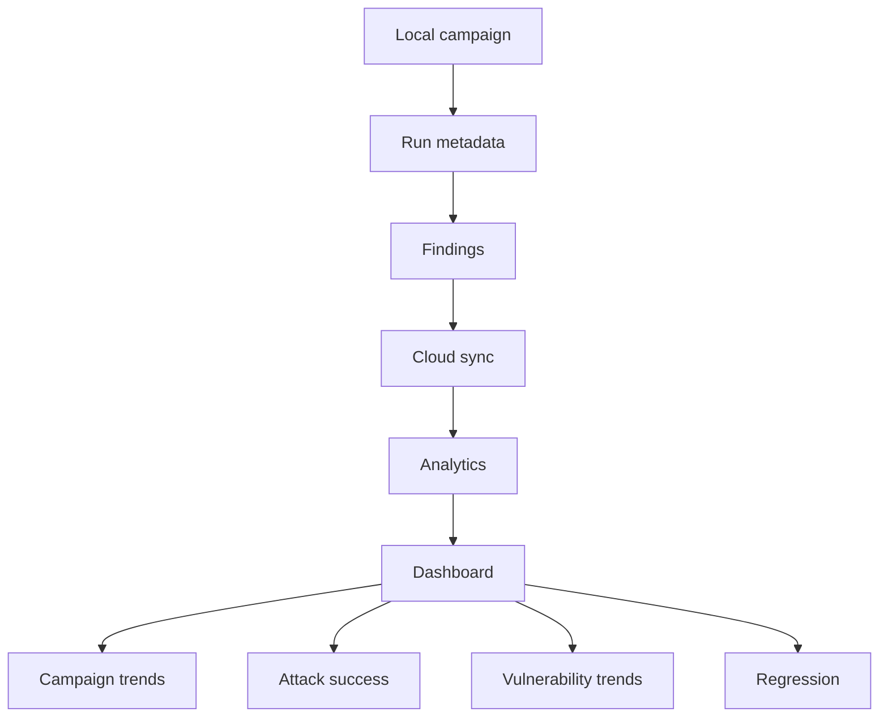

# Analytics overview

> Read [`../architecture/data-flow.md`](../architecture/data-flow.md) first. This page explains what the
> dashboard shows and where the numbers come from. The local analytics engine is documented in
> [`../attack-engine/ANALYTICS.md`](../attack-engine/ANALYTICS.md); this page is about the cloud dashboard
> view.

## Purpose

The dashboard turns synced campaign metadata into views a user can read at a glance: what was attacked,
what succeeded, how severe it was, and how it trends over time. The dashboard shows data; it never runs
attacks.

## Where the numbers come from

The heavy analysis already happens locally. The engine's `analyze` command computes attack success rate
with confidence intervals, breakdowns by strategy and category, findings by severity and taxonomy, and a
model leaderboard. See [`../attack-engine/ANALYTICS.md`](../attack-engine/ANALYTICS.md). The dashboard
reuses these outputs and prefers aggregates over raw data.

### Reading the target leaderboard

Each row shows the attack success rate (ASR) as "N of M worked", the 95% range (a Wilson interval),
attempts, refusals, findings, and high plus critical findings. A target with fewer than 30 attempts is
marked **small sample**: the range is wide because there is little evidence. For example, 0 of 4 gives
a range of 0% to 49%: the target refused every attack tried, but that does not show it is safe. Run
more objectives and strategies for a number you can compare. Each target name links to its latest
campaign, where the Attack transcript (when transcript sync is on) shows every prompt and reply.



## What the dashboard shows

```text
campaigns and runs
targets
attack attempts
successful attacks
success rate
vulnerabilities and severity
attack categories
models and providers
trend over time
regression results
```

## Privacy

- The dashboard works from summary metadata by default. Raw prompts, full model responses, and raw
  evidence stay on the user's machine unless the user opts in. See
  [`../architecture/data-flow.md`](../architecture/data-flow.md).
- Prefer aggregate analytics. Do not upload raw data unless a feature truly requires it and the user opts
  in.

## Failure cases

- Missing recent sync: the dashboard shows the last synced state and marks it as stale rather than showing
  nothing.
- Partial data: aggregates are computed from what synced; counts make clear when a run is still local only.

## Decisions

- Local and cloud boundary: [`../decisions/ADR-0014-local-cloud-boundary.md`](../decisions/ADR-0014-local-cloud-boundary.md).
