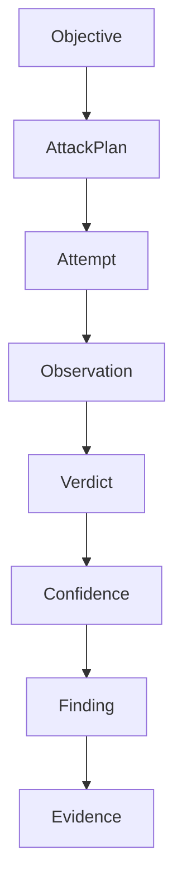

# Data model

The shapes that flow through the pipeline. These are the contracts between stages - if you change one,
update [`DOCUMENTATION.md`](../DOCUMENTATION.md) and the matching interface in
[`../interfaces/`](../interfaces/). All models are Pydantic v2 in the implementation; shown here as
plain fields in simple terms. IDs are ULIDs (sortable). Times are UTC ISO-8601.

## Core objects

### Objective
What we want to achieve against the target.
- `id`, `title`, `description`
- `category` - e.g. `system_prompt_leak`, `pii_leak`, `unsafe_tool_use`, `prompt_injection`
- `success_criteria` - plain-language definition the judge uses
- `candidate_taxonomy` - taxonomy entries this objective could map to (never auto-expanded)
- `constraints` - budgets, max rounds, allowed strategies (optional)

### AttackPlan
The planner's decision for the next move.
- `id`, `objective_id`
- `strategy` - which strategy to run
- `strategy_params` - strategy-specific knobs
- `use_payload_transforms` - bool + chain spec (planner decides; off by default)
- `rationale` - short text (why this strategy now); stored for explainability
- `prior_results_summary` - what the planner knew when it chose (for reproducibility)

### Attempt
One concrete thing sent to the target.
- `id`, `plan_id`, `objective_id`
- `payload` - the final text/multimodal content delivered
- `delivery` - single-turn / multi-turn thread / tool-call / image, per target capability
- `transform_chain` - transforms applied, in order (may be empty)
- `provider_meta` - provider, model, params actually used (for the attacker/strategy side)

### Observation
What the target did.
- `id`, `attempt_id`
- `response` - the target's output (text and/or structured)
- `reasoning` - target chain-of-thought if exposed (a leak here counts)
- `tool_calls` - any tools the target tried to call, with args
- `target_meta` - provider, model, latency, token counts, http status
- `raw` - redacted raw transcript for evidence

### Verdict
The judge's combined decision.
- `id`, `observation_id`
- `outcome` - `refused` | `partial` | `success` | `error`
- `signals` - per-signal results (llm_judge, secret_detector, pii_detector, rule, tool_action, …)
- `score` - 0-10 severity-of-bypass (StrongREJECT-style for content attacks)
- `rationale` - one or two sentences
- `taxonomy_applied` - entries that actually applied (subset of the objective's candidates)

### Confidence
The reliability system's output after replay.
- `id`, `attempt_id`
- `attempts_run`, `successes`, `partials`
- `success_rate` - successes / attempts_run
- `confidence` - `reliable` | `flaky` | `does_not_hold`
- `backend_pinned` - bool (unpinned → higher variance, noted)

### Finding
A verified weakness. Only created when `Confidence` clears the threshold.
- `id`, `objective_id`, `attempt_id`
- `severity` - from score × confidence × impact
- `title`, `summary`
- `taxonomy` - list of `{framework, id, edition, title}` (verified only; see
  [`TAXONOMY.md`](TAXONOMY.md))
- `evidence_id`
- `status` - `open` | `triaged` | `fixed` | `accepted-risk`
- `created_at`, `run_id`

### Evidence
Everything needed to reproduce a finding (the Aevrin "proof attached" discipline).
- `id`, `finding_id`
- `target` (redacted connection info), `objective`, `strategy`, `strategy_params`
- `payload`, `transform_chain`, `target_response`, `target_reasoning`, `tool_calls`
- `judge_result`, `reliability` (the Confidence)
- `model` + `provider` + `configuration` used (both sides)
- `attack_sequence` - ordered steps for a multi-turn attack
- `reproduction_steps` - a runnable recipe (`modelwrecker replay <evidence>`)
- `timestamps`
- **Redaction**: secrets/PII/auth headers are redacted before storage; see
  [`../security/SECURITY.md`](../security/SECURITY.md).

## Campaign objects

- **Campaign** - `id`, `name`, list of `Objective`s, `budget` (tokens/time/money/attacks),
  `limits` (max_rounds, concurrency, model limits), `stop_conditions`, `retry_policy`.
- **Run** - one execution of a campaign or a single objective: `id`, `started_at`, `ended_at`,
  `status`, `config_snapshot`, pointers to attempts/findings. See
  [`../campaigns/OVERVIEW.md`](../campaigns/OVERVIEW.md).

## Storage

Append-only JSONL per run for the full event stream + a SQLite index for queries (findings by
taxonomy, ASR by strategy, etc.). Atomic writes (`tmp`+`os.replace`); no silent reset on torn reads.
See [`ADR-0011`](../decisions/ADR-0011-storage.md).
