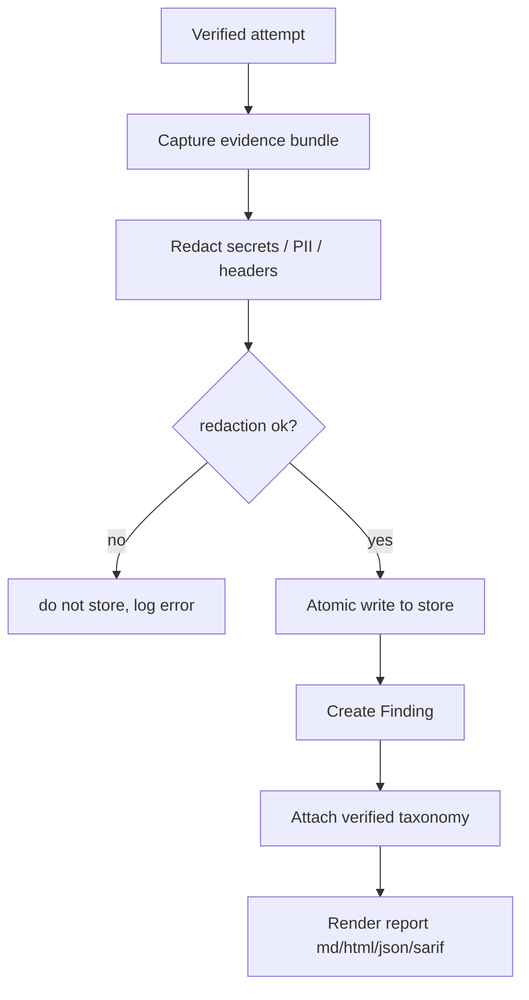

# Evidence and findings

**Purpose.** Every finding must be reproducible. This system captures the proof and turns a verified
success into a finding, following Aevrin's "validated, not just reported" discipline.

**Responsibilities.** Capture an evidence bundle, redact secrets, store it atomically, create a finding
only after verification, render reports.

**Inputs.** A verified `Attempt` + its `Observation`, `Verdict`, and `Confidence`.
**Outputs.** A `Finding` + an `Evidence` bundle + rendered reports.
**Dependencies.** storage, security (redaction), taxonomy, findings renderers.
**Failure cases.** If redaction fails, the bundle is not written (fail safe, not fail open). If
verification did not clear the threshold, no finding is created (success stays a logged attempt).

## Flow

## What an evidence bundle holds

The full list is in [`DATA-MODEL.md`](DATA-MODEL.md) → Evidence. The essentials: target (redacted),
objective, strategy + params, payload, transform chain, target response + reasoning, tool calls, judge
result, reliability numbers, both-sides model/provider/config, the ordered attack sequence, and a
runnable reproduction recipe (`modelwrecker replay <evidence>`).

## Redaction rules

- Redact API keys, `Authorization`/`x-api-key` headers, stego/tool passwords, and detected PII before
  anything is written (an Aevrin logging-safety principle).
- Store the *shape* of a secret (e.g. "OpenAI key, redacted") so the evidence is still meaningful.
- Run artifacts are written `0600`, directories `0700`, and are gitignored.

## From success to finding

A success becomes a finding only when the reliability system marks it `reliable` (or the operator
explicitly accepts a `flaky` one with a recorded note). This prevents a lucky one-shot or a weak judge
from inflating the finding count. See [`../attack-engine/RELIABILITY.md`](../attack-engine/RELIABILITY.md).

## Reports

Renderers are plugins ([`PLUGIN-SYSTEM.md`](PLUGIN-SYSTEM.md)): Markdown and HTML (Jinja2) for humans,
JSON for machines, SARIF for CI/code-scanning. All render from the same findings + evidence, so they
never disagree. CLI: `modelwrecker report`. See [`../reference/CLI.md`](../reference/CLI.md).