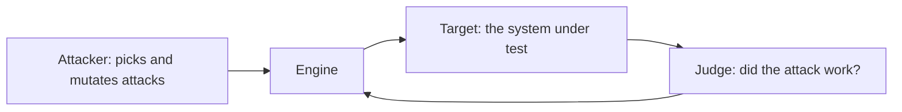
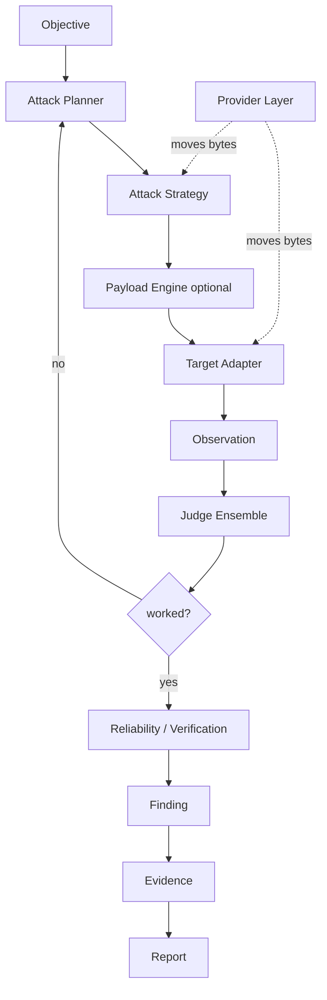
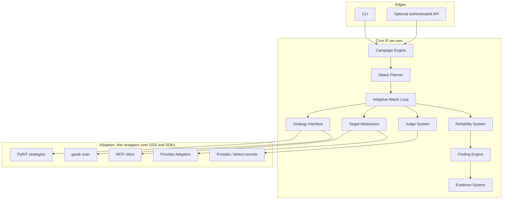

# Architecture overview

> Read `../../CLAUDE.md` first, then this. This is the single source of truth for how the whole
> system fits together. Deep detail for each part lives in the linked area docs.

## Purpose

modelWrecker takes an **objective** ("make the target leak its system prompt", "get the agent to call
a tool it shouldn't"), attacks a **target** safely and adaptively, decides with a **judge** whether
the attack worked, **verifies** that success is reliable, and emits a **finding** with full
reproduction **evidence**, mapped to a security taxonomy.

## The three roles (never mix them)



- **Attacker** - the reasoning that decides *what to try, whether to escalate, whether to mutate,
  when to stop*. It is code (the planner) plus, inside some strategies, an attacker LLM.
- **Target** - the system being tested. modelWrecker only uses the capabilities the target actually
  exposes (send message, multi-turn, call tool, upload image, …).
- **Judge** - decides refusal / partial / success / leak / unsafe action, using several signals, not
  one LLM's opinion.

Keeping these apart is the rule that everything else hangs off. See
[`ADR-0004`](../decisions/ADR-0004-attacker-target-judge-split.md).

## The pipeline



Read the loop as: the planner picks a strategy; the strategy builds an attack (optionally transformed
by the payload engine); the target adapter delivers it through a provider; the judge grades the
observation; if it failed, the planner adapts and tries again; if it succeeded, the reliability system
replays it, and only a verified success becomes a finding with evidence and a report entry.

## Layered view



The **core IP** boxes never import an adapter directly; they talk to adapters only through interfaces
(see [`../interfaces/README.md`](../interfaces/README.md)). That is what lets us swap PyRIT, a
provider, or a judge signal without touching the engine ([`ADR-0005`](../decisions/ADR-0005-strategy-plugin-system.md)).

## Repository structure

The engine is a Python package (`src/modelwrecker/`). The hosted platform (landing page, dashboard,
control-plane API) lives next to it under `src/`. Packages are added when their phase lands, not kept
as empty stubs. Layout as it exists today:

```text
modelWrecker/
├─ CLAUDE.md, README.md, ROADMAP.md, CHANGELOG.md, DECISIONS.md
├─ pyproject.toml, uv.lock, Dockerfile, .dockerignore
├─ docs/                      # everything in docs/index.md
├─ examples/                  # runnable example configs
├─ reports/                   # dated test snapshots from Phase 4
├─ deploy/                    # Cloudflare, Supabase, Google sign-in, and PyPI setup notes + migrations
├─ src/modelwrecker/          # the engine (Python)
│  ├─ data.py                 # the pipeline data models
│  ├─ interfaces.py           # the plugin contracts (Protocols) + Capability enum
│  ├─ config.py               # Pydantic config models + loader
│  ├─ taxonomy.py             # OWASP/ATLAS mapping tables + validators
│  ├─ providers/              # Provider base + the OpenAI-compatible adapter + a fake for tests
│  ├─ targets/                # Target adapters: chat, agent, rag, mcp + the target factory
│  ├─ attacker/               # Attack Planner + adaptive loop
│  ├─ strategies/             # Strategy interface + built-in strategies + the PyRIT and garak seams
│  ├─ payloads/               # payload/transform engine
│  ├─ campaigns/              # campaign engine: parallel objectives, budgets, stop conditions
│  ├─ judges/                 # judge signals + verdict combiner + calibration
│  ├─ reliability/            # replay + confidence scoring
│  ├─ findings/               # evidence capture + finding engine + report renderers
│  ├─ analytics/              # attack success rate + leaderboard, static HTML/JSON/CSV
│  ├─ security/               # egress guard + redaction
│  ├─ storage/                # atomic JSONL event log + SQLite index
│  ├─ mcp/                    # harness-integration MCP server + safe service layer
│  ├─ cloud/                  # device login + metadata and opt-in evidence sync
│  ├─ entitlements/           # signed plan check, verified offline
│  └─ cli.py                  # Typer CLI
├─ src/api/                   # control-plane API: Cloudflare Worker, TypeScript
├─ src/web/                   # landing page
├─ src/dash/                  # dashboard and staff admin console
├─ src/shared/                # plans.json: tiers, limits, prices, shared by API, sites, engine
└─ tests/                     # offline unit + e2e + mcp + strategy tests
```

Evidence capture lives in `findings/` rather than its own package. Attack-code sandbox and auth
helpers in `security/` are planned, not built.

### Why this structure

- **One folder per role/interface**, so "add a strategy / provider / target / judge" is "add a file
  in one folder", never "edit the core". This is modelWrecker's core rule.
- **The core engine owns no vendor code.** Vendor/OSS access is confined to `providers/`, `strategies/`,
  `targets/`, `judges/` adapters. This isolates the LiteLLM-style supply-chain and churn risk.
- **`security/` is its own module**, imported by targets/providers/payloads - an Aevrin security principle
  that security can't be bolted on per-call.
- **The API is separate.** The engine is a library + CLI first ([`ADR-0012`](../decisions/ADR-0012-engine-library-first.md))
  and opens no network listener. The hosted control-plane API in `src/api` is a separate service with
  auth from day one ([`control-plane-api.md`](control-plane-api.md)).
- `src/` layout keeps imports honest and packaging clean.

## Data flow (one shot)

See [`DATA-MODEL.md`](DATA-MODEL.md) for the exact shapes. In short: `Objective` → planner emits an
`AttackPlan` → strategy produces an `Attempt` (payload + delivery) → target returns an `Observation`
→ judge returns a `Verdict` → reliability returns a `Confidence` → a verified attempt becomes a
`Finding` holding an `Evidence` bundle → the report renders findings.

## Failure handling (built in, not retrofitted)

- Every run and every model call has a **wall-clock deadline** and a **cancel path**.
- The loop detects being **stuck** (no progress / repeated refusals) and stops instead of burning
  budget.
- All state writes are **atomic**; a torn read never silently resets state.
- All outbound attack HTTP goes through the **egress guard**; attack-generated code runs only in a
  **sandbox**. See [`../security/SECURITY.md`](../security/SECURITY.md).

## Open decisions that affect this architecture

Listed in [`../../DECISIONS.md`](../../DECISIONS.md) → "need approval": the default multi-provider
adapter (direct SDKs vs `any-llm`), how deep to integrate PyRIT, and which target types ship first.
