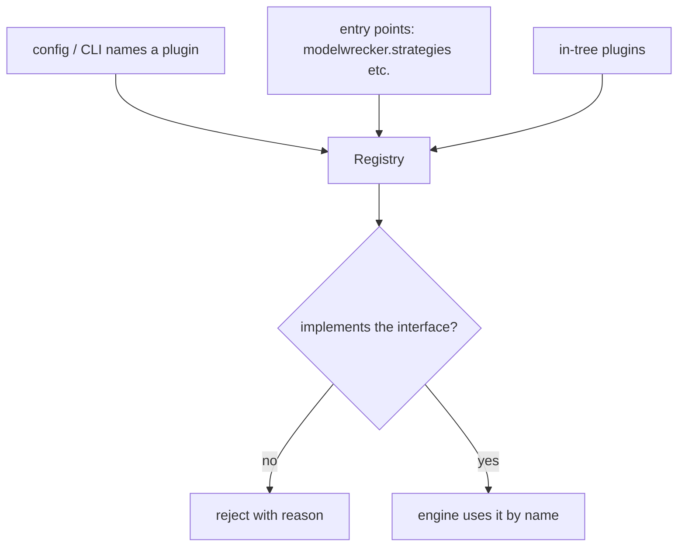

# Plugin system

**Purpose.** Let people add a new strategy, provider, target, judge signal, or transform **without
editing the core engine**. This is the critical rule of the project.

**Responsibilities.** Discover plugins, validate them against their interface, register them, and make
them selectable by name from config/CLI.

**Inputs.** Python entry points and in-tree registrations.
**Outputs.** Registries the engine queries by name.
**Dependencies.** Python `importlib.metadata` entry points; Pydantic for param schemas.
**Failure cases.** A plugin that fails validation is rejected with a clear error and does not load;
a broken plugin never half-registers (an Aevrin reliability principle).

## How it works

Each plugin kind has its own entry-point group and its own interface
([`../interfaces/README.md`](../interfaces/README.md)):

| Kind | Entry-point group | Interface |
|------|-------------------|-----------|
| Strategy | `modelwrecker.strategies` | `Strategy` |
| Provider adapter | `modelwrecker.providers` | `Provider` |
| Target adapter | `modelwrecker.targets` | `Target` |
| Judge signal | `modelwrecker.judges` | `JudgeSignal` |
| Transform | `modelwrecker.transforms` | `Transform` |
| Report renderer | `modelwrecker.reporters` | `Reporter` |

## Rules for a plugin

- Implement exactly one interface; declare a Pydantic params schema; declare `name` and `version`.
- Declare capabilities, not assumptions (a target says what it supports; a strategy says which target
  capabilities and taxonomy entries it needs). The engine checks compatibility before running.
- A strategy must never import a provider or target adapter directly - it receives them via context.
- Security-sensitive plugins (anything host-affecting) default to disabled and must be explicitly
  enabled; the engine refuses to expose them on a network surface. See
  [`../security/SECURITY.md`](../security/SECURITY.md).

## Versioning

Strategies are versioned so a finding records exactly which strategy version produced it (reproducible
runs). A breaking change to a strategy bumps its version rather than mutating behavior silently.
