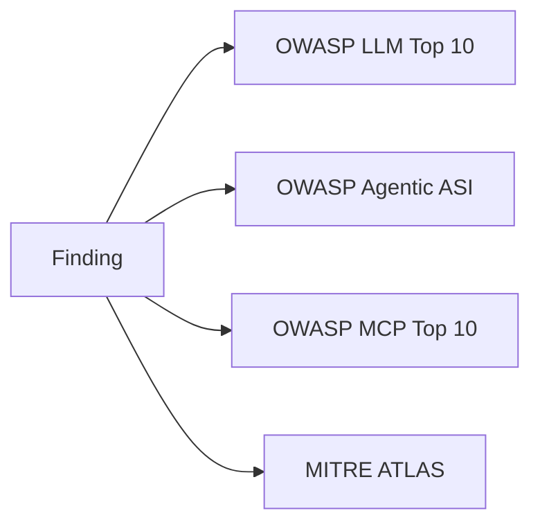

# Taxonomy mapping

**Purpose.** Map every finding to standard security taxonomies so a finding means the same thing in
the CLI, a report, and the Aevrin dashboard. **Rule: never invent a mapping.** Only map to entries
that exist in the official sources recorded in [`../research/taxonomies.md`](../research/taxonomies.md).

**Responsibilities.** Hold the verified entry tables, validate that any mapping on a finding points to
a real entry, and attach the edition so a mapping is never ambiguous.

**Inputs.** A finding + its strategy's candidate mappings + the judge verdict.
**Outputs.** A validated list of `{framework, id, edition, title}` on the finding.
**Failure cases.** A mapping to an unknown ID is rejected at write time (findings cannot ship an
invented mapping).

## Frameworks supported

- **OWASP LLM Top 10** - editions `2025` and `2026` (stored as e.g. `LLM01:2026`).
- **OWASP Agentic (ASI01-ASI10, 2026)** - exact ASI02-ASI09 titles to be loaded from the official PDF
  before shipping (see the open item in [`../research/taxonomies.md`](../research/taxonomies.md)).
- **OWASP MCP Top 10 (2025)** - MCP01-MCP10.
- **MITRE ATLAS** - only the verified `AML.Txxxx` IDs in the research note; look up any other ID before
  using it.

## How a mapping is produced

1. Each **strategy** declares the taxonomy entries its *attack type* can plausibly produce
   (candidates). Example: a system-prompt-extraction strategy → candidates include `LLM02`, `LLM07`
   (2025) / `LLM08` (2026 Hidden Context Exposure), `AML.T0057`.
2. The **judge verdict** says what actually happened (leak vs refusal vs unsafe action).
3. The taxonomy module intersects candidates with what happened and validates each against the tables.
4. The finding stores only the validated subset - never the full candidate list, never an unverified ID.

## Example mapping table (illustrative, verified IDs only)

| Objective category | Candidate OWASP LLM | Candidate ATLAS |
|--------------------|---------------------|-----------------|
| prompt_injection | LLM01 | AML.T0051 |
| system_prompt_leak | LLM07:2025 / LLM08:2026 | AML.T0057 |
| pii_leak | LLM02 | AML.T0057 |
| unsafe_tool_use | LLM03 (Excessive Agency, 2026) | AML.T0048 |
| jailbreak | LLM01 | AML.T0054 |
| data_exfiltration | LLM02 | AML.T0024 |

Keep this table in sync with the code tables; it is illustrative here, authoritative in
`src/modelwrecker/taxonomy/`.
