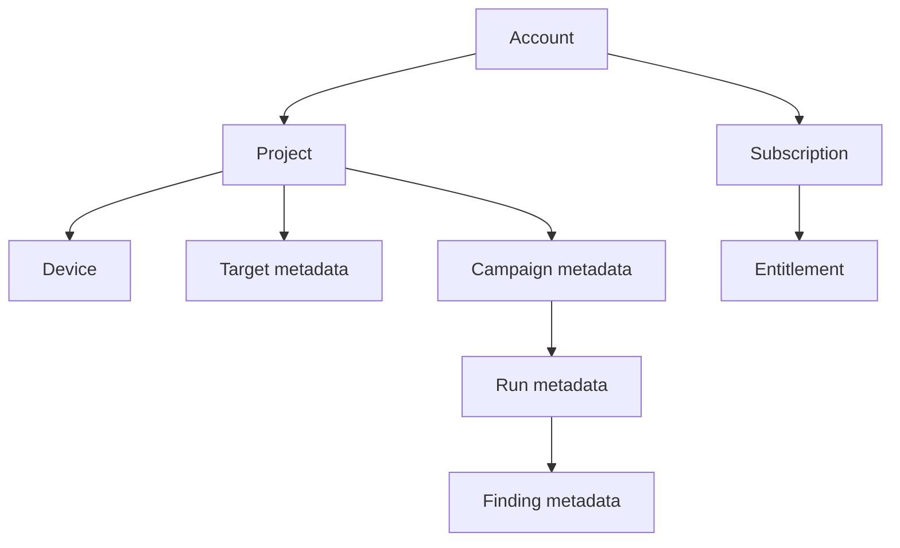
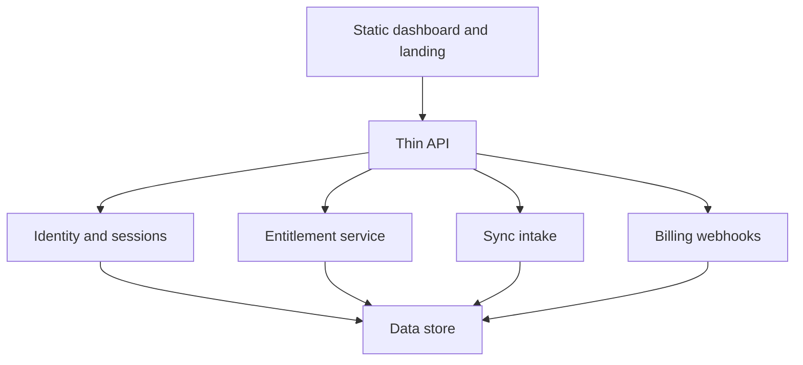
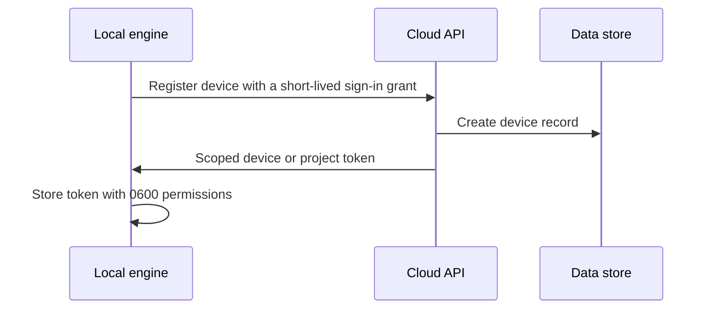

# Cloud control plane

> Read [`local-cloud.md`](local-cloud.md) first. This page is the single source of truth for what the
> Aevrin cloud does and does not do. Hosting detail lives in [`../deployment/cloudflare.md`](../deployment/cloudflare.md);
> the data-store decision lives in [`../decisions/ADR-0015-data-layer.md`](../decisions/ADR-0015-data-layer.md).

## Purpose

The control plane is the small cloud service behind `app.aevrin.net`. It answers five questions and
nothing more:

- Who are you?
- What project are you using?
- What are you allowed to do?
- What happened?
- What should the dashboard show?

It never runs attacks and never calls a model. That is the compute plane's job (see
[`docker.md`](docker.md)).

## What it stores

The control plane holds light records only. It does not hold raw attack prompts, full model responses, or
raw evidence unless the user explicitly opts in to upload them.

| Entity | Example fields | Sensitive content |
|--------|----------------|-------------------|
| Account | user id, email, created date | No |
| Project | name, owner, created date | No |
| Device | os, engine version, last seen | No raw machine details |
| Target metadata | name, type, model, provider | No endpoint secrets |
| Campaign and run metadata | status, counts, timestamps | No |
| Finding metadata | severity, strategy, taxonomy, success rate | No raw transcript by default |
| Subscription and entitlement | plan, limits, expiry | No payment card data |

## The parts

- **Static dashboard and landing**: served as static files. The dashboard shows synced metadata and never
  executes attacks. See [`../analytics/overview.md`](../analytics/overview.md).
- **Thin API**: the only network surface. Auth is required on every route, with anti-CSRF on mutating
  routes, and it refuses a non-loopback bind without auth. These are the standing rules in
  [`../security/SECURITY.md`](../security/SECURITY.md).
- **Identity and sessions**: Google sign-in; see [`../security/authentication.md`](../security/authentication.md).
- **Entitlement service**: issues a signed, scoped entitlement the local engine checks offline; see
  [`../security/entitlements.md`](../security/entitlements.md).
- **Sync intake**: accepts summary metadata from a registered device; see [`data-flow.md`](data-flow.md).
- **Billing webhooks**: Razorpay only, verified server-side; see [`../billing/razorpay.md`](../billing/razorpay.md).

## Device registration

Each local install registers once as a device and receives a scoped device or project credential. This
credential is what the engine uses to sync, never the user's Google token.

See [`../security/authentication.md`](../security/authentication.md) for the full credential model and
[`../decisions/ADR-0017-device-credential-model.md`](../decisions/ADR-0017-device-credential-model.md).

## Hosting and cost

The dashboard is static (Cloudflare Pages). The thin API runs on Cloudflare Workers (`src/api`). The data
store is Supabase Postgres with row-level security (a database rule that limits each row to its owner),
decided in ADR-0015. All services are chosen so the control plane can start on free tiers and fail
gracefully at quota. The full HTTP contract is [`control-plane-api.md`](control-plane-api.md). See
[`../deployment/cloudflare.md`](../deployment/cloudflare.md) and
[`../decisions/ADR-0015-data-layer.md`](../decisions/ADR-0015-data-layer.md).

## Multi-tenant isolation

The API never trusts the client for role, plan, project, or ownership. Every request is checked
server-side against the signed-in identity and the data store. Row-level security is a second layer so a
bug in the API cannot leak one account's rows to another. This threat is covered in the Phase 10 section
of [`../security/THREAT-MODEL.md`](../security/THREAT-MODEL.md).

## Failure cases

- Data store at quota: see the graceful-failure table in [`../deployment/cloudflare.md`](../deployment/cloudflare.md).
- Sync intake unavailable: the engine keeps results locally and retries; see [`data-flow.md`](data-flow.md).

## Decisions

- Local and cloud boundary: [`../decisions/ADR-0014-local-cloud-boundary.md`](../decisions/ADR-0014-local-cloud-boundary.md).
- Data layer: [`../decisions/ADR-0015-data-layer.md`](../decisions/ADR-0015-data-layer.md).
