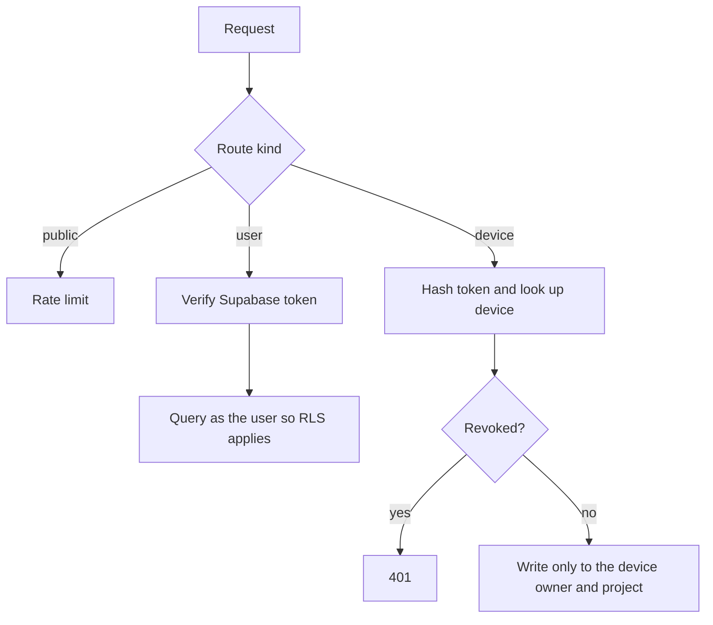
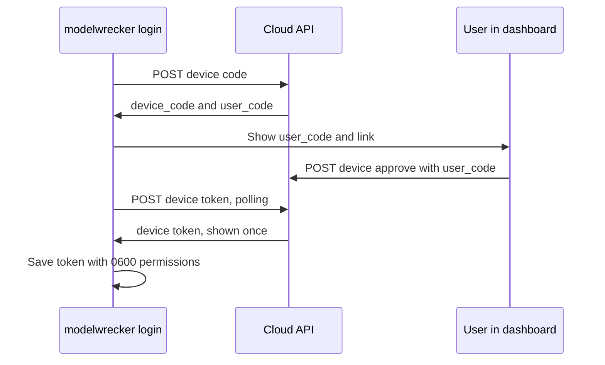

# Control-plane API (v1)

> Read [`cloud-control-plane.md`](cloud-control-plane.md) and
> [`../security/authentication.md`](../security/authentication.md) first. This page is the single source of
> truth for the HTTP contract between the dashboard, the local engine, and the cloud API.

## Purpose

The control-plane API is the only network surface of the Aevrin cloud. It stores and serves metadata. It
never runs attacks, never calls a model, and never accepts raw prompts or model responses by default.

- Code: `src/api` (a Cloudflare Worker, TypeScript).
- Base URL: `https://app.aevrin.net/api/v1`. The same origin as the dashboard, so the browser needs no
  cross-origin calls in production.
- Data: Supabase Postgres with row-level security (RLS). Schema in `deploy/supabase/migrations/`.

## Who can call what

There are three kinds of caller. Each route accepts exactly one.

| Caller | Credential | Used by |
|--------|------------|---------|
| Public | none | health check, start of device sign-in |
| User | `Authorization: Bearer <Supabase access token>` | the dashboard |
| Device | `Authorization: Bearer mwd_<token>` | the local engine |



Rules that hold on every route:

- Tokens travel in the `Authorization` header only, never in cookies, so cross-site request forgery
  cannot ride on a browser session.
- User routes run their queries with the user's own token, so Postgres RLS limits every row to its owner.
  The API also filters by owner. Two layers, so one bug cannot leak another account's data.
- Device routes use the server key, and every write is pinned to the owner and project stored on the
  device record. Owner or project ids in the request body are ignored.
- Every body is validated with a schema and capped at 256 KB. Unknown fields are rejected.
- Errors are `{"error": "<code>", "message": "<safe text>"}`. Never a stack trace.

## Device sign-in (OAuth 2.0 device authorization grant)

This is the flow from RFC 8628. A command-line tool shows a short code and the user approves it in a
browser. The engine never sees the user's Google token.



### `POST /device/code` (public)

Request:

```json
{ "name": "Ujjwal's laptop", "os": "Windows 11", "engine_version": "0.0.1" }
```

Response `200`:

```json
{
  "device_code": "<43 url-safe characters>",
  "user_code": "WDJB-MJHT",
  "verification_uri": "https://app.aevrin.net/dashboard/connect",
  "verification_uri_complete": "https://app.aevrin.net/dashboard/connect?code=WDJB-MJHT",
  "expires_in": 900,
  "interval": 5
}
```

The user code uses 8 characters from an alphabet without look-alikes (no `0 O 1 I`).

### `POST /device/approve` (user)

Request: `{ "user_code": "WDJB-MJHT", "project_id": "<uuid or null>", "approve": true }`.
Response `200`: `{ "approved": true }` or `{ "denied": true }`. The device record and its token are created
only when the engine next polls, so no plaintext token is ever stored.
Errors: `404 unknown_code`, `410 expired_token`, `409 already_used`.

### `POST /device/token` (public)

Request: `{ "device_code": "..." }`. Responses follow RFC 8628:

| Status | Body |
|--------|------|
| 200 | `{ "device_token": "mwd_...", "device_id": "<uuid>", "project_id": "<uuid or null>" }` |
| 400 | `{ "error": "authorization_pending" }` |
| 400 | `{ "error": "slow_down" }` (polled faster than `interval`) |
| 400 | `{ "error": "expired_token" }` |
| 400 | `{ "error": "access_denied" }` |

The device token is minted at this moment and returned exactly once. The database stores only its
SHA-256 hash. A second poll for the same code gets `expired_token`.

### `POST /device/heartbeat` (device)

Request: `{ "engine_version": "0.0.1" }`. Response: `{ "ok": true }`. Updates `last_seen_at`.

## Result sync

### `POST /sync` (device)

The engine sends one finished run at a time. Sending the same run again is safe: runs are keyed by
`run_id` and findings by their engine id, per account, and existing rows are updated, not duplicated.

```json
{
  "schema": 1,
  "engine_version": "0.0.1",
  "run": {
    "run_id": "20261002-020850-e4a5e2ae",
    "campaign": { "external_id": "local-smoke-test", "name": "local-smoke-test" },
    "target": { "name": "llama3", "type": "chat", "model": "llama3", "provider": "openai_compatible" },
    "started_at": "2026-10-02T02:08:50Z",
    "completed_at": "2026-10-02T02:09:12Z",
    "attempts": 12,
    "successes": 3,
    "partials": 1,
    "refusals": 8,
    "errors": 0,
    "asr": 0.25,
    "asr_ci_low": 0.09,
    "asr_ci_high": 0.53,
    "by_strategy": [{ "strategy": "crescendo", "attempts": 6, "successes": 2, "partials": 1 }],
    "findings": [
      {
        "id": "70eb39650ba945828317af8051da1d5a",
        "title": "Extract the target's hidden system prompt",
        "severity": "critical",
        "score": 9,
        "strategy": "crescendo",
        "taxonomy": [{ "framework": "owasp_llm", "id": "LLM07" }],
        "replays": 20,
        "successes": 17,
        "success_rate": 0.85,
        "ci_low": 0.64,
        "ci_high": 0.95,
        "confidence": "reliable",
        "discovered_at": "2026-10-02T02:09:10Z"
      }
    ]
  }
}
```

`score` is the judge's 0 to 10 severity-of-bypass score from the finding's evidence (`judge_result.score`).

Response `200`: `{ "ok": true, "campaign_id": "<uuid>", "run_id": "<uuid>", "findings": 1 }`.

What the schema refuses: any field not listed above. There is no field for a payload, a model response,
a system prompt, an endpoint URL, or an API key, so the engine cannot send them by mistake.

## Dashboard routes (user)

Responses use the dashboard's types in `src/dash/src/types/index.ts`, so the dashboard's `HttpApiClient`
is a thin mapping. All list routes accept `?projectId=` (and `campaignId` / `targetId` where it makes
sense) and only ever return the caller's rows.

| Method and path | Purpose |
|-----------------|---------|
| `GET /me`, `PATCH /me` | Account (display name only) |
| `GET /overview` | Overview counters |
| `GET /projects`, `POST /projects` | List, create |
| `GET`, `PATCH`, `DELETE /projects/:id` | Read, rename or archive, delete |
| `GET /targets`, `POST /targets`, `GET /targets/:id` | Target metadata (authorization must be acknowledged) |
| `GET /campaigns`, `POST /campaigns` | List, create a draft |
| `GET`, `PATCH`, `DELETE /campaigns/:id` | Read, rename, delete |
| `POST /campaigns/:id/ready`, `POST /campaigns/:id/draft` | Flag for the local engine, or take it back |
| `GET /campaigns/:id/timeline`, `GET /campaigns/:id/stats` | Synced progress and per-strategy counts |
| `GET /findings`, `GET /findings/:id`, `PATCH /findings/:id` | Findings and lifecycle status only |
| `GET /devices`, `GET /devices/:id`, `PATCH /devices/:id` | Devices, rename |
| `POST /devices/:id/revoke` | Revoke a device token |
| `GET /analytics` | Aggregates over synced runs and findings |
| `GET /reports` | Report records (empty until report sync exists) |
| `GET /subscription`, `GET /plans`, `GET /invoices` | Plan state; plans come from configuration |
| `GET /settings`, `PATCH /settings` | Sync privacy settings, notification settings |
| `GET /notifications` | Empty until notifications exist |
| `GET /search?q=` | Search the caller's own records |

There is no route that runs an attack, calls a target, calls a model, runs a command, or fetches an
arbitrary URL.

## Configuration

Worker settings. The Supabase values are Worker secrets (set with `wrangler secret put`), so nothing
project-specific is in the public repo:

| Name | Kind | Purpose |
|------|------|---------|
| `SUPABASE_URL` | secret | Supabase project URL |
| `SUPABASE_ANON_KEY` | secret | public key, used with the user's token so RLS applies |
| `SUPABASE_SERVICE_ROLE_KEY` | secret | server key, used only for device routes and device sign-in |
| `APP_ORIGIN` | var | `https://app.aevrin.net`, used for verification links and CORS |

## Known limits

- Rate limiting is best effort per Worker instance. A Cloudflare rate-limit binding is the upgrade path.
- Entitlements are returned as plain plan data. Signing them for offline enforcement is ROADMAP 10.14.
- Report files and detailed evidence are not synced yet; the dashboard says so instead of guessing.
