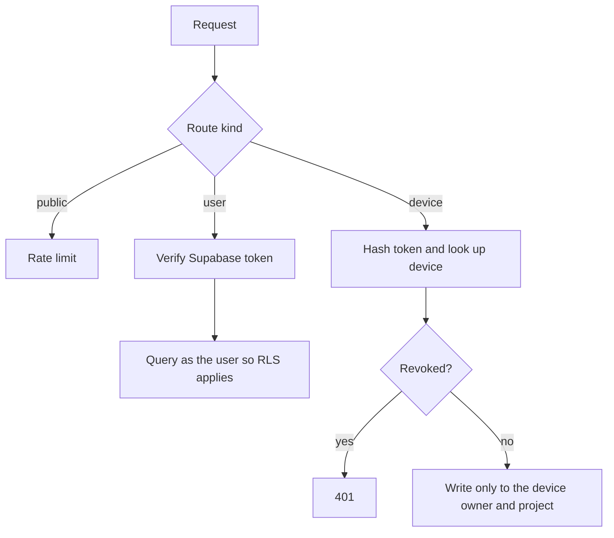
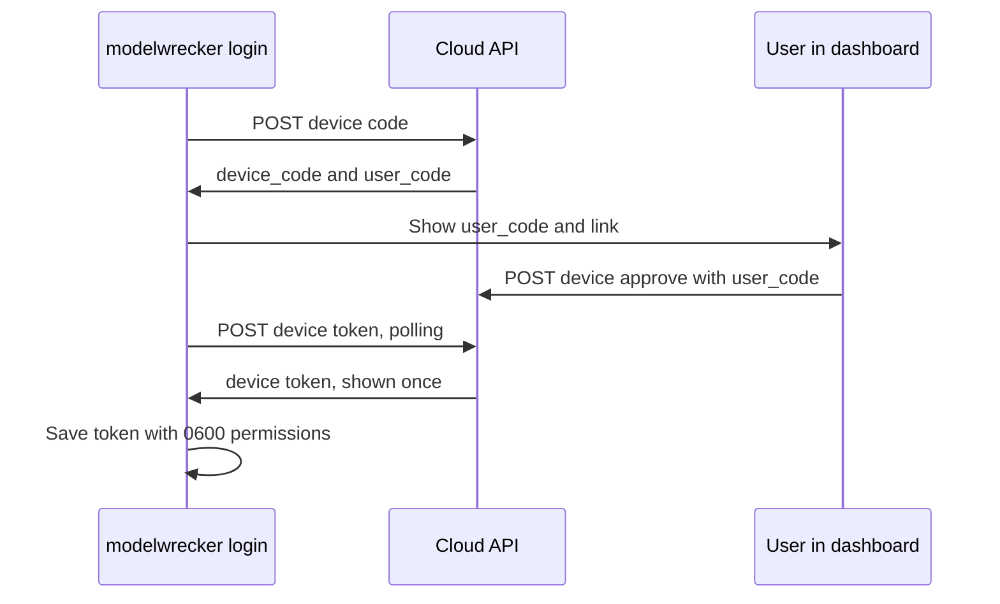

# Control-plane API (v1)

> Read [`cloud-control-plane.md`](cloud-control-plane.md) and
> [`../security/authentication.md`](../security/authentication.md) first. This page is the single source of
> truth for the HTTP contract between the dashboard, the local engine, and the cloud API.

## Purpose

The control-plane API is the only network surface of the Aevrin cloud. It stores and serves metadata. It
never runs attacks, never calls a model, and never accepts raw prompts or model responses by default.

- Code: `src/api` (a Cloudflare Worker, TypeScript).
- Base URL: `https://app.aevrin.net/api/v1`. The same origin as the dashboard, so the browser needs no
  cross-origin calls in production.
- Data: Supabase Postgres with row-level security (RLS). Schema in `deploy/supabase/migrations/`.

## Who can call what

There are three kinds of caller. Each route accepts exactly one.

| Caller | Credential | Used by |
|--------|------------|---------|
| Public | none | health check, start of device sign-in |
| User | `Authorization: Bearer <Supabase access token>` | the dashboard |
| Device | `Authorization: Bearer mwd_<token>` | the local engine |



Rules that hold on every route:

- Tokens travel in the `Authorization` header only, never in cookies, so cross-site request forgery
  cannot ride on a browser session.
- User routes run their queries with the user's own token, so Postgres RLS limits every row to its owner.
  The API also filters by owner. Two layers, so one bug cannot leak another account's data.
- Device routes use the server key, and every write is pinned to the owner and project stored on the
  device record. Owner or project ids in the request body are ignored.
- Every body is validated with a schema and capped at 256 KB. Unknown fields are rejected.
- Errors are `{"error": "<code>", "message": "<safe text>"}`. Never a stack trace.

## Device sign-in (OAuth 2.0 device authorization grant)

This is the flow from RFC 8628. A command-line tool shows a short code and the user approves it in a
browser. The engine never sees the user's Google token.



### `POST /device/code` (public)

Request:

```json
{ "name": "Ujjwal's laptop", "os": "Windows 11", "engine_version": "0.0.1" }
```

Response `200`:

```json
{
  "device_code": "<43 url-safe characters>",
  "user_code": "WDJB-MJHT",
  "verification_uri": "https://app.aevrin.net/dashboard/connect",
  "verification_uri_complete": "https://app.aevrin.net/dashboard/connect?code=WDJB-MJHT",
  "expires_in": 900,
  "interval": 5
}
```

The user code uses 8 characters from an alphabet without look-alikes (no `0 O 1 I`).

### `POST /device/approve` (user)

Request: `{ "user_code": "WDJB-MJHT", "project_id": "<uuid or null>", "approve": true }`.
Response `200`: `{ "approved": true }` or `{ "denied": true }`. The device record and its token are created
only when the engine next polls, so no plaintext token is ever stored.
Errors: `404 unknown_code`, `410 expired_token`, `409 already_used`.

### `POST /device/token` (public)

Request: `{ "device_code": "..." }`. Responses follow RFC 8628:

| Status | Body |
|--------|------|
| 200 | `{ "device_token": "mwd_...", "device_id": "<uuid>", "project_id": "<uuid or null>" }` |
| 400 | `{ "error": "authorization_pending" }` |
| 400 | `{ "error": "slow_down" }` (polled faster than `interval`) |
| 400 | `{ "error": "expired_token" }` |
| 400 | `{ "error": "access_denied" }` |

The device token is minted at this moment and returned exactly once. The database stores only its
SHA-256 hash. A second poll for the same code gets `expired_token`.

### `POST /device/heartbeat` (device)

Request: `{ "engine_version": "0.0.1" }`. Updates `last_seen_at`. Response:

```json
{
  "ok": true,
  "sync": { "metadata": true, "evidence": false, "transcripts": false },
  "entitlement": "<signed token>",
  "plan": "free",
  "expires_at": "2026-10-09T10:00:00.000Z"
}
```

`sync` is the account's choice in Settings (What syncs to Aevrin). Evidence and transcripts are a Pro
feature, so on Free both are `false` whatever the settings say. The engine reads `sync` before every sync
and adds detail only when it is on. `GET /device/me` returns the same `sync` object.

`entitlement` is a signed statement of what the plan allows (issue #11). The engine verifies and stores
it; see [`../security/entitlements.md`](../security/entitlements.md). It is absent when signing is not
configured, and the engine then runs the free baseline.

### `GET /device/entitlement` (device)

Returns `{ "entitlement": "<signed token>", "plan": "pro", "expires_at": "..." }`, or 503 when signing is
not configured. `modelwrecker login`, `modelwrecker plan --refresh`, and `run` (when the stored token is
over 12 hours old) call it.

### `GET /entitlements/keys` (public)

The public half of the signing key: `{ "keys": [{ "kid", "kty": "OKP", "crv": "Ed25519", "alg": "EdDSA",
"x" }] }`. Anyone can verify a token with it; only the Worker can sign.

## Billing (issue #12)

Prepaid plans through Razorpay Orders. The full flow, failure cases, and webhook setup are in
[`../billing/razorpay.md`](../billing/razorpay.md); prices in [`../billing/pricing.md`](../billing/pricing.md).

| Method and path | Caller | Purpose |
|-----------------|--------|---------|
| `GET /plans` | public | Plans, limits, and prices from `src/shared/plans.json` |
| `GET /subscription` | user | The plan in effect, paid-until date, credit, bonus, limits, features, this month's usage. Also reconciles recent unpaid orders with Razorpay |
| `GET /invoices` | user | Confirmed purchases (paid, refunded) |
| `POST /billing/checkout` | user | `{ "plan": "pro", "interval": "month" or "year" }`. Creates a Razorpay order for the configured price minus account credit, or pays fully from credit. The amount never comes from the client |
| `POST /billing/verify` | user | The ids Checkout returned. Checks the signature with the key secret, fetches the payment from Razorpay, and applies it once |
| `POST /billing/webhook` | Razorpay | HMAC-SHA256 of the raw body with the webhook secret. `payment.captured`, `order.paid`, `payment.failed`, `refund.processed`. Repeated event ids are skipped |

Plan limits are enforced here too: `POST /device/approve` refuses a device over the plan's device limit,
`POST /projects` refuses a project over the active-project limit, and `PATCH /settings` refuses to turn on
evidence or transcript sync without Pro (`403`, `plan_limit` or `upgrade_required`). `GET /analytics`
returns an empty leaderboard with `leaderboardLocked: true` without Pro.

## Result sync

### `POST /sync` (device)

The engine sends one finished run at a time. Sending the same run again is safe: runs are keyed by
`run_id` and findings by their engine id, per account, and existing rows are updated, not duplicated.

```json
{
  "schema": 1,
  "engine_version": "0.0.1",
  "run": {
    "run_id": "20261002-020850-e4a5e2ae",
    "campaign": { "external_id": "local-smoke-test", "name": "local-smoke-test" },
    "target": { "name": "llama3", "type": "chat", "model": "llama3", "provider": "openai_compatible" },
    "started_at": "2026-10-02T02:08:50Z",
    "completed_at": "2026-10-02T02:09:12Z",
    "attempts": 12,
    "successes": 3,
    "partials": 1,
    "refusals": 8,
    "errors": 0,
    "asr": 0.25,
    "asr_ci_low": 0.09,
    "asr_ci_high": 0.53,
    "by_strategy": [{ "strategy": "crescendo", "attempts": 6, "successes": 2, "partials": 1 }],
    "findings": [
      {
        "id": "70eb39650ba945828317af8051da1d5a",
        "title": "Extract the target's hidden system prompt",
        "severity": "critical",
        "score": 9,
        "strategy": "crescendo",
        "taxonomy": [{ "framework": "owasp_llm", "id": "LLM07" }],
        "replays": 20,
        "successes": 17,
        "success_rate": 0.85,
        "ci_low": 0.64,
        "ci_high": 0.95,
        "confidence": "reliable",
        "discovered_at": "2026-10-02T02:09:10Z"
      }
    ]
  }
}
```

`score` is the judge's 0 to 10 severity-of-bypass score from the finding's evidence (`judge_result.score`).

#### Optional detail (issue #28)

Only when the account turned it on, the engine adds detail. Each finding may carry `evidence`, and the
run may carry `transcript`:

```json
"evidence": {
  "objective": { "title": "...", "category": "system_prompt_leak", "success_criteria": "..." },
  "strategy": "crescendo",
  "transforms": ["base64"],
  "payload": "the prompt sent",
  "response": "the model reply",
  "reasoning": "",
  "tool_calls": [{ "name": "refund", "args": "{\"order_id\": 1182}" }],
  "judge": { "outcome": "success", "score": 9, "rationale": "...",
             "signals": [{ "signal": "llm_judge", "hit": true, "score": 0.9, "detail": "..." }] },
  "conversation": [{ "role": "user", "text": "..." }]
},
"transcript": {
  "attempts": [{ "at": "2026-10-02T02:08:51Z", "objective": "...", "category": "...", "strategy": "...",
                 "outcome": "refused", "score": 0, "payload": "...", "response": "..." }],
  "truncated": false
}
```

- `conversation` (multi-turn turns) is filled only when transcripts are on.
- Limits: evidence text 20,000 characters per field, transcript text 4,000, up to 2,000 attempts, and
  4 MB per `/sync` body (other routes stay at 256 KB). The engine redacts secrets, then caps, then
  stops adding detail before the body would pass the limit (`truncated: true` for a cut transcript).
- The server keeps detail only when the matching setting is on **at the time of the sync**. A client
  that sends detail while the setting is off gets a `200` with nothing stored.

Response `200`:

```json
{ "ok": true, "campaign_id": "<uuid>", "run_id": "<uuid>", "findings": 1,
  "detail": { "evidence": true, "transcripts": true },
  "stored": { "evidence": 1, "transcript": true } }
```

`detail` is what the account allows right now. The engine records it in `.synced.json`, so a run synced
without detail is sent again once detail is turned on.

What the schema refuses: any field not listed above, at any depth. There is no field for an endpoint
URL, an API key, a system prompt as such, or the run's configuration, so the engine cannot send them by
mistake. A payload and a model response can only appear inside the opt-in `evidence` and `transcript`.

## Admin console (staff)

Staff only; see [`../security/admin.md`](../security/admin.md). Every route needs a user token whose
verified email is exactly on `aevrin.net`, and every route except the `mfa` ones also needs
`X-Admin-Session: mwa_...`, issued after an authenticator code. Changes need a `reason` and are audited.

| Method and path | Purpose |
|-----------------|---------|
| `GET /admin/mfa/status` | Enrolled, locked |
| `POST /admin/mfa/enroll`, `POST /admin/mfa/activate` | Set up the authenticator; activate returns a session and 10 recovery codes once |
| `POST /admin/mfa/verify` | `{ "code" }` or `{ "recoveryCode" }`; returns a session |
| `POST /admin/session/end`, `GET /admin/me` | End the session; who is signed in |
| `GET /admin/users?q=&plan=&page=` | Users with plan, usage, activity |
| `GET /admin/users/:id` | Everything about one account, with its audit history |
| `PATCH /admin/users/:id/plan`, `POST .../bonus`, `POST .../credit` | Plan and paid-until date, bonus allowance, account credit |
| `POST /admin/users/:id/payments/:paymentId/refund` | Full refund through Razorpay |
| `PATCH /admin/users/:id/settings`, `PATCH .../profile` | Sync settings, display name |
| `POST /admin/users/:id/devices/:deviceId/revoke` | Revoke a device |
| `POST /admin/users/:id/suspend`, `POST .../reset-mfa`, `DELETE /admin/users/:id` | Suspend or restore, reset a staff authenticator, delete (type the email) |
| `GET /admin/payments`, `GET /admin/audit` | All payments; the audit log |
| `GET /admin/metrics?days=`, `GET /admin/traffic?days=&site=` | Platform analytics; page analytics |

A suspended account gets `403 account_suspended` on every user and device route.

### `POST /collect` (public)

First-party page-view beacon; always answers 204. What is kept: [`../analytics/page-analytics.md`](../analytics/page-analytics.md).

## Dashboard routes (user)

Responses use the dashboard's types in `src/dash/src/types/index.ts`, so the dashboard's `HttpApiClient`
is a thin mapping. All list routes accept `?projectId=` (and `campaignId` / `targetId` where it makes
sense) and only ever return the caller's rows.

| Method and path | Purpose |
|-----------------|---------|
| `GET /me`, `PATCH /me` | Account (display name only) |
| `GET /overview` | Overview counters |
| `GET /projects`, `POST /projects` | List, create |
| `GET`, `PATCH`, `DELETE /projects/:id` | Read, rename or archive, delete |
| `GET /targets`, `POST /targets`, `GET /targets/:id` | Target metadata (authorization must be acknowledged) |
| `GET /campaigns`, `POST /campaigns` | List, create a draft |
| `GET`, `PATCH`, `DELETE /campaigns/:id` | Read, rename, delete |
| `POST /campaigns/:id/ready`, `POST /campaigns/:id/draft` | Flag for the local engine, or take it back |
| `GET /campaigns/:id/timeline`, `GET /campaigns/:id/stats` | Synced progress and per-strategy counts |
| `GET /campaigns/:id/transcript` | Every synced attempt per run (`synced: false` for runs sent without it) |
| `GET /findings`, `PATCH /findings/:id` | Findings (metadata only) and lifecycle status |
| `GET /findings/:id` | One finding, with its evidence when evidence sync is on and it was sent |
| `GET /devices`, `GET /devices/:id`, `PATCH /devices/:id` | Devices, rename |
| `POST /devices/:id/revoke` | Revoke a device token |
| `GET /analytics` | Aggregates over synced runs and findings |
| `GET /reports` | Report records (empty until report sync exists) |
| `GET /subscription`, `GET /invoices` | Plan state and purchases (see Billing above) |
| `GET /settings`, `PATCH /settings` | Sync privacy settings, notification settings. Turning evidence or transcripts off deletes the copies already stored |
| `GET /notifications` | Empty until notifications exist |
| `GET /search?q=` | Search the caller's own records |

There is no route that runs an attack, calls a target, calls a model, runs a command, or fetches an
arbitrary URL.

## Configuration

Worker settings. The Supabase values are Worker secrets (set with `wrangler secret put`), so nothing
project-specific is in the public repo:

| Name | Kind | Purpose |
|------|------|---------|
| `SUPABASE_URL` | secret | Supabase project URL |
| `SUPABASE_ANON_KEY` | secret | public key, used with the user's token so RLS applies |
| `SUPABASE_SERVICE_ROLE_KEY` | secret | server key, used only for device routes and device sign-in |
| `APP_ORIGIN` | var | `https://app.aevrin.net`, used for verification links and CORS |
| `RAZORPAY_KEY_ID`, `RAZORPAY_KEY_SECRET` | secret | Razorpay API keys. Without them billing routes answer 503 |
| `RAZORPAY_WEBHOOK_SECRET` | secret | Checks webhook signatures. Without it the webhook answers 503 |
| `ENTITLEMENT_SIGNING_KEY` | secret | Ed25519 private key (PKCS#8, base64). Without it no entitlement is issued |
| `ENTITLEMENT_KEY_ID`, `ENTITLEMENT_PUBLIC_KEY` | var | Key id and public key, also shipped in the engine |
| `ADMIN_TOTP_KEY` | secret | Encrypts admin authenticator secrets at rest (admin console) |
| `ANALYTICS_SALT` | secret | Mixed into the daily visitor hash (page analytics) |

## Known limits

- Rate limiting is best effort per Worker instance. A Cloudflare rate-limit binding is the upgrade path.
- Payment amounts are fixed by the server from `src/shared/plans.json`; a renewal is a new payment.
- Report files are not synced yet; the dashboard says so instead of guessing. Evidence and transcripts
  sync only when turned on (tables `finding_evidence` and `run_transcripts`, migration `0003`).
