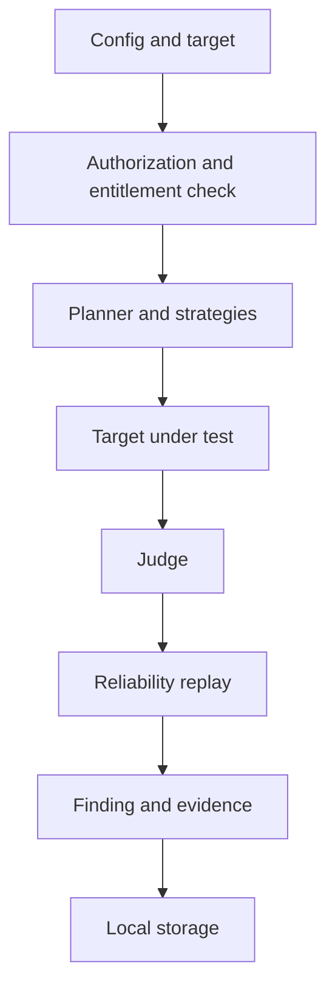
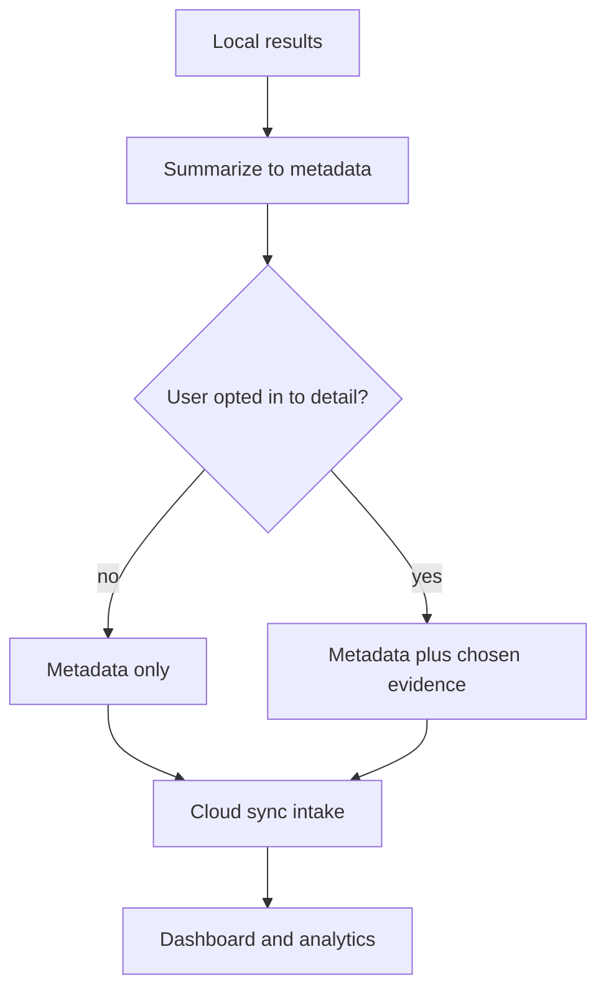
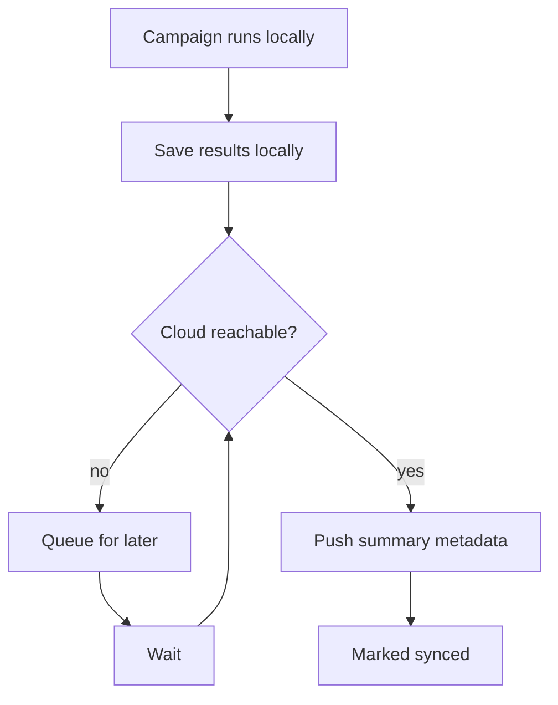
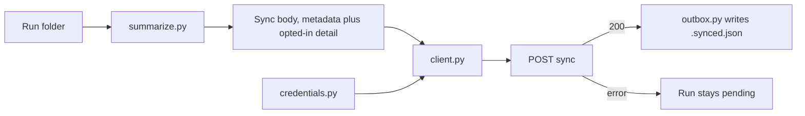

# Data flow: local to cloud

> Read [`local-cloud.md`](local-cloud.md) and [`cloud-control-plane.md`](cloud-control-plane.md) first.
> This page shows how data moves from a local campaign to the dashboard, what is sent, and what stays on
> the machine.

## Purpose

Explain, in order, what happens when a user runs a campaign and how the results reach the dashboard. The
rule throughout: heavy work is local, and only summary metadata leaves the machine by default.

## Campaign execution (local)

This is the normal engine pipeline from [`OVERVIEW.md`](OVERVIEW.md), with one addition at the front: the
engine checks the signed entitlement and the target authorization before any attack runs. See
[`../security/entitlements.md`](../security/entitlements.md) and
[`../targets/OVERVIEW.md`](../targets/OVERVIEW.md).

## Result synchronization

After a campaign, the engine summarizes results and syncs only the metadata the dashboard needs. Raw
transcripts and raw evidence stay local unless the user opts in.

### What is sent by default

| Sent by default | Kept local unless opted in |
|-----------------|----------------------------|
| campaign, run, finding identifiers | raw attack prompts |
| severity, attack strategy, taxonomy | full model responses |
| target name, model, provider | full evidence bundle |
| success rate and counts | sensitive system prompts, documents, data |
| evidence metadata and timestamps | |

The engine never silently uploads sensitive model responses. The choice is explicit in the dashboard:
Settings, What syncs to Aevrin, with two switches, both off by default:

- **Detailed evidence**: per finding, the prompt sent, the model reply, and the judge's verdict.
- **Full attack transcripts**: per run, every attempt (prompt, reply, result), and the turns of
  multi-turn attacks.

How it is enforced:

- The engine asks the API which switches are on (the device heartbeat) and builds detail only then.
  `modelwrecker sync --metadata-only` keeps detail local whatever the dashboard says.
- Detail is redacted for secrets (API keys, bearer tokens, device tokens) and capped in size before it
  leaves the machine. Prompts and replies are otherwise sent as they are: that is what the user opts in to.
- The API stores detail only when the matching switch is on at sync time, in owner-only tables. It
  never trusts the client's choice.
- Turning a switch off deletes the copies already in the cloud. The local run folder keeps the originals.
- Runs synced while detail was off are sent again with the detail on the next `modelwrecker sync`, so
  older runs can be back-filled. See [`../analytics/overview.md`](../analytics/overview.md).

## Offline synchronization

If the cloud is unreachable, the campaign still runs within the current entitlement. Results wait locally
and sync when the cloud returns. No results are lost because the dashboard is down.

The signed entitlement is what makes safe offline use possible: the engine can enforce the plan's limits
without asking the cloud each time. See [`../security/entitlements.md`](../security/entitlements.md).

## Engine side

The engine half of sync lives in `src/modelwrecker/cloud`. It does not run attacks; it reads finished
run folders and talks HTTP to the routes in [`control-plane-api.md`](control-plane-api.md).

| Module | Job |
|--------|-----|
| `credentials.py` | Load the device token from `MODELWRECKER_DEVICE_TOKEN` or the saved file; save it atomically with `0600` |
| `client.py` | Call `device/code`, `device/token`, `device/heartbeat` (which also returns the sync settings), and `sync`; https only, no redirects, typed RFC 8628 results |
| `policy.py` | `SyncPolicy`: which detail (evidence, transcripts) the account allows |
| `summarize.py` | Build the `POST /sync` body by picking named fields from `events.jsonl`, `finding-*.json`, and each evidence file; add redacted, capped detail only when the policy allows it |
| `outbox.py` | A run is pending until `.synced.json` exists (written only after a `200`), or when the policy asks for detail the marker says was not sent |

With detail off, the summary never reads or copies an attack payload, a model response or reasoning, a
system prompt, an endpoint URL, an API key, tool arguments, or the attack sequence. A test plants a
secret in each of those places and checks the body carries none of it. With detail on, a second test
checks that the endpoint URLs, the run configuration, the system prompt field, and the strategy
parameters are still never sent. The marker also records the size of
`events.jsonl`, so a run that grows after it synced becomes pending again. Commands: `login`,
`logout`, `sync`, and auto-sync after `run`; see [`../reference/CLI.md`](../reference/CLI.md).

## Privacy summary

- Default is local-heavy, cloud-light: compute and sensitive content stay on the machine.
- The cloud receives minimal metadata.
- Detailed evidence and full transcripts are an explicit opt-in per account (dashboard Settings), with
  a local override (`sync --metadata-only`).
- This matters because users may test private prompts, source code, documents, credentials, and
  proprietary agent behavior. See the Phase 10 section of
  [`../security/THREAT-MODEL.md`](../security/THREAT-MODEL.md).

## Failure cases

- Partial sync: the engine marks each record synced only after the cloud confirms, so a dropped
  connection retries without duplicating.
- Quota reached on the cloud side: the intake returns a clear error and the engine queues and retries.
  See [`../deployment/cloudflare.md`](../deployment/cloudflare.md).

## Decisions

- Local and cloud boundary: [`../decisions/ADR-0014-local-cloud-boundary.md`](../decisions/ADR-0014-local-cloud-boundary.md).
