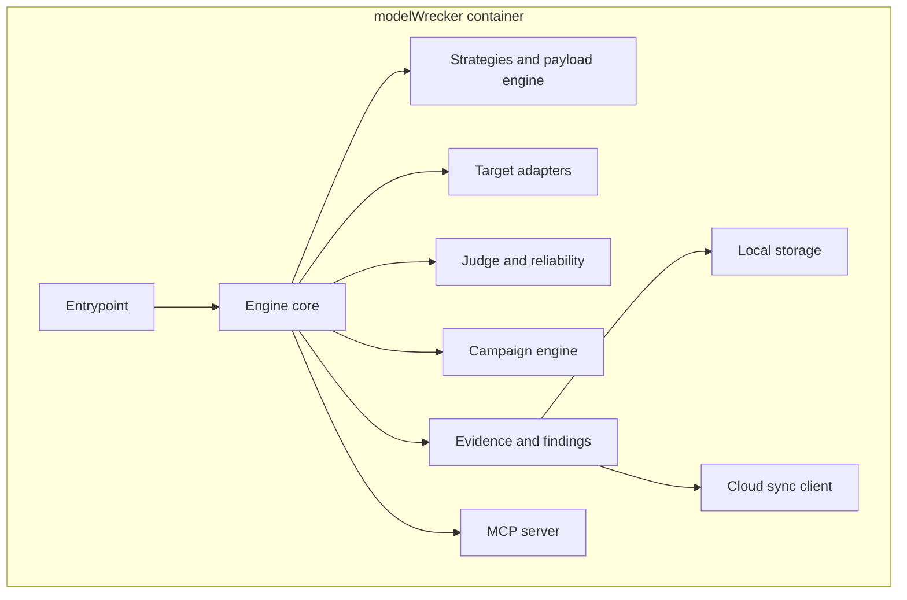

# Docker architecture

> Read [`local-cloud.md`](local-cloud.md) first. This page explains how the local engine is packaged and
> run as a Docker container (an isolated, self-contained unit that holds the engine and its
> dependencies). It covers the shape of the container, not the step-by-step install. For install steps see
> [`../deployment/docker.md`](../deployment/docker.md); for the security rules see
> [`../security/docker.md`](../security/docker.md).

## Purpose

Docker is the main way users get modelWrecker. One image holds the whole engine, so a user does not have
to install Python, PyRIT, garak, or any system library by hand. The container runs the heavy red-team
work on the user's own machine.

## What is inside the container

The container holds the same engine the CLI uses, plus the pieces that let it run on its own and talk to
the cloud control plane.



Everything heavy stays here. None of these parts move to the cloud. This is the no-hidden-compute rule
from [`local-cloud.md`](local-cloud.md).

Built today: everything in the diagram except the **cloud sync client**, which arrives with device
registration in Phase 10.8. The MCP server is in the image (the `mcp` extra) and starts only when asked.

## How a user runs it

The goal is setup that is as close to one command as practical. The image is built locally as
`modelwrecker:local`; compose wires the mounts and hardening flags:

```bash
cp .env.example .env
docker compose build
docker compose run --rm modelwrecker run /config/campaign.yaml
```

`docker compose up` runs the same config. The plain `docker run` form and all steps are in
[`../deployment/docker.md`](../deployment/docker.md).

## Mounts and volumes

The container reads config and writes results through a small number of explicit mounts (folders shared
between the host and the container). Nothing else from the host is shared.

| Host path | Container path | Direction | Why |
|-----------|----------------|-----------|-----|
| `./config` | `/config` | Read only | The YAML config and target definition |
| `./runs` | `/work/runs` | Read and write | Findings, evidence, reports, and the local event log |
| Credential file | - | Read only | Planned for Phase 10.8: the scoped device token; never the Google token |

Inside the container the working directory is `/work`, so the CLI's default `runs` output folder is the
mounted `/work/runs`. Provider keys come from `.env`, not a mount.

The host Docker socket, SSH keys, cloud credentials, and the wider host filesystem are **never** mounted.
See [`../security/docker.md`](../security/docker.md) for the full list of what is forbidden and why.

## Runtime shape

- Runs as a **non-root** user (uid `10001`) on a **read-only** root filesystem, with all Linux
  capabilities dropped. Verified from inside the running container.
- Resource limits (2 CPUs, 2 GB memory, 256 processes) are set so an autonomous loop cannot exhaust the
  host.
- The container uses the default bridge network and publishes no ports. The engine's egress guard (the
  control that blocks internal and metadata addresses) exists and is unit tested, but provider calls do
  not route through it yet; that wiring is Phase 10.3. See [`../security/docker.md`](../security/docker.md).
- The MCP server inside the container uses stdio by default. Any networked transport must require auth
  and refuse a non-loopback bind without it, same as any other network surface.

## Interfaces the container exposes

| Interface | Default | Notes |
|-----------|---------|-------|
| CLI | On | The main way to run a campaign |
| MCP server | Opt in | Safe orchestration tools only; see [`../mcp/overview.md`](../mcp/overview.md) |
| Cloud sync | Opt in, not built yet | Will send summary metadata to the control plane (Phase 10.8); see [`data-flow.md`](data-flow.md) |

## Failure cases

- No cloud connection: the engine still runs within the current entitlement and stores results locally.
  See the offline flow in [`data-flow.md`](data-flow.md).
- Missing or invalid credential: the engine runs in a local-only mode where allowed and does not sync.
- Hitting a resource limit: the campaign engine already enforces budgets and deadlines; the container
  limits are a second backstop. See [`../campaigns/OVERVIEW.md`](../campaigns/OVERVIEW.md).

## Decisions

- Local and cloud boundary: [`../decisions/ADR-0014-local-cloud-boundary.md`](../decisions/ADR-0014-local-cloud-boundary.md).
- Device credential model: [`../decisions/ADR-0017-device-credential-model.md`](../decisions/ADR-0017-device-credential-model.md).
