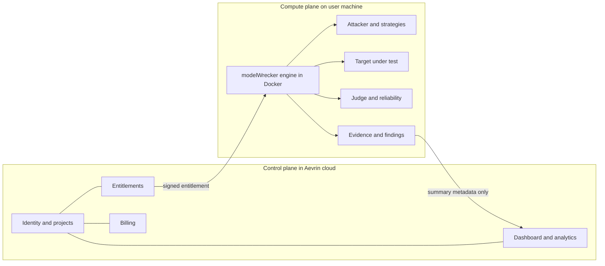
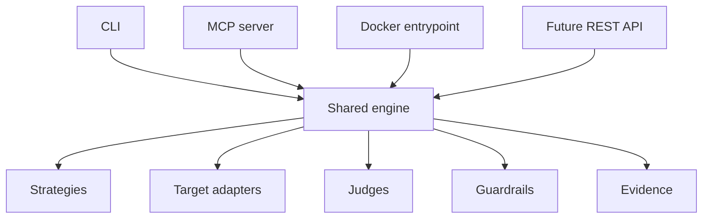
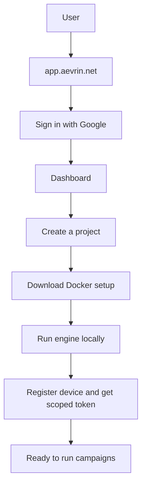

# Local and cloud boundary

> Read [`../../CLAUDE.md`](../../CLAUDE.md) first, then [`OVERVIEW.md`](OVERVIEW.md). This page is the
> single source of truth for the split between the user's machine and the Aevrin cloud. Deeper detail
> for each half lives in the linked docs.

## Purpose

modelWrecker is a local-first product. The heavy red-team work (the part that picks attacks, talks to
models, and judges results) runs on the user's own machine inside Docker (a way to package and run the
engine in an isolated container). The Aevrin cloud is a thin **control plane** (the part that manages
identity, projects, billing, and the dashboard). The cloud never runs attacks and never runs model
inference (asking a model for a response).

The one rule everything else follows:

> Heavy red-team compute runs locally. The cloud is control only, never a hidden compute dependency.

## The two planes

The arrow from the engine to the dashboard carries **summary metadata only** by default (counts,
severities, strategy names, timestamps). Sensitive attack content stays on the user's machine unless the
user explicitly opts in. See [`../analytics/overview.md`](../analytics/overview.md) and
[`data-flow.md`](data-flow.md).

## Who does what

| Concern | Lives where | Why |
|---------|-------------|-----|
| Attack generation, LLM calls, mutation | Local engine | Heavy compute; keeps private prompts and data on the machine |
| Judging, reliability replay, evidence | Local engine | Needs the full target responses, which are sensitive |
| Identity and sign-in | Cloud | One account across devices; see [`../security/authentication.md`](../security/authentication.md) |
| Projects, devices, subscriptions | Cloud | Light records the dashboard shows |
| Entitlements (what a plan allows) | Issued by cloud, enforced locally | No cloud round trip per attack; see [`../security/entitlements.md`](../security/entitlements.md) |
| Billing | Cloud only | Razorpay secrets never ship to the engine; see [`../billing/razorpay.md`](../billing/razorpay.md) |
| Dashboard and analytics | Cloud | Shows synced metadata; see [`../analytics/overview.md`](../analytics/overview.md) |

## One engine, many front doors

The CLI, the Docker container, the MCP server (a standard way for an AI agent to call an external tool),
and a future REST API all drive the **same** engine. There is never a separate "CLI engine" or "MCP
engine". This is the shared-engine rule from [`OVERVIEW.md`](OVERVIEW.md).

## User setup at a glance

The first-run journey, from the website to a local run.

Each step is detailed elsewhere: sign-in in [`../security/authentication.md`](../security/authentication.md),
device registration in [`cloud-control-plane.md`](cloud-control-plane.md), and the local run in
[`docker.md`](docker.md).

## Offline behavior

The engine keeps working when the cloud is unreachable, as far as the user's current entitlement allows.
Results are stored locally and synced later. See [`data-flow.md`](data-flow.md) for the offline sync
flow and [`../security/entitlements.md`](../security/entitlements.md) for how a signed entitlement lets
the engine enforce limits without a live connection.

## Security considerations

- The cloud never receives sensitive attack content by default. See [`../analytics/overview.md`](../analytics/overview.md).
- The engine trusts a cloud-issued **signed entitlement**, not a live cloud answer per attack, so there
  is no easy client-side bypass and no hidden compute dependency. See
  [`../security/entitlements.md`](../security/entitlements.md).
- The device holds a scoped device or project credential, never the user's Google token. See
  [`../security/authentication.md`](../security/authentication.md).

## Decisions

- Local and cloud boundary: [`../decisions/ADR-0014-local-cloud-boundary.md`](../decisions/ADR-0014-local-cloud-boundary.md).
- Data layer (proposed): [`../decisions/ADR-0015-data-layer.md`](../decisions/ADR-0015-data-layer.md).
