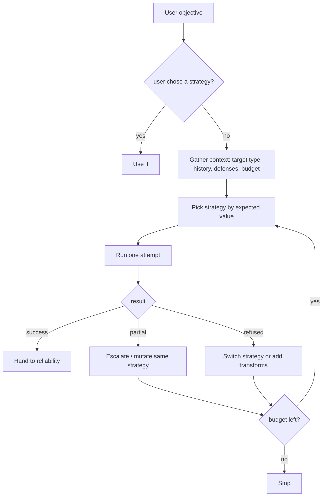

# Attack planner

**Purpose.** Decide *what attack to try next*. This is modelWrecker's core intelligence and a key piece
of IP. The planner is the "attacker" role in code form; some strategies additionally use an attacker LLM
internally, but **strategy selection is the planner's job, not the provider's and not a prompt's**
.

**Responsibilities.** Choose a strategy for an objective; after each result decide retry / mutate /
escalate / switch strategy / stop; respect budget, cost, and expected value.

**Inputs.** Objective, target capabilities, attack history (successes/failures), observed defenses,
budget left.
**Outputs.** An `AttackPlan` (strategy + params + whether to transform + rationale).
**Dependencies.** strategy registry, reliability stats, (optional) an attacker LLM for reasoning-heavy
planning.
**Failure cases.** No compatible strategy for the target's capabilities → clear error, no silent no-op.
Repeated no-progress → emit "stuck", stop.

## Decision flow

## What the planner considers

Target type · previous failures · previous successes · observed target defenses · attack history ·
objective category · available budget (tokens/time/money) · a strategy's expected value for this
target family.

## Selection model

- Start simple and explainable: a **per-target-family bandit** seeded with priors from measured attack
  success rates, so the planner learns which strategies work on which model families within a run (the
  approach aligned with Aevrin's red-team research, built first-party). Each choice records a `rationale`
  for explainability and reproducibility.
- If the user names a strategy, respect it. If not, the planner selects from the compatible
  registered strategies.
- An optional **LLM planner mode** uses an attacker model to reason about next moves for hard objectives;
  it still selects from the registered strategy set - it cannot invent an un-registered attack.

## Why not hard-code a sequence

A fixed "universal attack sequence" wastes budget on attacks that don't fit the target and can't adapt
to defenses. The planner picks per objective and per result instead.

## Reproducibility

An `AttackPlan` records what the planner knew when it chose (`prior_results_summary`) and why
(`rationale`), so a run can be explained and replayed. Backend pinning (see
[`RELIABILITY.md`](RELIABILITY.md)) reduces variance between replays.
