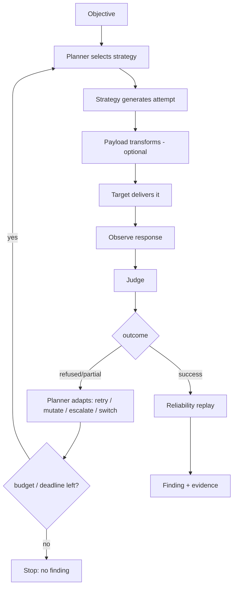

# Attack engine

**Purpose.** The heart of modelWrecker: take an objective, choose and run attacks adaptively, and hand
verified successes to the finding system. It is **not** a giant bag of prompts; it is a planner + a
loop + plug-in strategies.

**Responsibilities.** Drive the adaptive loop; call the planner; run strategies; route attempts through
targets; collect judge verdicts; decide retry/mutate/escalate/switch/stop; respect budgets and
deadlines.

**Inputs.** An `Objective` (+ optional constraints, chosen strategy).
**Outputs.** `Attempt`/`Observation`/`Verdict` records, and verified successes passed to reliability.
**Dependencies.** attacker (planner), strategies, targets, judges, payloads, security, storage.
**Failure cases.** Stuck detection stops a loop making no progress; a wall-clock deadline bounds every
run; a cancel path exists (an Aevrin reliability principle).

## The loop

The eight loop steps: receive objective → select strategy → generate attack → send → observe
→ judge → decide (retry/mutate/escalate/switch/stop) → validate successes → save evidence.

## The parts

- **Attack Planner** - picks and adapts strategies. The core IP. See
  [`ATTACK-PLANNER.md`](ATTACK-PLANNER.md).
- **Strategies** - the attack algorithms behind one interface. Built-in + PyRIT/garak-backed. See
  [`STRATEGIES.md`](STRATEGIES.md).
- **Payload engine** - optional transform/encode/mutate step the planner may request. See
  [`PAYLOAD-ENGINE.md`](PAYLOAD-ENGINE.md).
- **Reliability** - replays a success to decide if it is a real finding. See
  [`RELIABILITY.md`](RELIABILITY.md).

## What makes it extensible

The loop talks to strategies, targets, and judges **only through interfaces**. Adding a strategy is
adding a file in `strategies/`; the loop code does not change. The loop also never hard-codes
a universal attack sequence - the planner decides each move from context.
