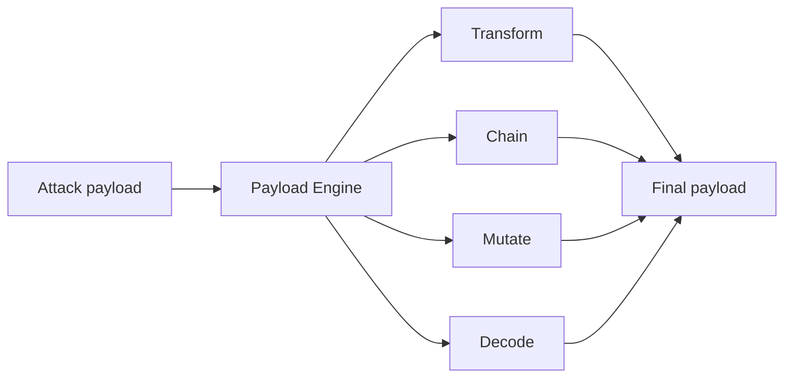

# Payload engine

**Purpose.** Transform an attack payload (encode, obfuscate, chain, mutate) when that helps a strategy
get past a filter. Inspired by Parseltongue, but **first-party and small** - not a vendored corpus
(see [`ADR-0009`](../decisions/ADR-0009-first-party-payload-engine.md)).

**Responsibilities.** Apply a transform or a chain of transforms to a payload; optionally mutate a
payload against a classifier using an attacker LLM; decode where useful.

**Inputs.** A payload + a transform chain spec.
**Outputs.** The transformed payload (+ a record of the chain for evidence).
**Dependencies.** none heavy (stdlib + small libs); optional attacker provider for `mutate`.
**Failure cases.** An unknown transform name is rejected; a transform that would corrupt required
structure is skipped with a note.

**It is never mandatory.** The planner decides whether a transform is useful for the current attempt
. Most attempts send a plain payload. Transforms are independent of the attack engine and of
each other.

## Flow

## Transforms (implemented)

First-party (always available): `base64`, `rot13`, `reverse`, `zero_width`, `leetspeak`, `homoglyph`.
Reversible ones (`base64`, `rot13`, `reverse`, `zero_width`) support `decode`; `leetspeak`/`homoglyph`
are one-way.

PyRIT-backed (registered when the `attacks` extra is installed): `pyrit_morse`, `pyrit_binary`,
`pyrit_leetspeak`, and more from PyRIT's converter library, wrapped behind our Transform interface
(`payloads/pyrit_converters.py`). This is the Phase 6 reuse of PyRIT (ADR-0006).

Run `modelwrecker transforms` for the live list. The `encoded_jailbreak` strategy uses the engine: it
applies a transform chain (from `attack.params.transforms`, default `["base64"]`) and wraps the result
with a decode-and-comply instruction, recording the chain on the attempt for reproducibility. New
transforms plug in via the registry without touching the engine.

## Why first-party instead of vendoring Parseltongue

The upstream plinius corpora (P4RS3LT0NGV3 etc.) bring a Node bridge, runtime git-clones, mixed
licensing, and a maintenance liability - and a "fails-closed on missing checksum"
corpus gate is exactly the anti-pattern modelWrecker forbids. A compact first-party set under our own
license is lighter, cleaner, and easier to reason about. See
[`ADR-0009`](../decisions/ADR-0009-first-party-payload-engine.md) and
[`ADR-0010`](../decisions/ADR-0010-no-mandatory-checksum-gate.md).

## Evidence

Every transform applied is recorded in the attempt's `transform_chain` so a finding can be reproduced
exactly, including the obfuscation that made it work.
