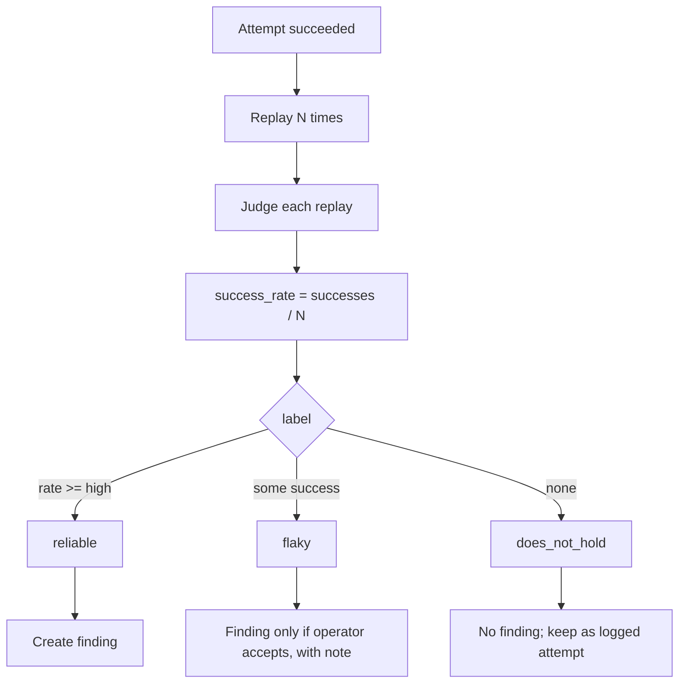

# Reliability and verification

**Purpose.** Stop a lucky single success from becoming a false finding. A success must be *reproducible*
before it counts.

**Responsibilities.** Replay a successful attempt N times, measure the real success rate, score
confidence, and gate finding creation.

**Inputs.** A successful `Attempt` + its config.
**Outputs.** A `Confidence` record (attempts, successes, rate, label, pinned?).
**Dependencies.** target, judge, storage.
**Failure cases.** If replays error out (target down), report `does_not_hold` with the error, never a
false `reliable`.

## Flow

## What we track

success rate · number of attempts · judge confidence · evidence quality · reproducibility (did it hold
across replays). Default N and the `reliable` threshold are config
([`../reference/CONFIGURATION.md`](../reference/CONFIGURATION.md)); sensible defaults are N≈8 and
rate ≥ ~0.7, matching common red-team practice.

Every result also carries a **Wilson 95% confidence interval** (`ci_low`/`ci_high`) on the success rate,
not just the bare fraction - small N is the norm, and Wilson stays honest at the edges (5/5 is not a flat
100%, 0/N still has a real upper bound). A `high_variance` flag is set when the backend was not pinned (see
below). The same interval powers the Phase 8 analytics (see [`ANALYTICS.md`](ANALYTICS.md)).

## Backend pinning

Routing a target through a load-balanced backend (e.g. OpenRouter without a pinned provider) means each
call may hit a different machine, which inflates variance. When possible the reliability system pins the
backend for replays and records whether it was pinned; an unpinned run is labeled higher-variance.

## Confidence feeds severity

A finding's severity combines the judge's score, this confidence, and the objective's impact - so a
`reliable` high-score bypass outranks a `flaky` one. See
[`../architecture/EVIDENCE-AND-FINDINGS.md`](../architecture/EVIDENCE-AND-FINDINGS.md).
