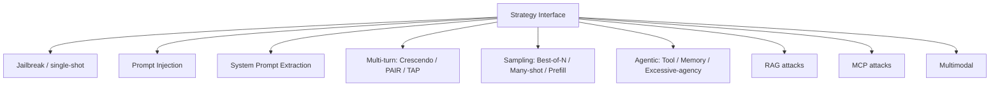

# Attack strategies

**Purpose.** Hold the attack *algorithms*, each behind one common interface so the planner and loop can
run any of them the same way, and so adding one never touches the core.

**Responsibilities.** Given an objective, a target handle, and a judge handle (via context), produce and
run attempts, returning results. A strategy may be single-shot or multi-turn, and may use an attacker LLM
internally.

**Inputs.** Objective, target (capability-checked), judge, strategy params, budget slice.
**Outputs.** One or more `Attempt`/`Observation`/`Verdict` records + a best result.
**Dependencies.** target + judge via context; optionally an attacker provider; optionally PyRIT/garak.
**Failure cases.** A strategy that needs a capability the target lacks is skipped by the planner before
it runs (capability check), not failed mid-flight.

## The interface

```text
name: str
version: str
params_schema: PydanticModel
required_target_capabilities: set[Capability]
candidate_taxonomy: list[TaxonomyRef]
async def run(ctx: StrategyContext) -> StrategyResult
```

Full signatures: [`../interfaces/strategy.md`](../interfaces/strategy.md).

## Strategy families



**Implemented and tested today:** `direct_jailbreak`, `prompt_extraction` (Phase 4); `best_of_n`,
`prefill`, `many_shot`, `crescendo` (Phase 5 first-party); `encoded_jailbreak` (Phase 6, uses the payload
engine); and the PyRIT-backed `pyrit_send`, `pyrit_pair` (PAIR), `pyrit_tap` (TAP), registered when the
`attacks` extra is installed. Run `modelwrecker strategies` for the live list.

**Planned:** encoding/probe batteries (via garak, Phase 8) and RAG / MCP / tool / memory / multimodal
attacks (Phase 9). See [`../../ROADMAP.md`](../../ROADMAP.md).

## Build vs reuse per strategy

Before implementing an algorithm, check for a maintained OSS implementation and wrap it behind the
interface rather than rewriting it:

| Strategy | Source | How |
|----------|--------|-----|
| best_of_n, prefill, many_shot, crescendo, encoded_jailbreak, direct jailbreak, prompt extraction | first-party | small, specific to our loop; cheap to own and test. **Done.** |
| PAIR, TAP | **PyRIT 1.1** (MIT) | our provider is bridged into a PyRIT target (`pyrit_bridge.py`); `pyrit_attacks.py` runs `PAIRAttack`/`TAPAttack` and converts the result. **Done** - PAIR runs offline to a SUCCESS outcome; registered when the `attacks` extra is present. See [`ADR-0006`](../decisions/ADR-0006-reuse-pyrit-garak.md). |
| Converters (morse, binary, leetspeak, ...) | **PyRIT 1.1** (MIT) | wrapped as payload transforms (`payloads/pyrit_converters.py`). **Done.** |
| Encoding/probe batteries (gcg, encoding, glitch, ...) | **garak** (Apache-2.0) | batch-scan adapter (Phase 8). |
| RAG / MCP / tool / memory / multimodal | first-party | modelWrecker's differentiated targets; built on our target adapters (Phase 9). |

A reused algorithm still produces our `Attempt`/`Observation`/`Verdict` shapes and goes through our
reliability + evidence pipeline. PyRIT's memory is adapted into our shapes at the boundary and its scorers
are wrapped as `JudgeSignal`s, so results are uniform across first-party and PyRIT-backed strategies. We
never expose PyRIT/garak's own reporting as the product.

## Capability + taxonomy declarations

A strategy declares which **target capabilities** it needs (so the planner can skip incompatible ones)
and which **taxonomy entries** its attack type can produce (candidates the finding draws from - see
[`../architecture/TAXONOMY.md`](../architecture/TAXONOMY.md)).

## Versioning

Each strategy is versioned; a finding records the exact version used, so runs are reproducible
([`PLUGIN-SYSTEM.md`](../architecture/PLUGIN-SYSTEM.md)).
