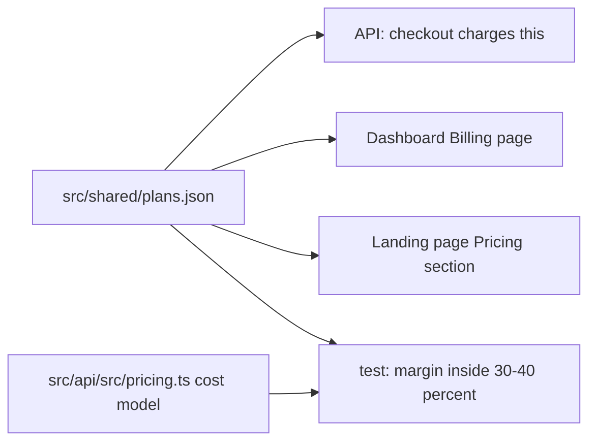

# Pricing

> Read [`razorpay.md`](razorpay.md) for how people pay, and
> [`../security/entitlements.md`](../security/entitlements.md) for how a plan is enforced. This page is the
> single source of truth for **how prices are set**. The prices themselves live in one file:
> `src/shared/plans.json`.

## Purpose

Prices must be fair to users and keep the product sustainable. The rule (issue #42): every paid price
keeps a **30 to 40 percent margin** after GST and payment fees. Margin here means profit as a share of
revenue without GST.

## Where prices live



One file feeds the checkout, the dashboard, and the landing page, so the page can never advertise a price
the checkout does not charge. A test (`src/api/test/billing.test.ts`) fails CI if any paid price leaves the
margin band.

## Current prices

| Plan | Monthly | Yearly | Margin (monthly / yearly) |
|------|---------|--------|---------------------------|
| Free | 0 | 0 | not applicable |
| Pro | 899 rupees | 9,899 rupees (about 825 a month, 8 percent off) | 36.8 / 31.4 percent |
| Enterprise | priced per contract | priced per contract | set per contract |

Prices are in Indian rupees and **include 18 percent GST**. Payment is prepaid; nothing renews on its
own (see [`../decisions/ADR-0019-prepaid-billing.md`](../decisions/ADR-0019-prepaid-billing.md)).

## The cost model

The engine runs on the user's machine with the user's own model keys, so attacks cost Aevrin nothing.
What a paying account costs is the hosted control plane, storage for synced evidence, support, and
payment fees. Monthly cost to serve one paying account, in rupees:

| Input | Value | Note |
|-------|-------|------|
| Fixed platform cost | 3,000 a month | managed Postgres (25 dollars), Workers paid plan (5 dollars), domain, mail, monitoring |
| Accounts it is spread over | 25 | a conservative first-year planning base |
| Platform share per account | 120 | 3,000 / 25 |
| Storage and egress | 40 | evidence and transcript sync |
| Support and operations | 300 | about 15 minutes a month at 1,200 an hour |
| **Cost per account** | **460** | |
| Payment fee | 2.36 percent of the price | Razorpay 2 percent plus 18 percent GST on the fee |
| GST | 18 percent, included in the price | passed to the government, not revenue |

For a price P covering M months:

```text
net per month   = P / M / 1.18
fee per month   = P / M x 0.0236
margin          = (net - fee - 460) / net
```

Pro monthly: net 761.86, fee 21.22, profit 280.64, margin 36.8 percent. Pro yearly: net 699.08 a month,
fee 19.47, profit 219.61, margin 31.4 percent. The yearly discount is kept small on purpose so it stays
inside the band.

## Changing a price or a cost

1. Change the input in `src/api/src/pricing.ts` (costs) or `src/shared/plans.json` (prices).
2. Run `npm test` in `src/api`. The margin test prints which plan and interval left the band.
3. Update the table above and the CHANGELOG. Existing purchases keep the price they paid; the change
   applies to the next checkout.

## Limits are value fences, not costs

The monthly campaign-run and attempt limits do not cost Aevrin anything (the engine runs locally). They
separate Free from Pro and are set in `src/shared/plans.json`. Free stays genuinely useful with free,
self-hostable parts: the full local engine, the core strategies, any OpenAI-compatible or local model, and
the dashboard.

## Security considerations

- The client never sends a price. `POST /billing/checkout` takes only a plan and an interval; the server
  reads the price from the config.

## Decisions

- [`../decisions/ADR-0019-prepaid-billing.md`](../decisions/ADR-0019-prepaid-billing.md)
