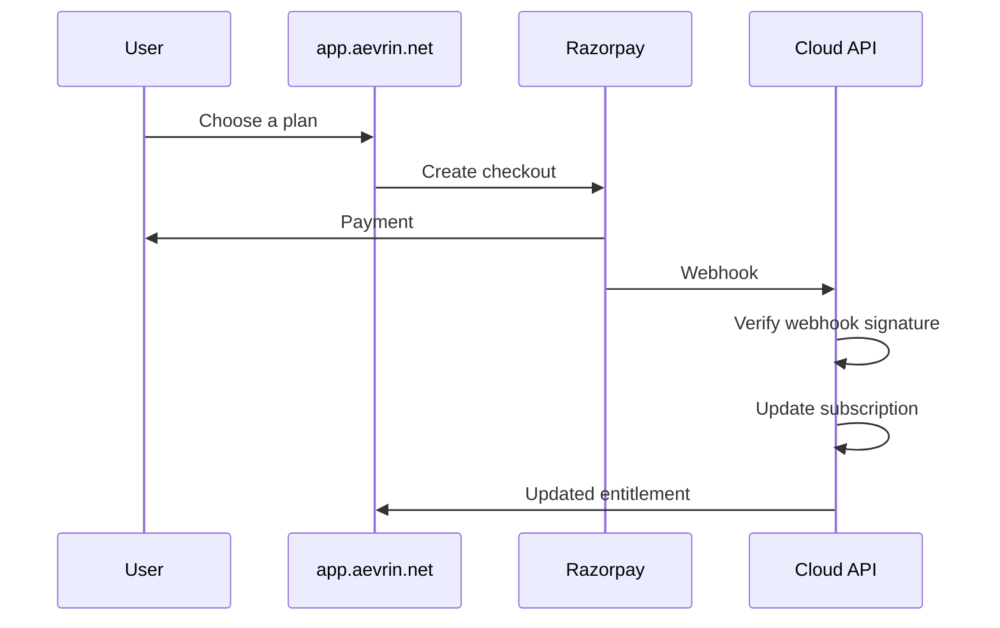
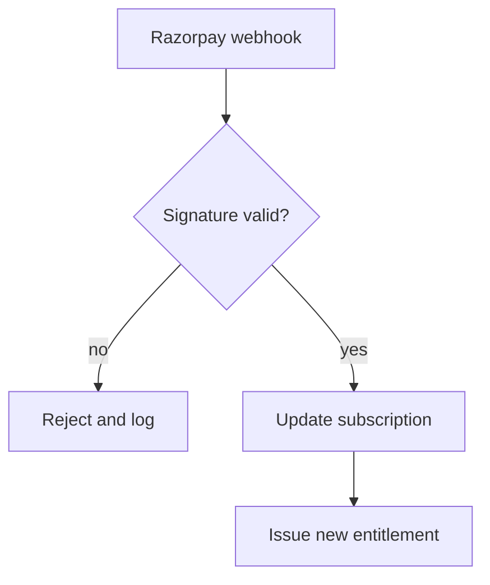

# Billing with Razorpay

> Read [`../security/entitlements.md`](../security/entitlements.md) first. This page is the single source
> of truth for how payment works. Razorpay is a payment provider. Billing lives entirely in the cloud
> control plane.

## Purpose

Users pay for a plan through Razorpay. Payment turns into an updated subscription, which turns into an
updated entitlement the local engine checks. The attack engine never touches billing.

## Hard rule: no Razorpay secret leaves the cloud

Razorpay secrets are never placed in:

```text
Docker
MCP
CLI
the local engine
```

Billing is a cloud-only concern. The local engine only ever sees the resulting signed entitlement, never a
payment credential. See [`../security/entitlements.md`](../security/entitlements.md).

## Payment flow



## Never trust the browser for payment success

The browser can be manipulated, so the cloud never treats a browser message as proof of payment. The truth
comes from the Razorpay webhook (a server-to-server message), verified server-side.

- The webhook signature is checked with HMAC SHA256 (a keyed hash) using the webhook secret as the key and
  the raw request body as the message. A mismatch is rejected.
- Only after the signature verifies does the cloud update the subscription.
- The subscription change then produces a new signed entitlement for the user's devices. See
  [`../security/entitlements.md`](../security/entitlements.md).



## What the cloud stores

The control plane stores the subscription state and plan, not raw card data. Card handling stays with
Razorpay. See [`../architecture/cloud-control-plane.md`](../architecture/cloud-control-plane.md).

## Failure cases

- Invalid webhook signature: rejected and logged; no subscription change.
- Duplicate webhook: handled so the same event does not apply twice.
- Webhook missed: the cloud can reconcile with Razorpay's API as a backstop; the user's existing
  entitlement stays valid until its expiry.

## Security considerations

- Razorpay keys and the webhook secret live only in the deploy secret store, never in the repo, logs, or
  docs. This repo is published.
- Entitlement changes are driven only by verified webhooks, not by client calls.

## Decisions

- Billing provider: [`../decisions/ADR-0016-billing-razorpay.md`](../decisions/ADR-0016-billing-razorpay.md).
