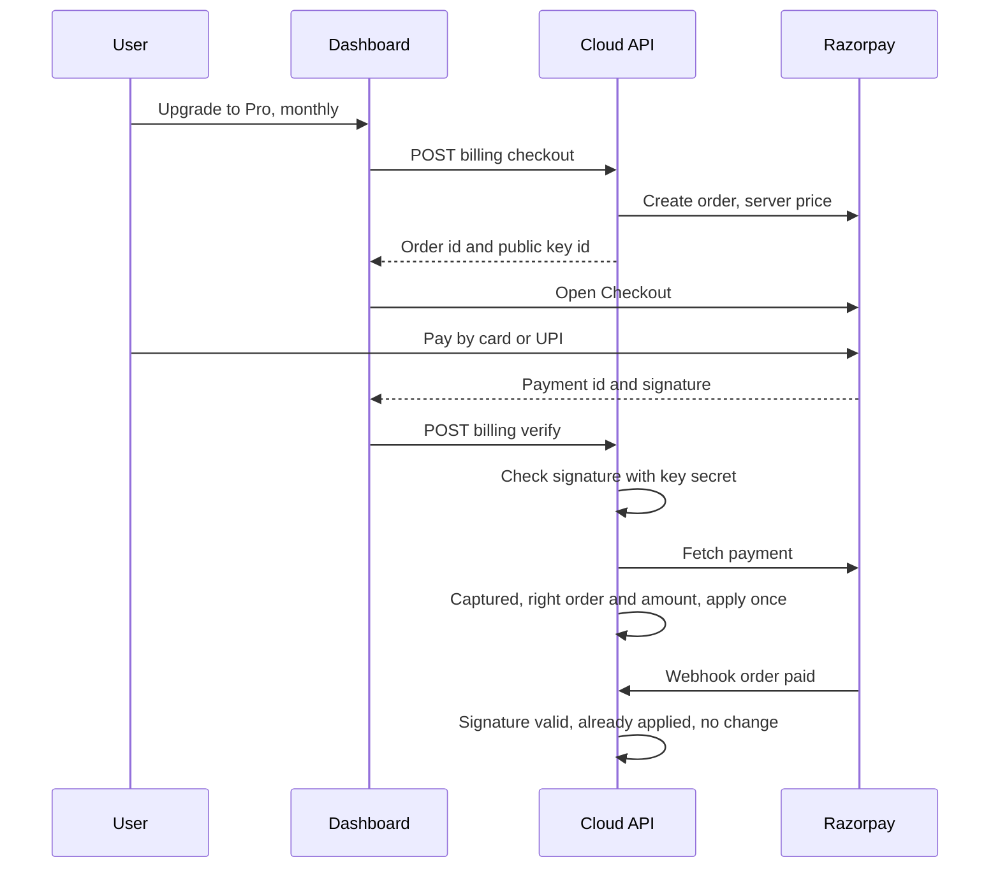
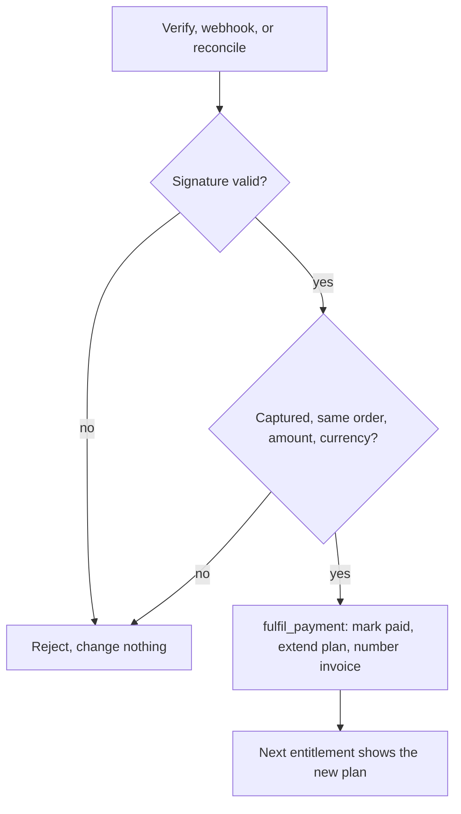

# Billing with Razorpay

> Read [`../security/entitlements.md`](../security/entitlements.md) first. This page is the single source
> of truth for how payment works. Prices are set in [`pricing.md`](pricing.md). Razorpay is a payment
> provider. Billing lives entirely in the cloud control plane.

## Purpose

Users pay for a plan through Razorpay. A confirmed payment extends the plan's paid-until date, which
changes the signed entitlement the local engine checks. The attack engine never touches billing.

## Hard rule: no Razorpay secret leaves the cloud

The Razorpay key secret and webhook secret are Worker secrets. They are never placed in Docker, MCP, the
CLI, the local engine, the browser, a log line, or this repo. Only the key id is sent to the browser,
because Razorpay Checkout needs it; it is public by design.

## Model: prepaid month or year

Pro is bought for **one month or one year up front** with a Razorpay Order. Nothing is charged
automatically. Buying again before the end adds the time to the current end date. When the paid-until date
passes, the account is on Free until the next purchase; synced data is kept. Why prepaid:
[`../decisions/ADR-0019-prepaid-billing.md`](../decisions/ADR-0019-prepaid-billing.md).

## Payment flow

## Payment success is decided on the server only

The browser can be manipulated, so a browser message is never proof of payment. A payment is applied in
one of three server-side ways, and all three call the same database function, `fulfil_payment`, which
applies an order **exactly once** inside a transaction with row locks:

1. **`POST /billing/verify`**: the server checks Checkout's signature (HMAC-SHA256 of
   `order_id|payment_id` with the key secret), **then fetches the payment from Razorpay** and checks that it
   is captured for this order, amount, and currency. An authorized payment is captured first.
2. **`POST /billing/webhook`**: Razorpay calls the API. The HMAC-SHA256 of the raw body with the webhook
   secret must match `X-Razorpay-Signature`. Repeated event ids (`X-Razorpay-Event-Id`) are skipped.
3. **Reconciliation**: `GET /subscription` asks Razorpay about the account's unpaid orders from the last 24
   hours. This covers a closed tab and a missed webhook.

## Account credit

Aevrin can add account credit (admin console). Credit is applied automatically at checkout: the order is
for the price minus the credit, never less than one rupee (Razorpay's minimum). If credit covers the whole
price, the purchase completes without Razorpay. Every change to the balance is recorded in
`credit_ledger` with a reason.

## Refunds

A full refund (from the admin console or the Razorpay dashboard, reported by the `refund.processed`
webhook) takes back the time that purchase bought and returns any credit applied to it. A partial refund
is recorded only.

## What the cloud stores

Migration `deploy/supabase/migrations/0004_billing.sql`:

- `subscriptions`: plan, status, paid-until date, interval, credit balance, admin bonus.
- `payments`: one row per order, with amount, credit applied, status, invoice number, and the period it
  bought. Users can read their own; only the server writes.
- `billing_events`: webhook event ids, for idempotency. Server only.
- `credit_ledger`: every credit change and why. Users can read their own.

No card or UPI data reaches Aevrin; it is entered in Razorpay's hosted form.

## Setting it up

1. Worker secrets `RAZORPAY_KEY_ID`, `RAZORPAY_KEY_SECRET`, `RAZORPAY_WEBHOOK_SECRET` (see
   [`../../deploy/cloudflare/README.md`](../../deploy/cloudflare/README.md)).
2. In the Razorpay dashboard, Settings, Webhooks, add `https://app.aevrin.net/api/v1/billing/webhook` with
   the same webhook secret and the events `payment.captured`, `order.paid`, `payment.failed`, and
   `refund.processed`.
3. Apply migration `0004_billing.sql`.

Billing still works without step 2 (verify and reconciliation confirm payments); the webhook makes
confirmation immediate when the tab is closed and records refunds made in the Razorpay dashboard.

## Failure cases

- Invalid signature on verify or webhook: rejected, nothing changes.
- Payment amount or currency differs from the order: rejected as a mismatch, nothing changes.
- Duplicate webhook or a second verify: `fulfil_payment` returns `already`, nothing changes.
- Webhook missed: verify or reconciliation applies the payment.
- Razorpay unreachable: checkout answers 502 with a plain message; no order row is left half done.
- Billing not configured: billing routes answer 503 and the Billing page disables the buttons.

## Security considerations

- The client sends only a plan and an interval. The amount comes from `src/shared/plans.json`.
- `fulfil_payment`, `refund_payment`, and `adjust_credit` are revoked from every client role; only the
  API's server key can call them. Users cannot write their subscription (read-only RLS policy).
- A user can only confirm their own order.

## Decisions

- Billing provider: [`../decisions/ADR-0016-billing-razorpay.md`](../decisions/ADR-0016-billing-razorpay.md).
- Prepaid orders and server confirmation: [`../decisions/ADR-0019-prepaid-billing.md`](../decisions/ADR-0019-prepaid-billing.md).
