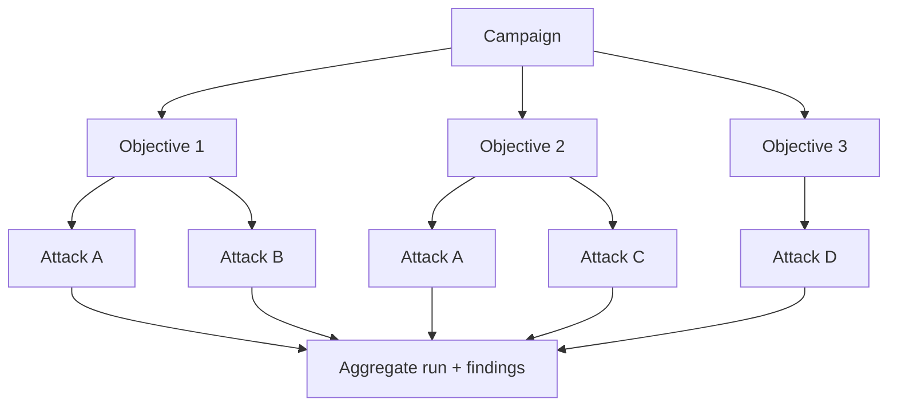

# Campaign engine

**Status: implemented (Phase 7).** Lives in `src/modelwrecker/campaigns/engine.py`; the attack loop
(`attacker/loop.py`) delegates scheduling to it. Configured by the `campaign:` section (see
[`../reference/CONFIGURATION.md`](../reference/CONFIGURATION.md)) and overridable from `modelwrecker run`
(`--concurrency`, `--stop-on`, `--max-objectives`, `--max-seconds`).

**Purpose.** Run many objectives against a target as one managed job, with budgets and limits, and
collect all findings together.

**Responsibilities.** Schedule objectives (parallel where safe), enforce budgets/limits/stop-conditions,
apply retry policy, aggregate results into one run with one report.

**Inputs.** A `Campaign` (objectives + budget + limits + stop conditions + retry policy).
**Outputs.** A `Run` with all attempts/findings and an aggregate report.
**Dependencies.** attack engine, reliability, findings, storage.
**Failure cases.** A single objective failing never kills the campaign; a budget/stop-condition hit ends
cleanly with partial results reported; every run has a wall-clock deadline and a cancel path.

## Shape

## Controls

- **Parallel execution** - objectives run concurrently up to `concurrency`, honored by a per-run
  `asyncio.Semaphore` (an Aevrin concurrency principle: scope pacing per run, don't mutate process-wide
  globals). The chat target and judge are stateless per call, so sharing them across objectives is safe.
- **Budgets** - `max_attempts` (strategy attempts), `max_tokens` (target prompt + completion tokens),
  `max_seconds` (wall-clock), and `max_objectives`. Checked before each objective and before each strategy,
  so a running objective stops cleanly rather than mid-attack. `max_seconds` falls back to
  `engine.deadline_seconds`.
- **Limits** - max rounds per objective (`engine.max_rounds`) and concurrency.
- **Stop conditions** (`stop_on`) - `first_finding` (stop scheduling once any finding lands), `budget`
  (run until a budget is hit), or `complete` (run every objective, the default).
- **Retry policy** - bounded retries (`retries`) on transient provider errors only; other errors are not
  retried, and any single objective's failure is isolated so it never kills the campaign (an Aevrin
  retry-cost principle).

Stopping is cooperative: no in-flight objective is hard-cancelled, so run artifacts are never torn.

## Reproducibility

A run snapshots its config (`config_snapshot`) so the whole campaign can be re-run. Backends are pinned
for reliability replays where possible. See
[`../attack-engine/RELIABILITY.md`](../attack-engine/RELIABILITY.md).

## Headless / CI

Campaigns run headless and emit JSON/SARIF; `--fail-on-finding` gates a build. See
[`../reference/CLI.md`](../reference/CLI.md).
