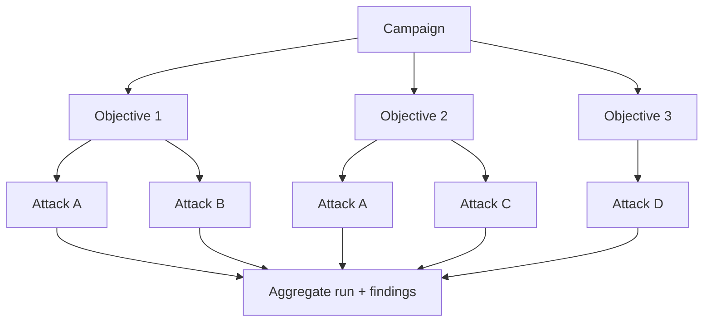

# Campaign engine

**Purpose.** Run many objectives against a target as one managed job, with budgets and limits, and
collect all findings together.

**Responsibilities.** Schedule objectives (parallel where safe), enforce budgets/limits/stop-conditions,
apply retry policy, aggregate results into one run with one report.

**Inputs.** A `Campaign` (objectives + budget + limits + stop conditions + retry policy).
**Outputs.** A `Run` with all attempts/findings and an aggregate report.
**Dependencies.** attack engine, reliability, findings, storage.
**Failure cases.** A single objective failing never kills the campaign; a budget/stop-condition hit ends
cleanly with partial results reported; every run has a wall-clock deadline and a cancel path.

## Shape

## Controls

- **Parallel execution** - objectives run concurrently within a concurrency limit; the limit is honored
  by a shared request gate (an Aevrin concurrency principle: scope pacing per run, don't mutate process-wide
  globals).
- **Budgets** - tokens, time, money, and attack counts; checked before each attempt.
- **Limits** - max rounds per objective, concurrency, model/provider limits.
- **Stop conditions** - stop on first finding, on budget exhaustion, on time, or run to completion.
- **Retry policy** - bounded retries on transient errors only; non-idempotent generation is not blindly
  retried (an Aevrin retry-cost principle).

## Reproducibility

A run snapshots its config (`config_snapshot`) so the whole campaign can be re-run. Backends are pinned
for reliability replays where possible. See
[`../attack-engine/RELIABILITY.md`](../attack-engine/RELIABILITY.md).

## Headless / CI

Campaigns run headless and emit JSON/SARIF; `--fail-on-finding` gates a build. See
[`../reference/CLI.md`](../reference/CLI.md).
