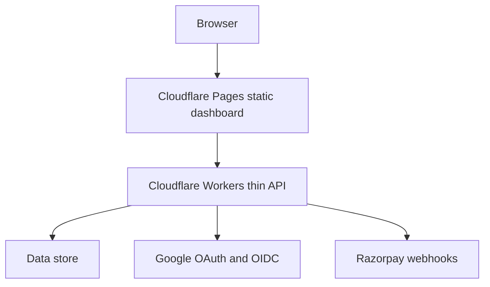
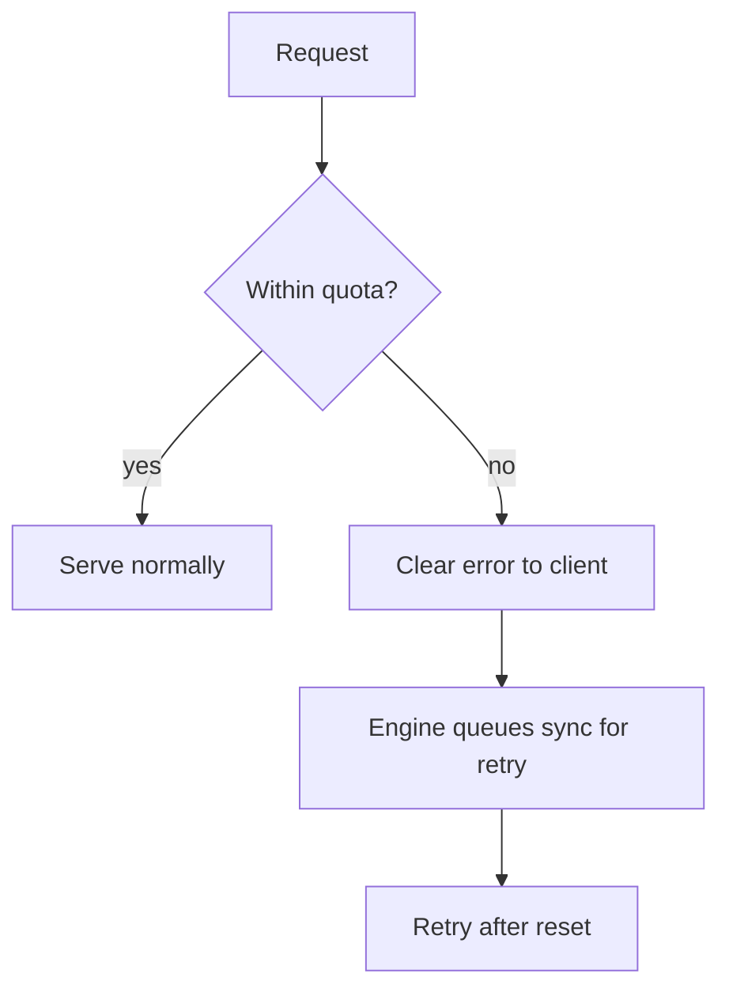

# Deploying the cloud control plane

> Read [`../architecture/cloud-control-plane.md`](../architecture/cloud-control-plane.md) first. This page
> covers hosting the thin control plane and the current free-tier limits. The data-layer choice is
> decided in [`../decisions/ADR-0015-data-layer.md`](../decisions/ADR-0015-data-layer.md).

## Purpose

Host the dashboard and the thin API so the control plane can start on free tiers and cost almost nothing at
small scale, while staying able to move to paid infrastructure later without rewriting the local engine.

## The plan

- **Cloudflare Pages**: serves the static dashboard and landing page. Static asset requests are free.
- **Cloudflare Workers**: runs the thin API and edge glue only. No heavy compute.
- **Data store**: Supabase Postgres with row-level security (decided, see
  [`../decisions/ADR-0015-data-layer.md`](../decisions/ADR-0015-data-layer.md)). The staged schema is
  `deploy/supabase/migrations/0001_init.sql`.

## The two web apps and auto-deploy

Both apps live in this repo and ship as one Cloudflare Pages project (`modelwrecker-app`) on one domain:

| App | Source | Served at |
|-----|--------|-----------|
| Landing page | `src/web` | `https://app.aevrin.net/` |
| Dashboard | `src/dash` | `https://app.aevrin.net/dashboard/` |

The workflow `.github/workflows/deploy-web.yml` runs on every push to `main` that changes `src/web/**` or
`src/dash/**`. It builds both apps, puts the dashboard under `/dashboard/`, writes the SPA fallback rules,
and deploys with Wrangler. It needs two GitHub secrets, `CLOUDFLARE_API_TOKEN` (Pages edit only) and
`CLOUDFLARE_ACCOUNT_ID`. The one-time setup steps, including the `app.aevrin.net` DNS record, are in
`deploy/cloudflare/README.md`.

Keep the dashboard mostly static and use Workers only for the required control-plane work. This keeps well
inside the free Workers request budget.

## Current free-tier limits

Free tiers are not unlimited. These are the limits to design around. They change, so re-check before
launch. Dates show when each was last confirmed during this research.

### Cloudflare, confirmed 2026

| Service | Free-tier limit | Behavior at quota |
|---------|-----------------|-------------------|
| Workers | 100,000 requests per day, resets at 00:00 UTC | Returns error 1027 when exceeded |
| Workers bundle | 64 MiB uncompressed | Deploy rejected if larger |
| Pages | Static assets free; 500 builds per month; 1 build at a time; up to 20,000 files per site; 100 projects per account | Build blocked past the monthly build count |
| D1 | 5 million rows read per day; 100,000 rows written per day; 5 GB total storage | Hard failure past the daily caps since 1 September 2026, until reset at 00:00 UTC |
| KV | 100,000 reads per day; 1,000 writes per day to different keys; 1 GB storage per account; value up to 25 MiB | Operations beyond the cap fail |
| R2 | 10 GB-month storage; 1 million class A operations per month; 10 million class B operations per month; egress free | Operations beyond the cap are billed or fail on a free account |

### Supabase, confirmed 2026

| Item | Free-tier limit |
|------|-----------------|
| Active free projects | 2 per organization |
| Database size | 500 MB per project |
| Monthly active users | 50,000 |
| Egress | 5 GB |
| File storage | 1 GB, 50 MB max file size |
| Edge Functions | 100 per project |
| Default rows returned per API query | 1,000 unless raised in settings |

Note: Supabase pauses free projects after a period of inactivity. Plan for a cold start or a keep-alive if
the dashboard must always respond.

## Graceful failure at quota

The design must fail cleanly, never silently, when a free quota is reached.

Rules:

- The API returns a clear, specific error when a quota is hit, not a generic failure.
- The local engine keeps results locally and retries sync later. No campaign result is lost because the
  cloud is at quota. See [`../architecture/data-flow.md`](../architecture/data-flow.md).
- The dashboard shows the last synced state and marks it stale rather than showing nothing. See
  [`../analytics/overview.md`](../analytics/overview.md).

## Migration to paid infrastructure

The local engine never depends on a specific cloud service, so moving to paid tiers or a different host
changes only the control plane. The boundary in [`../architecture/local-cloud.md`](../architecture/local-cloud.md)
is what makes this safe.

## Secrets

Hosting, OAuth, and billing credentials live only in the deploy secret store and local untracked files.
They are never committed, logged, printed, or named in anything that ships to a public repo or CDN. This
repo is published.

## Decisions

- Data layer (proposed): [`../decisions/ADR-0015-data-layer.md`](../decisions/ADR-0015-data-layer.md).
- Local and cloud boundary: [`../decisions/ADR-0014-local-cloud-boundary.md`](../decisions/ADR-0014-local-cloud-boundary.md).
