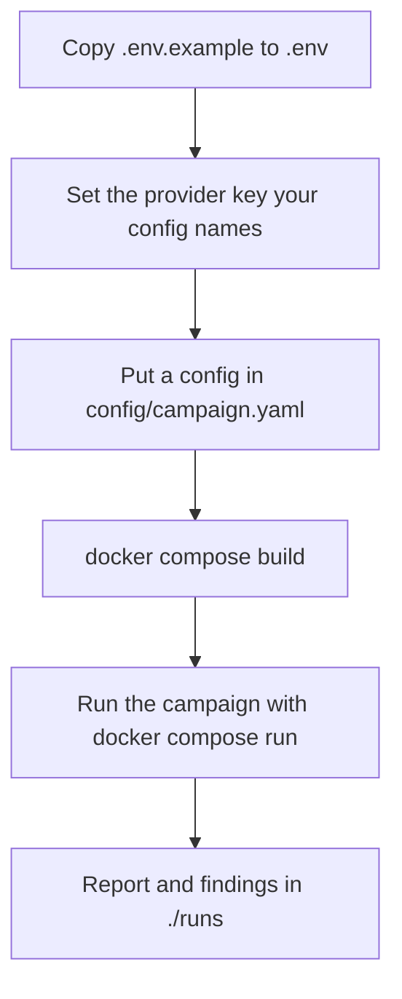

# Deploying the local engine with Docker

> Read [`../architecture/docker.md`](../architecture/docker.md) and [`../security/docker.md`](../security/docker.md)
> first. This page is the practical how-to for running the engine locally. The security rules it follows
> live in [`../security/docker.md`](../security/docker.md).

## Purpose

Get a user from "I have Docker" to "a campaign is running locally" with as few steps as practical. The
engine runs on the user's machine; the cloud is only the control plane (and that part is not built yet).

## What ships

| File | What it is |
|------|-----------|
| `Dockerfile` | Two-stage build. Installs the engine into `/opt/venv`, then copies only that venv into a pinned slim Python image that runs as uid `10001` |
| `docker-compose.yml` | One `modelwrecker` service with all the hardening flags from [`../security/docker.md`](../security/docker.md) already set |
| `.env.example` | Every environment variable the engine reads today, with placeholders. Copy it to `.env` |
| `.dockerignore` | Keeps `.env`, keys, `.git`, run output, tests, and docs out of the build context |

The image is not published to a registry yet, so you build it locally. Publishing a signed image is part of
the Phase 10 integrity work in [`../../ROADMAP.md`](../../ROADMAP.md).

## Quick start

From the repo root:

```bash
cp .env.example .env                       # then set the key your config names
mkdir config runs
cp examples/openrouter.yaml config/campaign.yaml
docker compose build
docker compose run --rm modelwrecker run /config/campaign.yaml
```

Results land in `./runs/<run-id>/` on your machine: `report.md`, `finding-*.json`, `evidence-*.json`,
`events.jsonl`, and `index.sqlite`. Both `config/` and `runs/` are git-ignored.

`docker compose up` runs the same `/config/campaign.yaml`. Any CLI command works through `run --rm`:

```bash
docker compose run --rm modelwrecker --help
docker compose run --rm modelwrecker validate /config/campaign.yaml
docker compose run --rm modelwrecker check /config/campaign.yaml
docker compose run --rm modelwrecker analyze /work/runs/<run-id>
```

Inside the container the working directory is `/work`, your configs are at `/config` (read-only), and run
output goes to `/work/runs`, which is your `./runs` folder. The full CLI is in
[`../reference/CLI.md`](../reference/CLI.md).

> **Git Bash on Windows:** Git Bash rewrites paths that start with `/`, so `/config/campaign.yaml`
> becomes a Windows path and the engine reports "config file not found". Run
> `export MSYS_NO_PATHCONV=1` first, or use PowerShell, which needs no workaround.

## Setup flow



Device registration and cloud sync come later (Phase 10.8). Today the container runs fully local.

## Without compose

The same hardening as a plain `docker run`. Use this if you do not want compose:

```bash
docker build -t modelwrecker:local .
docker run --rm -it \
  --init \
  --read-only --tmpfs /tmp:rw,noexec,nosuid,nodev,size=256m \
  --user 10001:10001 \
  --cap-drop ALL --security-opt no-new-privileges:true \
  --memory 2g --memory-swap 2g --cpus 2 --pids-limit 256 \
  --env-file .env -e HOME=/tmp \
  -v "$PWD/config:/config:ro" \
  -v "$PWD/runs:/work/runs" \
  --add-host host.docker.internal:host-gateway \
  modelwrecker:local run /config/campaign.yaml
```

In PowerShell, replace `$PWD` with `${PWD}` and the `\` line breaks with a backtick.

## Choosing extras

The default image has the core engine plus the `mcp` extra, about 300 MB. To add PyRIT strategies
(`pyrit_send`, `pyrit_pair`, `pyrit_tap`) or garak probes, rebuild with more extras:

```bash
# in .env
MODELWRECKER_EXTRAS=mcp,attacks
# then
docker compose build
```

Or without compose: `docker build --build-arg EXTRAS=mcp,attacks -t modelwrecker:local .`. The extras are
listed in `pyproject.toml`. With `attacks` the image is about 1.6 GB. Without `attacks`, the PyRIT
strategies simply do not register; everything else still runs.

## Local models

Inside the container, `localhost` means the container itself, not your machine. To reach a model served on
your machine, such as Ollama on port 11434, point the config at `host.docker.internal`:

```yaml
target:
  protocol: openai_compatible
  base_url: http://host.docker.internal:11434/v1
  model: llama3
  authorized: true

security:
  egress:
    allowed_schemes: [https, http]
    allow_hosts: [host.docker.internal]
```

The `security.egress` block is required. The egress guard only allows public HTTPS by default, so a model
on your machine is a narrow, explicit opt-in for exactly that host. Cloud metadata addresses stay blocked
even then. `modelwrecker validate` reports a blocked endpoint before the run starts.

The compose file maps `host.docker.internal` to the host on Linux too. Docker Desktop on Windows and macOS
already provides it.

## What to put in config

- The target definition, including an explicit `authorized: true` acknowledgement. The engine refuses to
  attack a target that is not marked authorized. See [`../targets/OVERVIEW.md`](../targets/OVERVIEW.md).
- Provider settings. Keys go in `.env`; the config holds only the env var **name** in `api_key_env`. See
  [`../reference/CONFIGURATION.md`](../reference/CONFIGURATION.md).
- Campaign budgets and stop conditions. See [`../campaigns/OVERVIEW.md`](../campaigns/OVERVIEW.md).

## Credentials

- Provider API keys come from `.env` through `env_file`. They are never baked into the image (`.env` is in
  `.dockerignore`) and are redacted from logs and evidence.
- There is no device or project token yet. When Phase 10.8 adds one, it will mount read-only and will never
  be the user's Google token. See [`../security/authentication.md`](../security/authentication.md).

## Linux file ownership

On Docker Desktop (Windows and macOS) the `./runs` mount is writable as is. On Linux, the container user
(uid `10001`) must be able to write `./runs`. Either run as yourself by setting
`MODELWRECKER_UID=$(id -u)` and `MODELWRECKER_GID=$(id -g)` in `.env`, or give the folder to uid `10001`
with `sudo chown 10001:10001 runs`.

## Offline use

The engine needs no cloud connection. With a local model it needs no internet either. Results stay in
`./runs`. When cloud sync exists (Phase 10.8) it will send summaries later; see
[`../architecture/data-flow.md`](../architecture/data-flow.md).

## Failure cases

| Symptom | Cause and fix |
|---------|---------------|
| `config error: config file not found: /config/...` | The file is not in `./config`, or Git Bash rewrote the path (see the note above) |
| `config file not found: C:/Program Files/Git/config/...` | Git Bash path rewriting. `export MSYS_NO_PATHCONV=1` |
| `Permission denied` under `/work/runs` | Linux ownership; see Linux file ownership above |
| Connection refused to `localhost` | Use `host.docker.internal` for a model on your machine |
| Container killed during a run | It hit the 2 GB memory cap. Lower campaign budgets or raise `mem_limit` in `docker-compose.yml` |
| Objective `errored ... unknown strategy 'pyrit_pair'` | The image was built without the `attacks` extra. Rebuild with it (see Choosing extras) |

Exit codes: `0` success, `2` config error.

## Verification status

Verified on Docker Desktop 29.6 (Windows, WSL2 engine) on 2026-10-02: build, `--help`, `validate`, and a
full offline campaign against a loopback stub (critical finding, 3 of 3 replays, artifacts written to
`./runs`, then `analyze`), and `docker compose up`. The `mcp,attacks` image ran `pyrit_send` to a finding
under the plain `docker run` flags above. The hardening flags were checked from inside the running
container. Native Linux and macOS hosts are not tested yet. See [`../testing/test-matrix.md`](../testing/test-matrix.md).

## Related

- Container shape and mounts: [`../architecture/docker.md`](../architecture/docker.md).
- Security rules: [`../security/docker.md`](../security/docker.md).
- Environment variables: [`../reference/ENVIRONMENT.md`](../reference/ENVIRONMENT.md).
- Other deployment shapes: [`../workflows/DEPLOYMENT.md`](../workflows/DEPLOYMENT.md).
