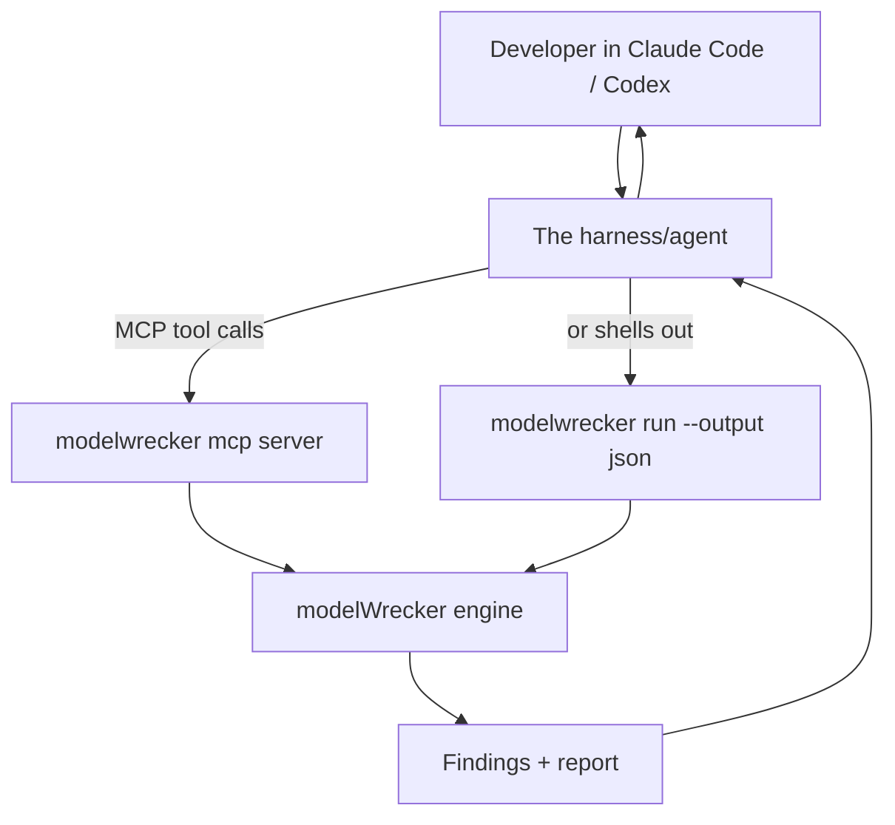

# Feature: harness integration

**Purpose.** Let a developer, from inside their own agentic coding harness (Claude Code, Codex, Cursor, or
any MCP client), say "use modelWrecker to try to break this model" and get a clear findings summary back,
without leaving the harness.

**Status: planned (Phase 9).** Decision: [`../decisions/ADR-0013-harness-integration.md`](../decisions/ADR-0013-harness-integration.md).

## How it works

The developer stays in their agent. The agent calls modelWrecker, which runs the attack loop, and hands
back structured findings the agent turns into a plain-language summary.

## Two ways to connect

1. **MCP server** - run `modelwrecker mcp`. It registers as an MCP server the harness can add. The harness
   then drives these **safe** tools:

   | Tool | What it does |
   |------|--------------|
   | `list_strategies` | show available attack strategies + what each needs |
   | `define_target` | describe the model/system to test (endpoint, type) |
   | `run_objective` | run one objective against the target, return the verdict + reliability |
   | `run_campaign` | run a set of objectives, return aggregate findings |
   | `get_findings` | fetch findings from a run |
   | `get_report` | render a report (md/json/sarif) |
   | `replay_finding` | reproduce a finding from its evidence |

2. **JSON driver** - for harnesses that are not MCP clients, shell out:
   `modelwrecker run target.yaml --output json`. The harness reads the structured result.

## What it returns

Structured findings (see [`../architecture/DATA-MODEL.md`](../architecture/DATA-MODEL.md)): each with
severity, taxonomy mapping, reliability, and a short summary. The harness can read these aloud, open an
issue, or gate a commit.

## Security (this surface is deliberately small)

- The MCP server exposes **only** the orchestration tools above. It never exposes shell, file-write, or
  arbitrary-HTTP host tools - the harness cannot use modelWrecker as a path to the host.
- All attacks still go through the egress guard; all output is redacted; authorization asserted by the
  developer is recorded in the run.
- Over stdio (local) no network auth is needed; any networked transport requires the auth token and
  refuses non-loopback binds without it. See [`../security/SECURITY.md`](../security/SECURITY.md).

## Example (what the developer experiences)

> Developer, in Claude Code: *"Use modelWrecker to see if my local model leaks its system prompt."*
> The agent calls `define_target` (the local Ollama endpoint) and `run_objective`
> (`system_prompt_leak`), modelWrecker runs and verifies, and the agent replies: *"modelWrecker ran a
> system-prompt-extraction strategy; it leaked the prompt on 7/8 replays (reliable), mapped to
> LLM07:2025. Here is the reproduction."*
