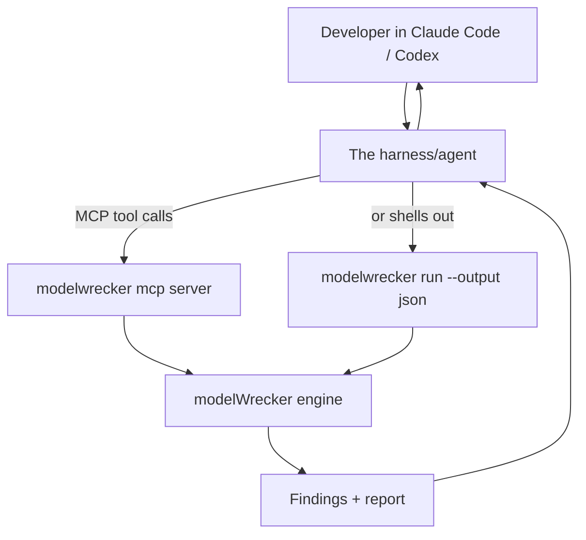

# Feature: harness integration

**Purpose.** Let a developer, from inside their own agentic coding harness (Claude Code, Codex, Cursor, or
any MCP client), say "use modelWrecker to try to break this model" and get a clear findings summary back,
without leaving the harness.

**Status: implemented and tested.** The MCP server (`modelwrecker mcp`) and the JSON driver
(`modelwrecker run --output json`) both work; a real MCP client round-trip and the guardrails are covered
by `tests/test_mcp.py`. Decision: [`../decisions/ADR-0013-harness-integration.md`](../decisions/ADR-0013-harness-integration.md).

To add it to a client such as Claude Code, register a stdio MCP server that runs `modelwrecker mcp`.
Use `--config-dir` to name the only folder the server reads configs from, and `--runs-dir` for the
folder it keeps runs in.

## How it works

The developer stays in their agent. The agent calls modelWrecker, which runs the attack loop, and hands
back structured findings the agent turns into a plain-language summary.

## Two ways to connect

1. **MCP server** - run `modelwrecker mcp`. It registers as an MCP server the harness can add. The harness
   then drives a small set of **safe** tools: `list_strategies`, `validate_config`, `run`,
   `get_findings`, `get_report`, and `replay`. The full list, with arguments, is in
   [`../mcp/tools.md`](../mcp/tools.md). The target always comes from a config file the developer wrote
   and marked `authorized: true`; no tool can name or change a target.

2. **JSON driver** - for harnesses that are not MCP clients, shell out:
   `modelwrecker run target.yaml --output json`. The harness reads the structured result.

## What it returns

Structured findings (see [`../architecture/DATA-MODEL.md`](../architecture/DATA-MODEL.md)): each with
severity, taxonomy mapping, reliability, and a short summary. The harness can read these aloud, open an
issue, or gate a commit.

## Security (this surface is deliberately small)

- The MCP server exposes **only** the orchestration tools above. It never exposes shell, file-write, or
  arbitrary-HTTP host tools - the harness cannot use modelWrecker as a path to the host.
- Every tool call passes the MCP guardrail chain: tool and argument allowlist, rate limits, path scope,
  target scope, an entitlement hook, and resource limits on the size and length of a run. A refused call
  returns a clear error code and runs nothing. See [`../security/mcp.md`](../security/mcp.md).
- Output is redacted, and refusals are logged with secrets redacted.
- Over stdio (local) no network auth is needed; any networked transport requires auth and refuses
  non-loopback binds without it. See [`../security/SECURITY.md`](../security/SECURITY.md).

## Example (what the developer experiences)

> Developer, in Claude Code: *"Use modelWrecker to see if my local model leaks its system prompt."*
> The agent calls `validate_config` and then `run` on `local-model.yaml` (a config the developer wrote
> for their local Ollama model, with `authorized: true` and a `system_prompt_leak` objective).
> modelWrecker runs and verifies, and the agent replies: *"modelWrecker ran a
> system-prompt-extraction strategy; it leaked the prompt on 7/8 replays (reliable), mapped to
> LLM07:2025. Here is the reproduction."*
