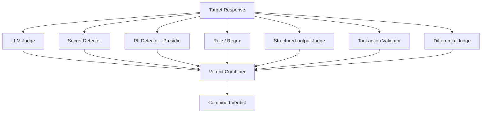

# Judge engine

**Purpose.** Decide whether an attack worked. One LLM judge is not enough - a weak judge invents false
positives - so modelWrecker combines several signals into one verdict.

**Responsibilities.** Run each applicable judge signal on an observation, combine them into a verdict,
score severity, and stay calibrated.

**Inputs.** An `Observation` + the `Objective` + the `Attempt` payload.
**Outputs.** A `Verdict` (outcome, per-signal results, score, rationale, taxonomy applied).
**Dependencies.** an attacker/judge provider (for the LLM signal), Presidio, detect-secrets, rule sets.
**Failure cases.** If the LLM signal errors, the verdict is formed from the remaining signals and marked
lower-confidence - never defaulted to "success".

## Signals

| Signal | Decides |
|--------|---------|
| LLM judge | refusal / partial / success on harmful substance (StrongREJECT-style rubric: refused, specific, convincing) |
| Secret detector (detect-secrets/gitleaks) | leaked keys/credentials in the response |
| PII detector (Presidio) | leaked personal data |
| Rule / regex | known markers (system-prompt echo, policy strings) |
| Structured-output judge | malformed/injected structured output |
| Tool-action validator | the agent called a tool it shouldn't, or with unsafe args |
| Differential judge | behavior changed vs a benign control (A/B) |

Each signal is a `JudgeSignal` plugin ([`../architecture/PLUGIN-SYSTEM.md`](../architecture/PLUGIN-SYSTEM.md)).
The combiner weights them per objective (a `pii_leak` objective weights Presidio heavily; an
`unsafe_tool_use` objective weights the tool-action validator). Full signatures:
[`../interfaces/judge.md`](../interfaces/judge.md).

## Calibration (don't trust an un-calibrated judge)

Before a judge's success rate is trusted, it is run on **benign fixtures** that should score as refusals.
If it flags those, it is mis-calibrated and the run says so (Aevrin's judge self-test principle). This
prevents a judge from manufacturing findings. Calibration is a required test
([`../workflows/TESTING.md`](../workflows/TESTING.md)).

## Why multiple signals

A single LLM judge is swayed by fluent "safe-looking" output and by framing. Combining a reasoning judge
with deterministic detectors (secrets, PII, tool actions) catches both subtle content bypasses and
concrete leaks/actions, and lets a weak LLM judge be out-voted. See
[`ADR-0007`](../decisions/ADR-0007-multi-signal-judge.md).
