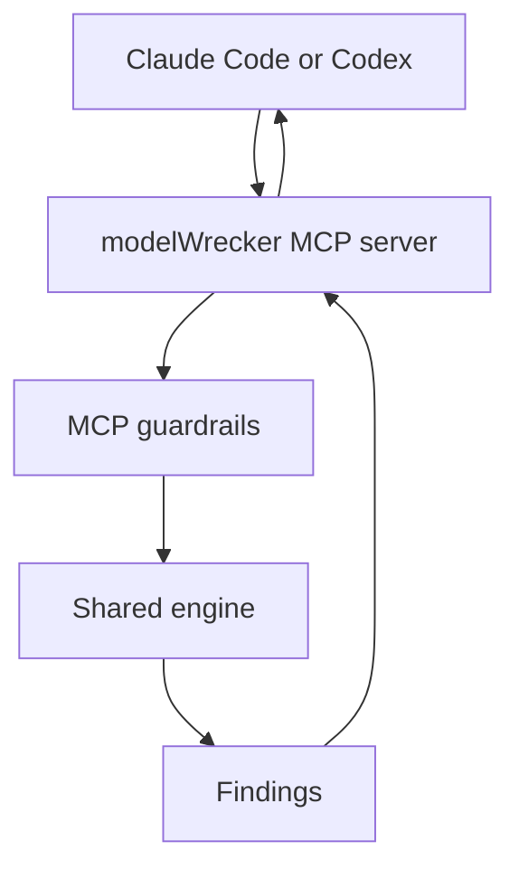

# MCP server overview

> Read [`../architecture/local-cloud.md`](../architecture/local-cloud.md) first. This page explains what
> the modelWrecker MCP server is and how it fits the product. The tool list is in [`tools.md`](tools.md);
> the guardrails are in [`../security/mcp.md`](../security/mcp.md).

## Purpose

MCP (Model Context Protocol) is a standard way for an AI agent, such as Claude Code or Codex, to call an
external tool. The modelWrecker MCP server lets a developer, from inside their coding agent, say "use
modelWrecker to try to break this model" and get a findings summary back, without leaving the agent.

The MCP server is **another interface to the same engine**. It is not a second attack engine. It calls the
same core the CLI uses. See the shared-engine rule in
[`../architecture/local-cloud.md`](../architecture/local-cloud.md).

## Where it runs

The MCP server runs inside the local Docker container (or alongside a local install), on the user's
machine. It drives local compute, exactly like the CLI. It never runs attacks in the cloud.

The guardrails box is not optional. Every request passes the ordered checks in
[`../security/mcp.md`](../security/mcp.md) before the engine runs anything.

## What it is good for

- Orchestration from an agent: check a config, run it against its authorized target, fetch findings and
  the report, and get a finding's reproduction steps. Campaign-shaped tools (create, start, stop, status)
  are planned. See [`tools.md`](tools.md).
- Fitting modelWrecker into an existing agent workflow the way Aevrin already meets developers.

## What it is not

- Not a shell. It never runs host commands.
- Not a network proxy. It never makes arbitrary outbound requests on request.
- Not a file browser. It never gives arbitrary file-system access.
- Not a separate engine. It shares the CLI's engine.

## Transports

- **Local stdio**: standard input and output on the same machine. No network surface, so no network auth.
  This is the current harness integration shape. See
  [`../features/harness-integration.md`](../features/harness-integration.md).
- **Remote over HTTP**: Streamable HTTP with bearer-token auth following the MCP authorization model built
  on OAuth 2.1. See [`../security/mcp.md`](../security/mcp.md).

## Relationship to MCP targets

modelWrecker also *attacks* MCP-connected systems as targets. That is a different use of MCP and lives in
[`../targets/OVERVIEW.md`](../targets/OVERVIEW.md). This page is about modelWrecker exposing its own MCP
server so an agent can drive it.

## Decisions

- Harness integration: [`../decisions/ADR-0013-harness-integration.md`](../decisions/ADR-0013-harness-integration.md).
