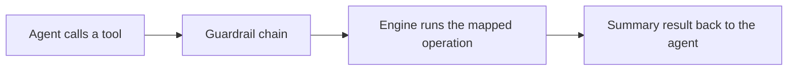

# MCP tools

> Read [`overview.md`](overview.md) and [`../security/mcp.md`](../security/mcp.md) first. This page lists
> the safe, high-level tools the MCP server exposes and what each one does.

## Purpose

The MCP server exposes a small set of orchestration tools only. Each tool maps to an engine operation the
CLI already supports. There is no low-level or host-affecting tool.

## The tools (built today)

This table is the allowlist. A tool that is not here does not exist, and each tool accepts only the
arguments listed. Any other argument is refused (see [`../security/mcp.md`](../security/mcp.md)).

| Tool | Arguments | What it does |
|------|-----------|--------------|
| `list_strategies` | none | List the attack strategies and what each one needs |
| `validate_config` | `config_path` | Check a config file: schema, roles, authorization, objectives |
| `run` | `config_path`, optional `run_id` | Run the config's objectives against its authorized target and return a findings summary |
| `get_findings` | `run_id` | List finding metadata for a finished run |
| `get_report` | `run_id` | Render the markdown report for a finished run |
| `replay` | `run_id`, `evidence_id` | Return the reproduction payload and steps for a recorded finding |

- `config_path` is a `.yaml` or `.yml` file inside the server's config folder (`--config-dir`).
- `run_id` and `evidence_id` are single plain names inside the runs folder (`--runs-dir`).
- `run` is the only tool that starts the engine. It passes the full chain: target scope, entitlement,
  resource limits, and the run rate limit. The other tools are read-only and pass tool permission, the
  call rate limit, and path scope.

Every call passes the guardrail chain in [`../security/mcp.md`](../security/mcp.md) before the engine
runs. A call that fails any check is refused with a clear error code and nothing runs.

## Planned tools

Phase 10.5 moves toward campaign-shaped tools: `create_campaign`, `list_targets`, `start_campaign`,
`get_campaign`, `get_finding`, `replay_finding`, `stop_campaign`, and `get_status`. Each one will join the
allowlist only when it is built, and each will pass the same chain. See
[`../../ROADMAP.md`](../../ROADMAP.md).

## What is deliberately missing

```text
no run_shell
no http_request
no read_file or write_file
no raw provider or credential access
no way to pass a target or endpoint in a tool call
no way to change the MCP limits from a tool call
```

If a capability is not on the table above, the MCP server does not offer it. New tools are added only when
they are safe, high-level, and map to an existing engine operation.

## Request shape



Results are summaries suitable for an agent to relay: status, counts, severities, and finding metadata.
Raw transcripts are not returned by `run` or `get_findings`, matching the privacy rule in
[`../architecture/data-flow.md`](../architecture/data-flow.md). `get_report` and `replay` return the
report and the reproduction payload for a run on the user's own machine.

## Target authorization

Before a run starts, the target must be defined in the config file and explicitly marked
`authorized: true`. The MCP server never attacks an arbitrary target on request, and no tool argument can
name or change a target. See [`../targets/OVERVIEW.md`](../targets/OVERVIEW.md) and the target-scope check
in [`../security/mcp.md`](../security/mcp.md).

## Decisions

- Safe-tools-only rule: [`../decisions/ADR-0013-harness-integration.md`](../decisions/ADR-0013-harness-integration.md).
