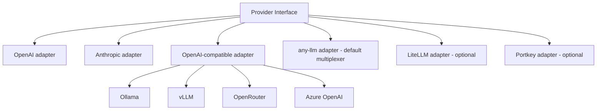

# Provider layer

**Purpose.** Move bytes to and from models. Nothing else. The provider layer is completely independent
of the attack engine and contains **no attack logic** (`../../CLAUDE.md` core rule).

**Responsibilities.** Given an endpoint config and messages, return a completion or a stream; count
tokens; report capabilities; health-check. Own the HTTP client lifecycle.

**Inputs.** An `Endpoint` (protocol, base_url, model, auth, params) + messages.
**Outputs.** A completion / stream of events; token counts; a capability report.
**Dependencies.** httpx; official SDKs (`openai`, `anthropic`); optionally `any-llm` or a gateway.
**Failure cases.** Network errors become clean typed failures (no crashes on timeout - basic
hygiene); a bad protocol is rejected at config load.
**Security.** Keys come from env/secret store, never written by an unauthenticated request; outbound
discovery never attaches a key to a freshly-changed `base_url`; see
[`../security/SECURITY.md`](../security/SECURITY.md).

## The interface (small on purpose)

Only what the engine actually needs:

```text
generate(messages, **params) -> Completion
stream(messages, **params)   -> AsyncIterator[StreamEvent]
count_tokens(messages)       -> int
capabilities()               -> ProviderCapabilities
health_check()               -> HealthStatus
```

Full signatures: [`../interfaces/provider.md`](../interfaces/provider.md).

## Adapters



- **OpenAI** and **Anthropic** - official SDKs, first-class, always available.
- **OpenAI-compatible** - one adapter covers Ollama, vLLM, OpenRouter, Azure OpenAI, Groq, Together,
  and any OpenAI-wire endpoint via `base_url`. This is the self-hostable baseline that needs no gateway.
- **any-llm** (Mozilla, Apache-2.0) - the **default multiplexer**. It is a library, not a proxy, so it
  reaches many providers behind our interface without standing up a gateway service. It is the default
  because it gives breadth at low maintenance cost while staying fully self-hostable.
- **LiteLLM / Portkey** - optional adapters for teams that already run them. **Neither is required.** The
  LiteLLM adapter is optional specifically because of its enterprise split and the Mar-2026 supply-chain
  incident. See [`ADR-0003`](../decisions/ADR-0003-provider-abstraction.md) and
  [`../research/oss-landscape.md`](../research/oss-landscape.md).

Default stack: **any-llm as the multiplexer**, with the direct OpenAI / Anthropic / OpenAI-compatible
adapters as first-class fallbacks that keep the engine working even if any-llm is removed.

## Separate models per role

Config sets independent endpoints for attacker, target, and judge:

```text
attacker = Claude Opus      target = GPT-4o      judge = Claude Sonnet
# or, fully local:
attacker = Ollama/llama     target = vLLM/model  judge = Ollama/llama
```

The engine never cares which provider is underneath. Both the all-cloud and all-local configurations
are first-class ([`ADR-0003`](../decisions/ADR-0003-provider-abstraction.md)).

## Client lifecycle

Providers are built and owned by the engine's run context and closed once at the run boundary - **not**
constructed ad hoc inside strategies/tools. Strategies receive a provider via context. This avoids the
pooled-client leak that appears when providers are built ad hoc across many call sites. See
[`../interfaces/provider.md`](../interfaces/provider.md).
