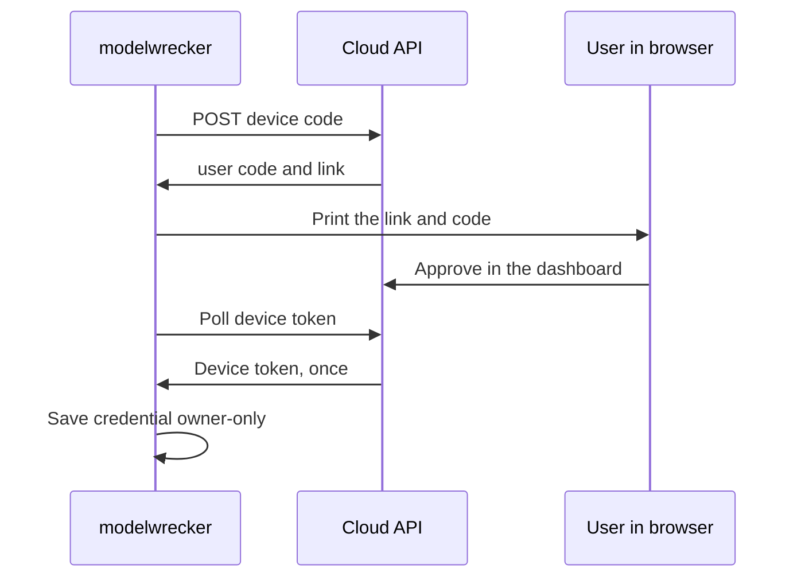

# CLI reference

The CLI is Typer-based. This is the source of truth for the CLI; update it with every command/flag
change. Binary: `modelwrecker`.

## Commands

```bash
modelwrecker init       my.yaml                    # write a starter config to edit
modelwrecker validate   my.yaml                    # full pre-run checks: roles, authorization, objectives, egress
modelwrecker check      my.yaml                    # load the config and print a summary, incl. which API keys resolve
modelwrecker provider test my.yaml --role target   # one small live request: latency, tokens, errors
modelwrecker run        my.yaml  --output md|json  # run all objectives, verify, write a report
modelwrecker report     runs/<run-id> --output md|json  # re-render a finished run's findings and transcript
modelwrecker analyze    runs/<run-id> [more...]    # ASR analytics + leaderboard as static HTML/JSON/CSV
modelwrecker replay     evidence.json              # print a finding's recorded payload (re-run not built, #52)
modelwrecker strategies                            # list registered strategies + required capabilities
modelwrecker transforms                            # list payload transforms (first-party + PyRIT)
modelwrecker mcp        --runs-dir runs --config-dir .  # start the harness MCP server over stdio (ADR-0013)
modelwrecker login      [--name my-laptop]         # connect this install to the dashboard as a device
modelwrecker logout                                # remove the saved device credential
modelwrecker plan       [--refresh]                # show the plan in force and this month's usage
modelwrecker sync       --runs-dir runs [--dry-run] [--resync] [--metadata-only]  # list, then send
modelwrecker version                               # same as: modelwrecker --version (or -V)
```

`run` options: `--output md|json` (default `md`), `--out-dir runs` (where artifacts go). Campaign
overrides (they override the config's `campaign:` section): `--concurrency N` (objectives in parallel),
`--stop-on complete|first_finding|budget`, `--max-objectives N`, `--max-seconds N`. See
[`../campaigns/OVERVIEW.md`](../campaigns/OVERVIEW.md). `--sync/--no-sync` controls the dashboard
upload after the run; the default sends the summary only when this install is signed in (see below).
`provider test` option: `--role attacker|target|judge` (default `target`).
`mcp` options: `--runs-dir` (default `runs`, where runs are kept) and `--config-dir` (default `.`, the
only folder the server reads config files from). MCP runs also obey the MCP guardrails and limits in
[`../security/mcp.md`](../security/mcp.md).
`report` options: `--output md|json` (default `md`); exit `2` if the folder is not a run directory.
`replay`: prints the payload recorded in an `evidence-*.json` file and says that re-sending it to the
target is not built yet (#52). Exit `1` if the evidence file is missing. The evidence file holds the full
payload and steps to reproduce the finding by hand.
`analyze` options: one or more run directories; `--out-dir` (default: each run's own dir),
`--formats html,json,csv`. With two or more runs it also writes a `leaderboard.*`. Output is static
files only - no server. See [`../attack-engine/ANALYTICS.md`](../attack-engine/ANALYTICS.md).

## Your plan (issue #11)

The plan check in `run` and the `plan` command are merged on `main` but not in a PyPI release yet; the
current release (0.0.2) runs without a plan check.

`run` checks your plan before it creates anything or calls a model (see
[`../security/entitlements.md`](../security/entitlements.md)). Without a valid signed entitlement it uses
the free baseline. A run the plan does not allow (an MCP target, an explicitly chosen PyRIT or garak
strategy, or a month with no runs or attempts left) stops with `not allowed by your plan: ...` and exit
code 2. Auto-selected strategies the plan lacks are skipped with a note.

| Command | What it does |
|---------|--------------|
| `modelwrecker plan` | Show the plan in force, where it came from (signed, or free baseline and why), when it expires, the monthly limits, and this month's usage. |
| `modelwrecker plan --refresh` | Fetch a fresh signed entitlement first (needs `login`). Run it after buying or changing a plan. |

`login` fetches the entitlement right away, `sync` refreshes it with the heartbeat, and `run` refreshes it
when the stored one is over 12 hours old. `logout` removes it.

## Dashboard sign-in and sync (Phase 10.4, 10.8, 10.9)

These commands connect a local install to the dashboard. By default they only send summary metadata
(counts, rates, finding titles, severity, taxonomy ids). Prompts and model responses leave the machine
only if you turn on evidence or transcript sync in the dashboard (see `sync` below). Endpoint URLs,
API keys, and the run's configuration never leave the machine. Code: `src/modelwrecker/cloud`. Contract:
[`../architecture/control-plane-api.md`](../architecture/control-plane-api.md).



- `login` uses the OAuth 2.0 device sign-in (the flow where the CLI shows a code and you approve it in
  a browser). It prints a link and a short code, then waits. It honors the server's poll `interval` and
  waits 5 seconds longer after each `slow_down`. It stops on approval, denial, or expiry. On success it
  saves the credential and prints the device id. It never prints the token. `--name` sets the device
  name shown in the dashboard (default: the hostname). Exit `1` if denied, expired, or unreachable;
  exit `2` if the cloud URL is not allowed.
- `logout` deletes the saved credential file. It does not revoke the token on the server; revoke the
  device in the dashboard for that.
- `sync` sends every run folder under `--runs-dir` (default `runs`) that is not synced yet, one run
  at a time. It first lists each of those runs (folder, target model and provider, attempts, findings,
  start time), then sends them and prints how many were synced, kept for retry, or refused.
  `--dry-run` prints the same list and sends nothing. It needs no sign-in; when signed in it asks the
  API which detail is on (one heartbeat) so the list is accurate. Check it before a first sync from a
  folder that may hold old or test runs.
- What `sync` sends: summary metadata always. Per finding evidence (prompt sent, model reply, judge
  verdict) and per run transcripts (every attempt) only when they are turned on in the dashboard
  (Settings, What syncs to Aevrin); `sync` reads that setting first and prints what it will include.
  Detail is redacted for secrets and capped in size. When detail is turned on later, runs that were
  synced without it are listed as `[synced before, sending again]` and sent again with it, so old runs
  are back-filled.
- `--resync` sends every run again, including runs already synced (safe: the API updates in place).
  `--metadata-only` never sends evidence or transcripts, whatever the dashboard says. A run counts as synced only
  after the API answers `200`; it then gets a `.synced.json` marker in its folder. If the cloud is
  down or busy (network error, `5xx`, `429`), the run stays queued and the exit code is `0`. The exit
  code is `1` only when the API refused a run (another `4xx`, for example a revoked token) or when
  this install is not signed in.
- `run` sends the new run's summary right after it finishes, if a credential exists, with the same
  detail rules as `sync`. `--no-sync`
  skips it; `--sync` asks for it and prints a note if you are not signed in. A sync failure after
  `run` prints a warning only: it never changes the exit code and the run stays queued for `sync`.

Where the credential lives: `MODELWRECKER_DEVICE_TOKEN` first (for CI), else
`~/.config/modelwrecker/device.json` (or `$XDG_CONFIG_HOME/modelwrecker/device.json`), or
`%APPDATA%\modelwrecker\device.json` on Windows. The file is written atomically with `0600`
permissions (best effort on Windows). A saved credential is only sent to the URL it was issued for;
if `MODELWRECKER_CLOUD_URL` points elsewhere, `sync` refuses and asks you to `login` again. See
[`ENVIRONMENT.md`](ENVIRONMENT.md) and [`../security/authentication.md`](../security/authentication.md).

```bash
modelwrecker login                 # open the printed link, check the code, approve
modelwrecker run my.yaml           # results sync automatically while signed in
modelwrecker sync --dry-run        # see which runs would be sent
modelwrecker sync                  # push anything that was queued while offline
```

## Planned (later phases)

- `attack` - run a single quick objective.
- `--output sarif|html`, `--fail-on-finding`, `--ci`, `--headless` (CI modes).
- `run --remote` - call the authenticated REST API with the device token. Not built.
- `replay` that re-sends a finding's payload to the target and re-judges it (#52).

The `mcp` server and a JSON driver are implemented; see
[`../features/harness-integration.md`](../features/harness-integration.md).

## Safety behavior

- `login` and `sync` talk only to the cloud API over https (plain http is allowed only for
  `localhost` and `127.0.0.1`, for local development). They never follow redirects.
- No command opens a network listener. (A future `api`/`mcp` surface requires an auth token and refuses
  non-loopback binds without auth - see [`../security/SECURITY.md`](../security/SECURITY.md).)
- `run` refuses a target that is not marked `authorized: true`.
- Host-affecting tools stay off by default; there is no flag that silently enables them.
- Errors return a non-zero exit code with a useful message, not a stack trace: config errors and runs
  not allowed by your plan exit `2`, a failed run exits `1`. A run that produces findings still exits `0`
  (a `--fail-on-finding` mode is planned).

## Examples

```bash
# Fully local, free run against an Ollama model (no API key; the file opts in to the local address)
modelwrecker run examples/local-model.yaml

# Through OpenRouter, JSON output
export OPENROUTER_API_KEY=sk-or-...
modelwrecker run examples/openrouter.yaml --output json

# Check connectivity before spending anything
modelwrecker provider test examples/openrouter.yaml --role target
```
