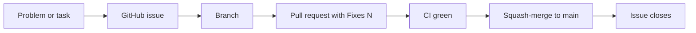

# Git workflow

How every change reaches `main`. The short version: **issue first, branch, pull request, squash-merge,
issue closes**. Docs change in the same pull request as the code.



## 1. Open an issue first

Every problem or piece of work gets a GitHub issue in `Aevrin-ai/modelWrecker` **before** it is fixed:
a bug you hit, a bug you notice in passing, a gap found during review, a roadmap item you start.

- Use a template: **Bug** for something broken, **Task** for planned or maintenance work.
- Title says what is wrong or what will exist, in plain words.
- Labels: one type (`bug`, `enhancement`, `documentation`, `chore`, `roadmap`, `security`) and one area
  (`engine`, `cloud`, `web`).
- If a problem is found and fixed in one sitting, still open the issue, then close it from the pull request.
  The issue list is the record of what went wrong and why.
- Security problems that could hurt users if published: do not open a public issue. Fix privately first,
  then open the issue with the details once the fix is released.

## 2. Branch

Never commit straight to `main`. Name the branch after the issue:

```text
fix/<issue>-<short-slug>      # a bug          e.g. fix/3-sync-preview
feat/<issue>-<short-slug>     # a new feature
docs/<issue>-<short-slug>     # docs only
chore/<issue>-<short-slug>    # cleanup, CI, tooling
```

## 3. Commit

- Conventional style: `type(scope): what changed`, for example `fix(engine): sync lists runs before sending (#3)`.
- Put the issue number in the subject as `(#N)`.
- **No AI co-author lines.** Never add `Co-Authored-By:` trailers for an AI tool, and never add
  "Generated with ..." lines to commits, pull requests, or issues. Commits carry the maintainer's identity only.
- Never commit secrets. Hosted-platform credentials stay in local untracked files and the deploy secret store
  (see `CLAUDE.md` Security rules).

## 4. Pull request

- Body starts with `Fixes #N` (or `Closes #N`), so merging closes the issue.
- Fill in the template: what changed, how it was tested (honest PASS / FAIL / NOT TESTED), which docs changed.
- Code and docs go together. Use `docs/DOCUMENTATION.md` to find the docs a change touches, and update
  `CLAUDE.md` when a long-term rule changes.

## 5. Merge

- Wait for CI to pass (`.github/workflows/ci.yml`).
- **Squash-merge**, then delete the branch. One commit per issue keeps `main` readable.
- Merging to `main` redeploys whatever the change touched (site, API) through the deploy workflows.

## 6. After the merge

- Check the issue closed. If the fix needs a follow-up (a live check, a maintainer step), leave a comment and
  open a new issue for it instead of reopening.
- A user-visible change also gets a `CHANGELOG.md` line in the same pull request.

## Releases

Bump the version in `pyproject.toml` in a pull request, merge it, then tag `main`:

```bash
git tag -a v0.0.2 -m "modelwrecker 0.0.2"
git push origin v0.0.2   # publish-pypi.yml tests, builds, and publishes
```

## Rewriting history

Rewriting published history (force-pushing `main` or moving a release tag) is a last resort. It needs the
maintainer's explicit go-ahead at the time, and an issue that explains why.
