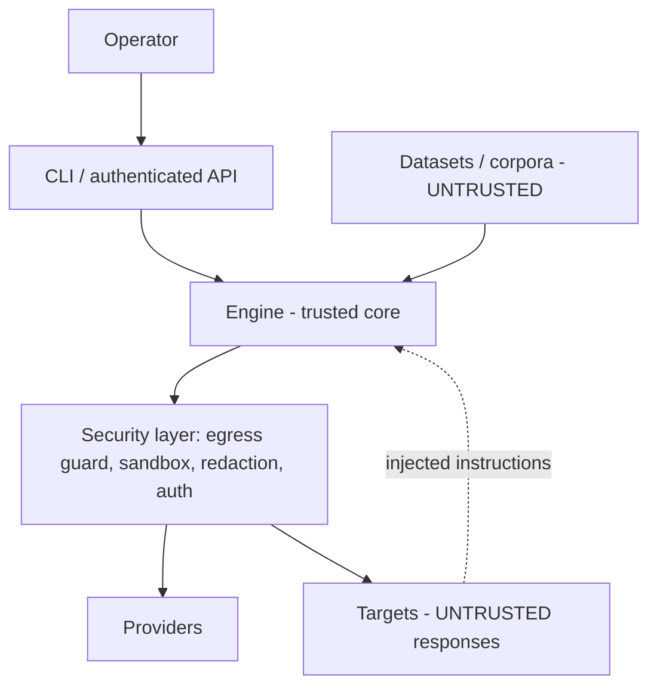

# Security model

**Purpose.** modelWrecker runs attacks, drives an autonomous loop, and handles secrets and harmful
content. It must not become a danger to its own operator. This is the single source of truth for how we
stay safe. Every rule here is traceable to a threat (see [`THREAT-MODEL.md`](THREAT-MODEL.md)) and most
are grounded in Aevrin's security research (see [`../research/design-lessons.md`](../research/design-lessons.md)).

**Core stance:** treat targets, prompts, responses, datasets, and tool outputs as **untrusted**; grant
**least privilege** by default; **fail safe**, not open.

## Trust boundaries

Everything crossing a boundary into the engine from a target or dataset is data, never instructions.

## Rules (and the failure mode each answers)

### Authentication & network surface
- The engine ships as a **library + CLI** first; there is **no network surface** until an API is built,
  and that API requires auth from day one (SEC-1/2). [`ADR-0012`](../decisions/ADR-0012-engine-library-first.md)
- Any API/dashboard: **mandatory auth token** on every route via a dependency; **anti-CSRF** (reject
  cross-site `Origin`/`Sec-Fetch-Site`, require a non-simple header) on all mutating routes. CORS is
  never treated as access control (SEC-2).
- **Refuse non-loopback binds** unless auth is configured; loud warning on any non-loopback bind (SEC-7).
- Secret/config writes are **privileged**; never performed from an unauthenticated request (SEC-3).

### Least privilege for tools
- **Host-affecting tools are OFF by default**: shell execution, file writes, arbitrary outbound HTTP.
  They are never present in a network-reachable toolset without explicit operator opt-in (SEC-1/6).
- The attacker loop does **not** get a raw shell. Attack-generated code runs only in a **sandbox** (see
  below), never on the host.
- File reads are **confined** to a working directory via `resolve().relative_to(base)`; symlink escapes
  rejected (SEC-5/SEC-10).

### Egress guard (SSRF)
- All outbound HTTP the engine makes on behalf of an attack goes through one **egress guard**: block
  loopback, link-local, RFC1918, and cloud metadata (`169.254.169.254`); allow only permitted schemes;
  **re-check on every redirect** (SEC-4).
- Provider discovery never attaches the operator's API key to a freshly-changed `base_url` (SEC-4).

### Secrets & logging
- **Redact** API keys, `Authorization`/`x-api-key` headers, tool/stego passwords, and detected PII
  **before** writing any log or evidence (SEC-9).
- Run artifacts are written `0600`, directories `0700`, and are gitignored. They can contain harmful
  content and must stay off version control.
- Keys come from env or a secret store; never persisted into tracked config.

### Reliability as safety
- Every run and every model call has a **wall-clock deadline** and a **cancel/force-stop** path; the
  autonomous loop cannot wedge forever (REL-6/7).
- All state writes are **atomic** (`tmp`+`os.replace`); a torn read never silently resets state (REL-3).
- Provider HTTP clients are owned centrally and closed once per boundary (REL-2).
- Narrow exception handling; never boot a half-initialized engine silently (REL-8).

### Sandboxing attack-generated code
- When a strategy produces code to run (e.g. an exploit to validate), it runs in an isolated sandbox:
  process isolation, no host network except via the egress guard, CPU/memory/time limits, no host
  filesystem access outside a scratch dir. The default is **do not execute**; execution is an explicit,
  logged opt-in.

### Responsible use
- modelWrecker is for **authorized** testing only. The CLI records the operator's asserted authorization
  for a run in the run metadata.

## Where this is enforced

Centralized in `src/modelwrecker/security/` (egress guard, sandbox, redaction, auth helpers), imported
by providers, targets, and payloads - so security is a layer, not a per-call afterthought. See
[`THREAT-MODEL.md`](THREAT-MODEL.md) for the full threat list and
[`ADR-0008`](../decisions/ADR-0008-security-model.md) for the decision record.
