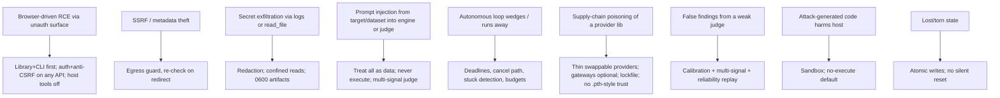
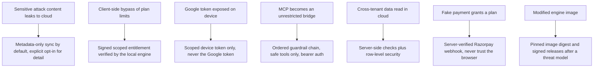

# Threat model

**Purpose.** Name the threats modelWrecker faces so the controls in [`SECURITY.md`](SECURITY.md) exist
for a reason, not by habit. Written in simple terms.

**Method.** We look at each actor and asset, list what could go wrong, and point to the control. This is
grounded in Aevrin's security research into very similar AI tooling, plus the standard LLM/
agent threat set.

## Assets

- The operator's machine and network (the engine runs autonomous loops on it).
- Provider API keys and other secrets.
- Evidence/run artifacts (can contain harmful content and leaked secrets).
- The integrity of findings (a false finding wastes trust; a missed one is a gap).

## Actors

- **Operator** - trusted, authorized.
- **The target** - untrusted. Its responses/reasoning/tool outputs can carry injected instructions.
- **Datasets/corpora** - untrusted content fetched or loaded.
- **A malicious web page** the operator visits while a tool is running (a known CSRF vector against local AI tools).
- **A supply-chain attacker** (the LiteLLM Mar-2026 incident: a poisoned provider library).

## Threats → controls

| # | Threat | Control | Source |
|---|--------|---------|--------|
| T1 | Unauthenticated surface → browser-CSRF RCE | library+CLI first; auth + anti-CSRF; host tools off by default; refuse non-loopback bind without auth | Aevrin security research |
| T2 | SSRF to internal/metadata endpoints | central egress guard, redirect re-check | Aevrin security research |
| T3 | Secret/PII exfiltration via logs or arbitrary file read | redaction before write; confined reads; restrictive perms | Aevrin security research |
| T4 | Indirect prompt injection from target or dataset | untrusted-by-default; never follow target output as instruction; multi-signal judge resists framing | OWASP LLM01; MCP06/10 |
| T5 | Runaway/wedged autonomous loop | wall-clock deadlines, cancel/force-stop, stuck detection, budgets | Aevrin security research |
| T6 | Poisoned provider dependency | thin provider layer, optional gateways, pinned lockfile, Docker-pinned if a gateway is used | LiteLLM incident |
| T7 | False findings | judge calibration + ensemble + reliability replay | Aevrin "validated"; reliability-first practice |
| T8 | Attack code damaging the host | sandbox with isolation + limits; no-execute default | general |
| T9 | Lost settings / torn state | atomic writes, lock/merge, no silent `{}` reset | Aevrin security research |

## Phase 10 additions: local-first product and cloud control plane

Phase 10 adds a thin cloud control plane, a Docker-distributed local engine, device sync, remote MCP,
billing, and entitlements. This adds new actors and assets. The boundary that contains most of the risk is
in [`../architecture/local-cloud.md`](../architecture/local-cloud.md): heavy compute and sensitive content
stay local; the cloud is control only.

New assets:

- The scoped device or project token on each install.
- The signed entitlement the local engine trusts.
- The cloud control plane's data (accounts, projects, metadata) and its multi-tenant isolation.
- Billing secrets (Razorpay keys and webhook secret), cloud-only.

New actors:

- **A malicious or buggy MCP client** that tries to drive attacks beyond its scope.
- **Another tenant** in the shared control plane trying to read data that is not theirs.
- **A manipulated browser** claiming a payment succeeded.

| # | Threat | Control | Source doc |
|---|--------|---------|------------|
| T10 | Sensitive attack content uploaded to the cloud | metadata-only sync by default; detail is explicit opt-in; never silently upload responses | [`../architecture/data-flow.md`](../architecture/data-flow.md) |
| T11 | Client-side bypass of plan limits | signed, scoped entitlement the local engine verifies; denied by default on failure | [`entitlements.md`](entitlements.md) |
| T12 | Google token exposed inside Docker | scoped device or project token only; Google token never in the engine | [`authentication.md`](authentication.md) |
| T13 | MCP server used as an unrestricted bridge | auth, authorization, target scope, entitlement, rate, resource, tool-permission chain; safe tools only | [`mcp.md`](mcp.md) |
| T14 | Cross-tenant data access in the control plane | server-side ownership checks on every request plus row-level security | [`../architecture/cloud-control-plane.md`](../architecture/cloud-control-plane.md) |
| T15 | Forged payment success | Razorpay webhook verified server-side with HMAC SHA256; browser never trusted | [`../billing/razorpay.md`](../billing/razorpay.md) |
| T16 | Tampered or substituted engine image | pinned image digest and signed releases after a threat model; no blanket checksum gate in dev | [`docker.md`](docker.md) |
| T17 | Host harm via the container | non-root, no host Docker socket, read-only mounts, resource limits, egress guard | [`docker.md`](docker.md) |

Partly mitigated and stated honestly: integrity controls (T16) are designed in Phase 10.15 but not yet
built; multi-tenant isolation (T14) is a new surface that gets its own review when the control plane is
implemented. The existing engine threats T1 through T9 still apply inside the container.

## Explicitly out of scope (for now, stated honestly)

- Hardening the *targets* we test (that's the customer's job; we report).
- Defending against a malicious *operator* (the operator is trusted; we record asserted authorization).
- A fully multi-tenant hosted service (the engine is self-hosted; a hosted Aevrin layer would add its own
  tenant isolation threat model later).

Honesty over false confidence (the Aevrin principle): where a threat is only partly mitigated, the
relevant doc and run output say so rather than implying full coverage.
