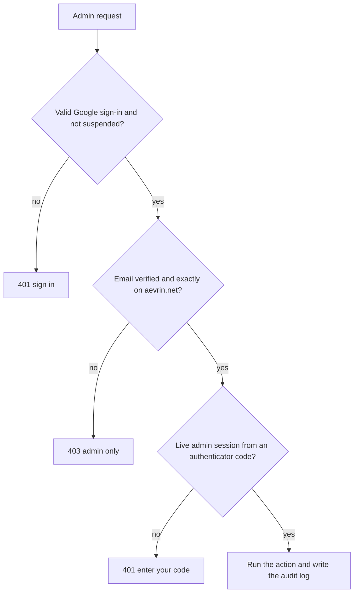

# Admin console

> Read [`authentication.md`](authentication.md) and [`entitlements.md`](entitlements.md) first. This page is
> the single source of truth for who can use the admin console, how access is checked, and what it can do.
> Issues #43, #44, #45. Decision: [`../decisions/ADR-0020-admin-console.md`](../decisions/ADR-0020-admin-console.md).

## Purpose

Aevrin staff manage accounts and watch the platform at **https://app.aevrin.net/admin**. It is the same
dashboard build served under a different path, with its own navigation: Users, Payments, Audit log,
Platform analytics, and Page analytics. The page is never indexed, framed, or cached.

## Who can get in

Three checks, all on the server, on **every** admin request:

1. **Google sign-in** through Supabase Auth, as for the dashboard. A suspended account is refused.
2. **Staff email**: the sign-in provider must have verified the email, and its domain must be exactly
   `aevrin.net`. `x@sub.aevrin.net`, `x@aevrin.net.evil.com`, and `x@evilaevrin.net` are refused.
3. **Authenticator (TOTP, RFC 6238)**: a 6-digit code from an authenticator app (SHA-1, 30-second steps,
   one step of clock drift either way). A correct code starts an **admin session**.

The UI hiding the console from other accounts is a convenience, not the control.

## The authenticator

- **Enrollment**: the first visit shows a QR code and a setup key. The QR code is drawn in the browser,
  so the secret never goes to a QR service. The secret is stored only **encrypted** (AES-256-GCM, fresh
  random IV, key in the Worker secret `ADMIN_TOTP_KEY`).
- **One use per code**: the last accepted step is stored; that code and any older one are refused.
- **Lockout**: 5 wrong codes lock the account's second factor for 15 minutes. Code attempts are also rate
  limited per account and per address.
- **Recovery codes**: 10 single-use codes are shown once at enrollment and stored only as SHA-256 hashes.
- **Reset**: another admin can reset a staff member's authenticator from that user's page (not their own).
  If the only admin loses both the phone and the recovery codes, the domain owner deletes that row from
  `admin_mfa` in the database and the admin enrolls again.

## Admin sessions

A random token (`mwa_...`) returned once and kept in the tab's `sessionStorage` (it ends when the tab
closes). The database stores only its SHA-256 hash, bound to the staff member. It is refused after 30
minutes without use, after 8 hours in total, after `End admin session`, or for any other account.

## What admins can do (issue #44)

Every change needs a written reason and is written to `admin_audit` with the admin's email, the target
user, the time, the address, and the details. Audit entries are kept when a user is deleted.

| Action | Effect |
|--------|--------|
| Change plan | Free, Pro, or Enterprise, with an optional paid-until date. Source becomes `admin` |
| Bonus | Extra campaign runs, attempts, devices, projects on top of the plan, optionally until a date |
| Account credit | Add or remove credit (never below zero); applied at the next checkout. Recorded in `credit_ledger` |
| Refund | Full refund through Razorpay; takes back the time bought and returns credit used |
| Sync settings | Turn evidence or transcript sync on or off; off deletes the cloud copies |
| Rename | Change the display name |
| Revoke device | The device stops syncing and fetching entitlements |
| Suspend or restore | Blocks Google sign-in (Supabase ban), the API, and the account's devices. Nothing is deleted |
| Reset authenticator | For staff accounts only, never your own |
| Delete user | Type the email to confirm. Deletes the account and everything it owns. Payment records are kept for accounting, detached from the account, with the email they were for. Staff accounts cannot be deleted here |

## Analytics (issue #45)

- **Platform analytics**: users, new and active users, paying and granted accounts, monthly recurring
  revenue, revenue and refunds in the range, plan mix, devices, campaigns, runs, findings, and daily
  sign-ups, runs, and revenue. Computed by Postgres functions over the live tables.
- **Page analytics**: see [`../analytics/page-analytics.md`](../analytics/page-analytics.md).

## Where it lives

- API: `src/api/src/routes/admin.ts`, `src/api/src/admin/totp.ts`, `src/api/src/routes/collect.ts`.
- UI: `src/dash/src/admin/` (a separate chunk that loads only under `/admin/`).
- Database: `deploy/supabase/migrations/0005_admin.sql`. `admin_mfa`, `admin_sessions`, `admin_audit`, and
  `page_views` have RLS on and **no policies**, so only the API's server key can read them. The aggregate
  functions are revoked from every client role.
- Daily upkeep (Worker cron, 03:17 UTC): delete page views older than 400 days, expired admin sessions,
  and webhook event ids older than 90 days; confirm recent unpaid orders with Razorpay.

## Setting it up

1. Apply migration `0005_admin.sql`.
2. Set the Worker secrets `ADMIN_TOTP_KEY` (32 random bytes, base64) and `ANALYTICS_SALT`.
3. Add `https://app.aevrin.net/admin/` and `https://app.aevrin.net/admin/**` to the Supabase Auth redirect
   allow list, so Google sign-in returns to the console.
4. Sign in at `/admin` with an `@aevrin.net` Google account and enroll an authenticator.

## Failure cases

- Not configured (`ADMIN_TOTP_KEY` missing): every admin route answers 503.
- Wrong code: 400, counted toward the lockout. Locked: 429 for 15 minutes.
- Session over: 401 `admin_session_required`; the console asks for a code again.

## Security considerations

- Anyone who controls a mailbox on `aevrin.net` can create a Google account for it, so the domain's mail
  must stay under Aevrin's control. The authenticator is the second factor that protects against a
  compromised Google session.
- The authenticator secret is shown once at enrollment over HTTPS to the signed-in staff member and is
  never logged.
- Covered in [`THREAT-MODEL.md`](THREAT-MODEL.md).
