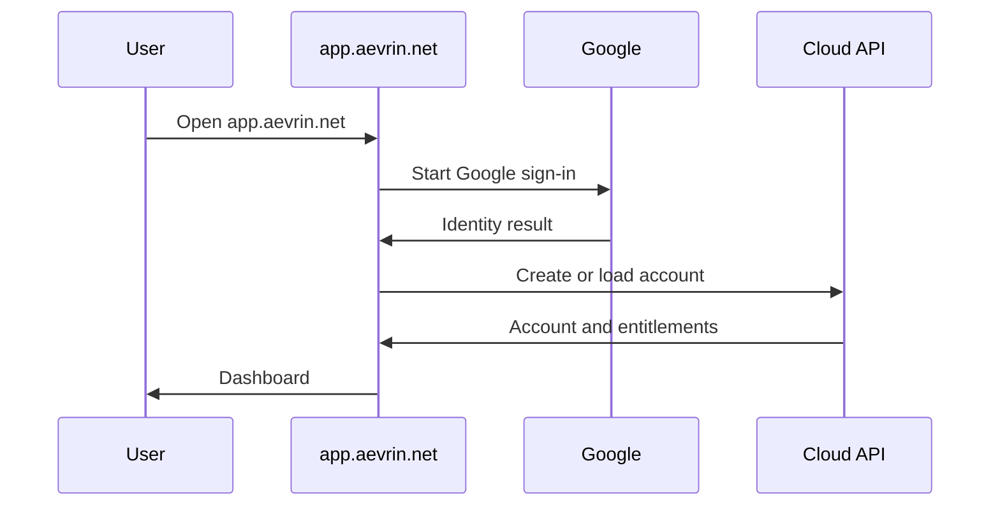
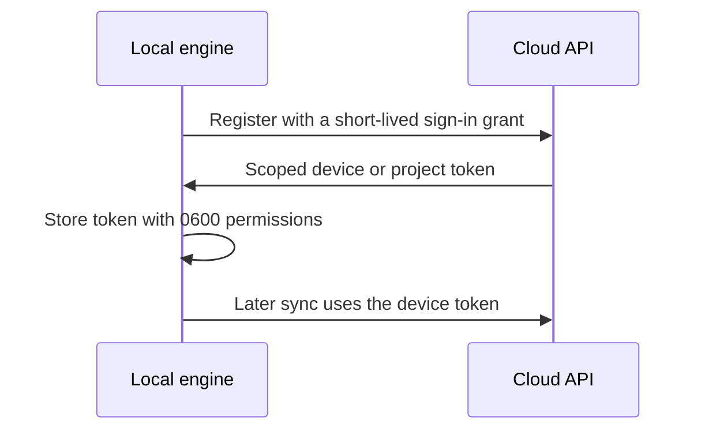
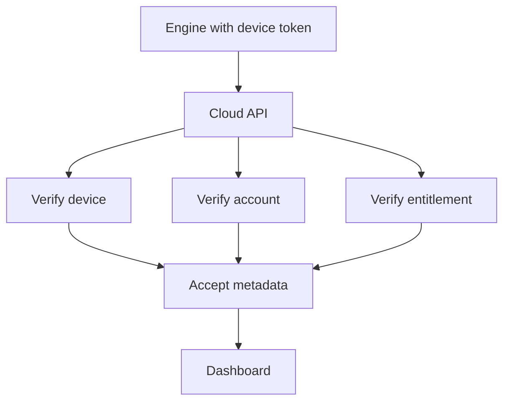

# Authentication

> Read [`SECURITY.md`](SECURITY.md) first. This page is the single source of truth for how users and
> devices prove who they are. The cloud side is in [`../architecture/cloud-control-plane.md`](../architecture/cloud-control-plane.md);
> the credential decision is [`../decisions/ADR-0017-device-credential-model.md`](../decisions/ADR-0017-device-credential-model.md).

## Purpose

There are two things to authenticate: the **user** signing in to the dashboard, and the **device** (a
local install of the engine) syncing results. They use different credentials on purpose, so a problem with
one does not expose the other.

## User sign-in with Google

Users sign in with Google using OAuth and OIDC (OpenID Connect, the identity layer on top of OAuth that
tells the app who the user is). modelWrecker never sees or stores the user's Google password.



Rules:

- Never store Google passwords. Only the identity Google returns is used.
- Use OAuth and OIDC correctly: verify the token, check the audience, and keep sessions short.
- Keep user sign-in separate from the local engine. The engine never handles the Google flow.

### How the dashboard does it

The dashboard (`src/dash`) has two build modes, set by `VITE_API_MODE`:

- **mock** (the default): sample data, no sign-in. Used for local development and the demo.
- **http**: real Google sign-in through Supabase Auth, then the real control-plane API
  ([`../architecture/control-plane-api.md`](../architecture/control-plane-api.md)).

In http mode:

- Sign-in uses the PKCE flow (the browser proves it started the sign-in, so a stolen redirect code is
  useless). Google returns to `/dashboard/`, the dashboard exchanges the code once, cleans the address
  bar, and returns the user to the page they started from.
- Every API call sends `Authorization: Bearer <access token>`, read fresh from the session. No cookies.
- A `401` from the API signs the user out of that browser and shows the sign-in screen.
- Error text shown to the user comes only from the API's `message` field, never a raw response.
- The build needs `VITE_SUPABASE_URL` and `VITE_SUPABASE_ANON_KEY`. Both are public values; row-level
  security protects the data. A server key never goes in the dashboard. If either is missing, the
  dashboard shows a configuration screen instead of starting.

## Device credential

Each local install registers once as a device and receives a **scoped device or project token**. This is
what the engine uses to sync. It is not the user's Google token, and the Google token never enters the
container.



Why a separate token:

- It is **scoped**: it can sync results and read the current entitlement for its project, and nothing more.
- It can be revoked per device without signing the user out everywhere.
- If a device token leaks, it cannot be used to sign in as the user or touch billing.

## CLI sign-in

The CLI signs in with the OAuth 2.0 device authorization grant (the flow where a command-line tool shows a
code and the user approves it in a browser). It stores the resulting token with `0600` permissions. For
continuous integration, where a browser is not available, the `MODELWRECKER_DEVICE_TOKEN` env var carries
the device token instead. This is the Phase 10.4 work in [`../../ROADMAP.md`](../../ROADMAP.md),
implemented in `src/modelwrecker/cloud` (`modelwrecker login`, `logout`, `sync`; see
[`../reference/CLI.md`](../reference/CLI.md)).

The approval half lives on the dashboard Connect page (`/dashboard/connect`). The user code from
`modelwrecker login` arrives in the `?code=` link or is typed in as `XXXX-XXXX`. The user picks a project
and approves or denies. The page warns to approve only a code the user started, because a code sent by
someone else would link their engine to this account.

Engine-side token rules:

- The token is never printed or logged. The redactor masks any `mwd_...` value and any field named
  `device_token`.
- The cloud API URL must be https (plain http only for `localhost` and `127.0.0.1`), and the client
  never follows redirects, so the token cannot be bounced to another host.
- A saved credential is only sent to the URL it was issued for.

## Local-to-cloud connection

When the engine connects, the cloud verifies the device, the account, and the entitlement before accepting
any metadata.



The engine stays usable offline where practical; it does not need a live connection for every attack. See
[`entitlements.md`](entitlements.md) and [`../architecture/data-flow.md`](../architecture/data-flow.md).

## What the engine never holds

```text
the user's Google password
the user's Google access or refresh token
Razorpay secrets
any other account-level secret
```

Billing secrets live only in the cloud control plane. See [`../billing/razorpay.md`](../billing/razorpay.md).

## Failure cases

- Invalid or revoked device token: sync is refused; the engine keeps results locally.
- Expired user session: the dashboard asks the user to sign in again; local runs are unaffected.
- Google unreachable: users cannot sign in to the dashboard, but a device that already has a token and a
  current signed entitlement keeps working offline.

## Security considerations

- Any network surface requires auth from day one, with anti-CSRF on mutating routes, per
  [`SECURITY.md`](SECURITY.md).
- Tokens are stored with restrictive permissions and redacted from logs and evidence.
- Hosted-platform credentials live only in local untracked files and the deploy secret store, never in the
  repo or in docs. This repo is published.

## Decisions

- Device credential model: [`../decisions/ADR-0017-device-credential-model.md`](../decisions/ADR-0017-device-credential-model.md).
