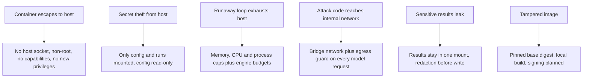

# Docker security

> Read [`SECURITY.md`](SECURITY.md) first. This page is the single source of truth for how the local
> container is kept safe. The container shape and mounts are described in
> [`../architecture/docker.md`](../architecture/docker.md); install steps are in
> [`../deployment/docker.md`](../deployment/docker.md).

## Purpose

The container runs an autonomous attack loop on the user's machine. It must not be able to harm the host
or leak host secrets. The stance is the same as the rest of the project: least privilege by default, fail
safe.

## What the container must never receive

These are off by default and are never granted automatically:

```text
host filesystem (beyond explicit mounts)
host Docker socket
SSH keys
cloud credentials
browser credentials
arbitrary host commands
```

Mounting the host Docker socket would let code in the container control the host's Docker, which is
equal to host root. It is forbidden. `docker-compose.yml` mounts nothing except `./config` and `./runs`.

## How the shipped files enforce it

Every control below is set in `Dockerfile` or `docker-compose.yml`, so the safe shape is the default.

| Control | Where | Setting |
|---------|-------|---------|
| Non-root user | Dockerfile, compose | `USER 10001:10001`; compose `user: 10001:10001` |
| Read-only root filesystem | compose | `read_only: true` |
| Scratch space only in memory | compose | `tmpfs: /tmp` with `noexec,nosuid,nodev,size=256m` |
| No Linux capabilities | compose | `cap_drop: [ALL]` |
| No privilege escalation | compose | `security_opt: no-new-privileges:true` |
| Memory cap | compose | `mem_limit: 2g`, `memswap_limit: 2g` |
| CPU cap | compose | `cpus: 2` |
| Process cap | compose | `pids_limit: 256` |
| Signals reach the engine | compose, Dockerfile | `init: true`; `STOPSIGNAL SIGINT` |
| Config is read-only | compose | `./config` to `/config`, `read_only: true` |
| One writable results folder | compose | `./runs` to `/work/runs` |
| Explicit environment only | compose | `env_file: .env` plus `HOME=/tmp`; nothing else is passed in |
| No secrets in the image | `.dockerignore` | `.env`, `.env.*`, `*.key`, `*-key`, `*-keys`, `.secrets/`, `.git`, `/config/` excluded |
| Minimal image | Dockerfile | Two-stage build; the runtime stage holds only the venv, no source tree or build cache |
| Reproducible base | Dockerfile | `python:3.12.15-slim-bookworm` pinned by tag and digest |
| No listener | compose | No `ports:`. The CLI opens no network listener; the harness MCP server defaults to stdio |

## How this maps to threats



## Rules

- **Non-root user.** The image and the compose service run as uid `10001`. Verified from inside the
  container.
- **Read-only where possible.** The root filesystem is read-only. `/config` is read-only. The only writable
  places are `/tmp` (in memory, not executable) and `/work/runs`.
- **No host socket.** The Docker socket is never mounted. The engine never needs to control Docker.
- **No capabilities, no escalation.** All Linux capabilities are dropped and `no-new-privileges` stops
  setuid binaries from gaining privileges. Verified: `CapEff` and `CapBnd` are zero and `NoNewPrivs` is 1.
- **Resource limits.** The campaign engine's own budgets and deadlines are the first backstop; the
  container limits are the second. See [`../campaigns/OVERVIEW.md`](../campaigns/OVERVIEW.md). Raise the
  limits in `docker-compose.yml` only within what the host can spare.
- **Network.** The container uses the default compose bridge network, never `network_mode: host`, and
  publishes no ports. `host.docker.internal` is mapped so a config can reach a local model on the host.
- **Egress guard.** The engine's egress guard (`src/modelwrecker/security/egress.py`) runs on every
  attacker, target, and judge request. It blocks loopback, link-local, private, and cloud metadata
  addresses by default and refuses redirects. A local model is a narrow opt-in through
  `security.egress.allow_hosts`. DNS rebinding between the check and the connect is not covered yet
  (#16), so only point configs at targets you are authorized to test. See [`SECURITY.md`](SECURITY.md).
- **Redaction before write.** Secrets and detected personal data are redacted before anything is written
  to the results mount, same as the rest of the engine.
- **Credential handling.** Provider keys come only from `.env`. The optional scoped device token also
  comes from `.env` (`MODELWRECKER_DEVICE_TOKEN`) and is never the user's Google token. See
  [`authentication.md`](authentication.md).
- **Attack-generated code is never run.** The engine does not execute attack-generated code today, and
  running the container does not relax that rule. A sandbox for it is planned (#17). See
  [`SECURITY.md`](SECURITY.md).

## Do not weaken these by hand

Never add any of these to `docker-compose.yml` or a `docker run` line:

```text
-v /var/run/docker.sock:...      privileged: true          network_mode: host
-v ~/.ssh:...  -v ~/.aws:...     cap_add: ...              pid: host
-v ~:...  -v /:...               security_opt: seccomp=unconfined
```

## Example run shape

`docker-compose.yml` is the reference: every rule above is already set there. The same flags as a plain
`docker run` command are kept in one place,
[`../deployment/docker.md`](../deployment/docker.md#without-compose).

## Integrity

Production images should be verifiable so a user can confirm the engine was not modified. Today the base
image is pinned by digest and users build locally. Publishing the image with a pinned digest and signed
releases comes later, after a threat model, without adding a blanket checksum gate to normal development.
This follows
[`../decisions/ADR-0010-no-mandatory-checksum-gate.md`](../decisions/ADR-0010-no-mandatory-checksum-gate.md)
and is part of the Phase 10.15 integrity work in [`../../ROADMAP.md`](../../ROADMAP.md).

## Decisions

- Security model: [`../decisions/ADR-0008-security-model.md`](../decisions/ADR-0008-security-model.md).
