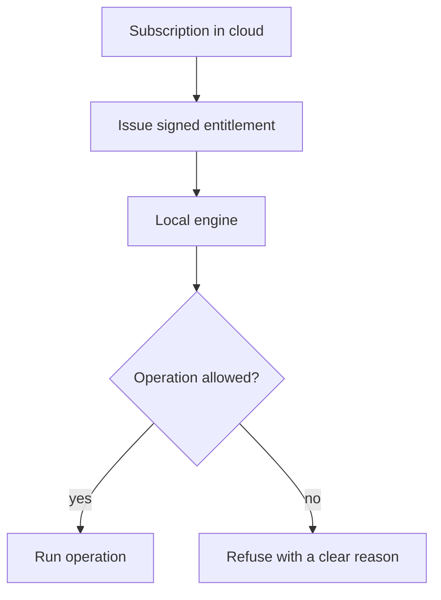
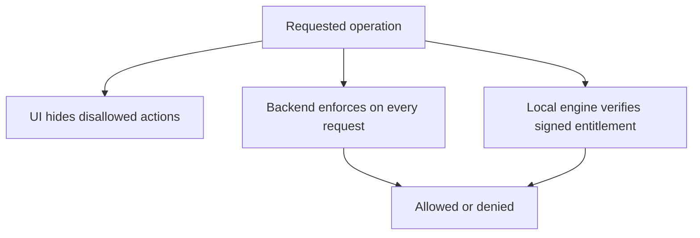

# Entitlements

> Read [`SECURITY.md`](SECURITY.md) and [`authentication.md`](authentication.md) first. This page is the
> single source of truth for how plan limits are decided and enforced. The billing side is in
> [`../billing/razorpay.md`](../billing/razorpay.md).

## Purpose

An **entitlement** is a signed statement from the cloud that says what a user's plan allows. The attack
engine does not know about prices or plans. It only asks one question and acts on the answer:

```text
Can this operation run?  ->  allowed  or  denied
```

This keeps subscription logic out of the attack code and stops plan checks from being scattered everywhere.

## How it works

The cloud issues a signed, scoped entitlement. The local engine checks it before each guarded operation.
There is no cloud round trip per attack, so the engine works offline, and there is no easy client-side
bypass, because the engine verifies the signature.



- The entitlement is **signed** by the cloud, so the engine can trust it without calling home.
- It is **scoped** to a device or project and has an expiry, so a leaked entitlement is limited in time and
  reach.
- The engine **verifies the signature** and enforces the limits locally. Editing a local file does not
  grant more, because an unsigned or expired entitlement is rejected.

## What an entitlement covers

The plan maps to a set of entitlements. The exact numbers are configuration, not code.

```text
campaigns
attacks
devices
MCP access
advanced attack strategies
enterprise features
analytics
evidence storage
```

## Plan tiers

Tiers, limits, and prices are configuration in `src/shared/plans.json` (prices: [`../billing/pricing.md`](../billing/pricing.md)).
The free tier must be genuinely useful with free, self-hostable parts (local models count as a full
configuration, per [`../../CLAUDE.md`](../../CLAUDE.md)).

| | Free | Pro | Enterprise |
|---|---|---|---|
| Campaign runs a month | 20 | 300 | unlimited |
| Attack attempts a month | 2,000 | 100,000 | unlimited |
| Connected devices | 1 | 10 | unlimited |
| Active projects | 2 | 25 | unlimited |
| Core strategies, chat, agent, and RAG targets, any model | yes | yes | yes |
| PyRIT and garak strategies (`pyrit_send`, `pyrit_pair`, `pyrit_tap`, `garak_probe`) | no | yes | yes |
| MCP targets and `mcp_tool_poisoning` | no | yes | yes |
| Evidence and transcript sync | no | yes | yes |
| Model leaderboard | no | yes | yes |

An admin can add a bonus on top of any plan (extra runs, attempts, devices, projects, optionally until a
date). Pricing decisions are never implemented inside the engine.

## The token (issue #11)

```text
base64url(header) . base64url(payload) . base64url(Ed25519 signature over "header.payload")
header  {"alg": "EdDSA", "typ": "mw-entitlement", "kid": "2026-10-a"}
payload {"v": 1, "iss": "https://app.aevrin.net", "sub": <account>, "dev": <device>, "plan": "pro",
         "limits": {...}, "features": {...}, "usage": {"period": "2026-10", "campaigns": n, "attacks": n},
         "plan_ends_at": <paid-until or null>, "iat": <issued>, "exp": <expires>}
```

- **Signed** with an Ed25519 private key that exists only as the Worker secret `ENTITLEMENT_SIGNING_KEY`.
  The engine ships the public key (`src/modelwrecker/entitlements/token.py`) and checks the signature,
  algorithm, key id, issuer, version, and time window. `GET /api/v1/entitlements/keys` publishes the same
  public key.
- **Expires** after 7 days, or at the paid-until date if that is sooner (but never in under an hour). A
  lapsed plan therefore stops working offline within the token's life, at most 7 days.
- **Delivered** in every device heartbeat and by `GET /device/entitlement`. The engine stores it as
  `entitlement.jws` next to the device credential, or reads `MODELWRECKER_ENTITLEMENT` (for CI). It is
  refreshed on `modelwrecker login`, `modelwrecker sync`, `modelwrecker plan --refresh`, and before `run`
  when the stored one is over 12 hours old. A refresh failure never blocks a run.
- **Key rotation**: add the new public key to the engine in a release first, then switch the Worker's key
  id and secret. Old engines keep working until their stored token expires.

## What the engine checks

`entitlements.check_run(config)` runs once at the start of every run (CLI and MCP), before a model is
called or a run folder is created:

- A target of type `mcp`, or an explicitly chosen strategy the plan lacks, refuses the run with a clear
  message and the upgrade link (exit code 2).
- When the planner picks strategies automatically, ones the plan lacks are skipped with a note.
- Campaign runs and attack attempts are counted per calendar month (UTC). The engine uses the larger of
  its own count (`usage.json` next to the credential) and the count the cloud signed into the token. A
  month with no runs left refuses the run; otherwise the campaign's attempt budget is capped at what is
  left. Like every campaign budget, the cap is checked before each strategy, so a strategy that started
  under it can finish a few attempts over.
- `modelwrecker plan` shows the plan in force, where it came from, the limits, and this month's usage.

The cloud enforces the rest on every request: device and project limits, evidence and transcript sync,
and the leaderboard (see [`../architecture/control-plane-api.md`](../architecture/control-plane-api.md)).

## Limits of local enforcement

The engine is open source and runs on the user's machine, so a determined user can change its code.
Signing stops the easy bypasses: editing the token file, copying another plan's file, or extending the
date all break the signature. Deleting `usage.json` resets only this machine's count until the next
token refresh brings the cloud's count back. Cloud-side features (sync, devices, projects, leaderboard)
are enforced on the server and cannot be bypassed locally.

## Enforcement is outside the UI

Hiding a button is not enforcement. The backend and the local engine both enforce the entitlement.



- The UI is a convenience only.
- The backend never trusts the client for plan, role, project, or ownership.
- The local engine verifies the signed entitlement before guarded operations, so the compute plane itself
  enforces limits.

## Enterprise controls

Enterprise features are enforced capabilities, not hidden buttons. Examples: organization policies,
approved targets and providers, allowed strategies, maximum campaign size, MCP restrictions, network
restrictions, audit logs, device controls, evidence retention, and a signed-engine requirement. Each is
checked by the backend and, where it affects a run, by the local engine. See the Phase 10.15 work in
[`../../ROADMAP.md`](../../ROADMAP.md).

## Pricing must not control local compute directly

The engine must not depend on a live cloud answer for every attack. The signed entitlement is the
mechanism that avoids this: the cloud signs once, the engine enforces many times, including offline.

## Failure cases

- No entitlement present: the engine runs the free baseline (Free limits and features), and denies the
  rest with a clear message.
- Expired entitlement: the free baseline applies until a fresh entitlement is fetched.
- Tampered entitlement, unknown key, wrong issuer, or a date in the future: rejected, free baseline. Fail
  safe, not open.
- Cloud unreachable: the stored entitlement keeps working until it expires.

## Security considerations

- The signing key is a cloud secret and never ships in Docker, MCP, CLI, or the engine.
- Denied-by-default: when the engine cannot verify an entitlement, it denies the guarded operation.
- This is covered in the Phase 10 section of [`THREAT-MODEL.md`](THREAT-MODEL.md).

## Decisions

- Entitlement enforcement: [`../decisions/ADR-0018-entitlement-enforcement.md`](../decisions/ADR-0018-entitlement-enforcement.md).
- Billing provider: [`../decisions/ADR-0016-billing-razorpay.md`](../decisions/ADR-0016-billing-razorpay.md).
