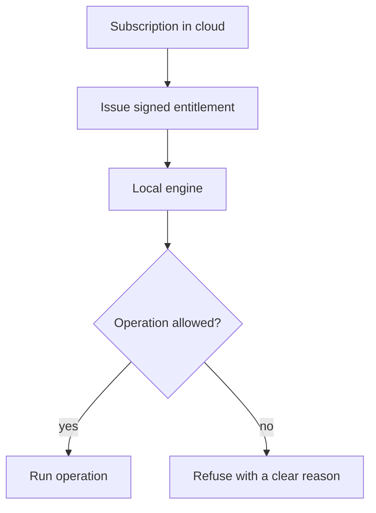
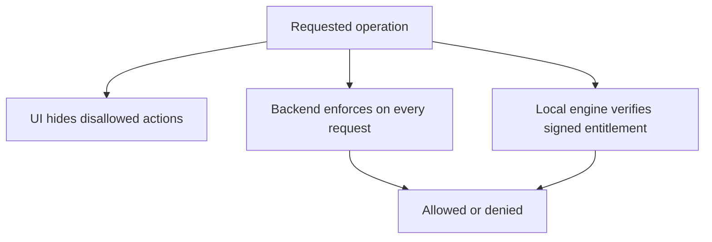

# Entitlements

> Read [`SECURITY.md`](SECURITY.md) and [`authentication.md`](authentication.md) first. This page is the
> single source of truth for how plan limits are decided and enforced. The billing side is in
> [`../billing/razorpay.md`](../billing/razorpay.md).

## Purpose

An **entitlement** is a signed statement from the cloud that says what a user's plan allows. The attack
engine does not know about prices or plans. It only asks one question and acts on the answer:

```text
Can this operation run?  ->  allowed  or  denied
```

This keeps subscription logic out of the attack code and stops plan checks from being scattered everywhere.

## How it works

The cloud issues a signed, scoped entitlement. The local engine checks it before each guarded operation.
There is no cloud round trip per attack, so the engine works offline, and there is no easy client-side
bypass, because the engine verifies the signature.



- The entitlement is **signed** by the cloud, so the engine can trust it without calling home.
- It is **scoped** to a device or project and has an expiry, so a leaked entitlement is limited in time and
  reach.
- The engine **verifies the signature** and enforces the limits locally. Editing a local file does not
  grant more, because an unsigned or expired entitlement is rejected.

## What an entitlement covers

The plan maps to a set of entitlements. The exact numbers are configuration, not code.

```text
campaigns
attacks
devices
MCP access
advanced attack strategies
enterprise features
analytics
evidence storage
```

## Plan tiers

Tiers are configuration-driven. The free tier must be genuinely useful with free, self-hostable parts
(local models count as a full configuration, per [`../../CLAUDE.md`](../../CLAUDE.md)).

```text
Free     local engine, basic attacks, basic dashboard, limited campaigns, limited devices
Pro      more campaigns, advanced strategies, richer analytics, MCP, more devices
Enterprise  organization, advanced guardrails, policy controls, audit logs, SSO, compliance
```

Pricing decisions are never implemented inside the engine. Plans are config.

## Enforcement is outside the UI

Hiding a button is not enforcement. The backend and the local engine both enforce the entitlement.



- The UI is a convenience only.
- The backend never trusts the client for plan, role, project, or ownership.
- The local engine verifies the signed entitlement before guarded operations, so the compute plane itself
  enforces limits.

## Enterprise controls

Enterprise features are enforced capabilities, not hidden buttons. Examples: organization policies,
approved targets and providers, allowed strategies, maximum campaign size, MCP restrictions, network
restrictions, audit logs, device controls, evidence retention, and a signed-engine requirement. Each is
checked by the backend and, where it affects a run, by the local engine. See the Phase 10.15 work in
[`../../ROADMAP.md`](../../ROADMAP.md).

## Pricing must not control local compute directly

The engine must not depend on a live cloud answer for every attack. The signed entitlement is the
mechanism that avoids this: the cloud signs once, the engine enforces many times, including offline.

## Failure cases

- No entitlement present: the engine runs only the free-tier baseline where allowed, and denies the rest.
- Expired entitlement: guarded operations are denied until a fresh entitlement is fetched.
- Tampered entitlement: signature check fails, so it is rejected. Fail safe, not open.

## Security considerations

- The signing key is a cloud secret and never ships in Docker, MCP, CLI, or the engine.
- Denied-by-default: when the engine cannot verify an entitlement, it denies the guarded operation.
- This is covered in the Phase 10 section of [`THREAT-MODEL.md`](THREAT-MODEL.md).

## Decisions

- Entitlement enforcement: [`../decisions/ADR-0018-entitlement-enforcement.md`](../decisions/ADR-0018-entitlement-enforcement.md).
- Billing provider: [`../decisions/ADR-0016-billing-razorpay.md`](../decisions/ADR-0016-billing-razorpay.md).
