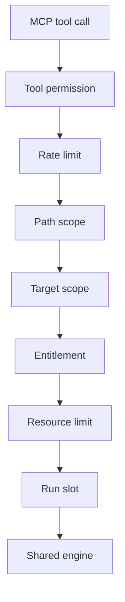
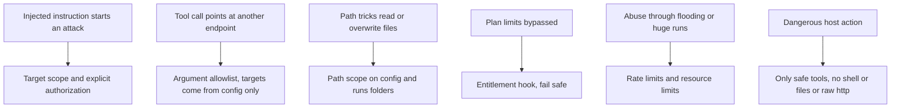

# MCP security

> Read [`SECURITY.md`](SECURITY.md) and [`../mcp/overview.md`](../mcp/overview.md) first. This page is the
> single source of truth for the guardrails on the MCP server (the interface that lets an AI agent drive
> modelWrecker). The tool list itself lives in [`../mcp/tools.md`](../mcp/tools.md).

## Purpose

The MCP server is another front door to the same engine. The risk is that it becomes an unrestricted
bridge into the attack engine: an agent could be tricked, through prompt injection, into starting attacks
on targets it should not touch, or into using the server to read files or reach the network. The
guardrails exist so that cannot happen.

> The MCP server must not become an unrestricted bridge into the attack engine.

## The guardrail chain

Every MCP tool call passes the same ordered checks before the engine runs anything. If any check fails,
the call is refused, the refusal is logged, and nothing runs. All checks run before the first model call,
so a refused call never partially runs an attack and never creates a run folder.



| Check | Question it answers | Built today |
|-------|---------------------|-------------|
| Tool permission | Is this a known tool, called with only its known arguments? | yes |
| Rate limit | Is this process within the allowed call rate? | yes |
| Path scope | Does every path stay inside its allowed folder? | yes |
| Target scope | Is the target defined in the config and marked `authorized: true`? | yes |
| Entitlement | Does the plan allow this operation? | hook only, allows locally |
| Resource limit | Is the run within the MCP caps on size and time? | yes |
| Run slot | Is there a free run slot right now? | yes |
| Authentication and authorization | Who is the caller, and may they act on this project? | later, with remote MCP |

Tool permission comes first because no other check makes sense for a tool that does not exist. The run
slot comes last so a refused run never uses up a slot.

The code lives in `src/modelwrecker/mcp/guardrails.py`. The service (`mcp/service.py`) calls it, and the
server (`mcp/server.py`) overrides the MCP SDK's `call_tool` so the tool and argument checks see the raw
arguments before the SDK filters them.

### Tool permission

Only the tools in [`../mcp/tools.md`](../mcp/tools.md) exist. Each tool accepts only its documented
argument names. Anything else is refused:

- An unknown tool such as `run_shell` is refused with `unknown_tool`.
- An extra argument such as `base_url`, `endpoint`, `target`, or `authorized` is refused with
  `unexpected_argument`. This is how the server stops an agent from pointing an attack at an endpoint it
  passes in a tool call. Targets and endpoints come only from the config file.
- A missing required argument is refused with `missing_argument`.

The server also checks at start-up that its registered tools match the allowlist exactly, so the two can
never drift apart.

### Target scope

The target must be defined in the loaded config file and must be explicitly marked `authorized: true`.
This is the same acknowledgment the CLI requires (see [`../targets/OVERVIEW.md`](../targets/OVERVIEW.md)).

- No target in the config: refused with `unknown_target`.
- A target without `authorized: true`: refused with `target_not_authorized`.

A run started over MCP uses the same engine as the CLI, so every model request it makes also passes the
egress guard from the config's `security.egress` policy (see [`SECURITY.md`](SECURITY.md)).

### Path scope

The server touches the disk only inside two folders, both fixed when the server starts:

- **Config folder** (`--config-dir`, default: the folder you start the server in). A `config_path` must
  resolve, after following `..` and symlinks, to a `.yaml` or `.yml` file inside it. URLs, null bytes,
  absolute paths outside it, and other file types (for example a `.env` file) are refused.
- **Runs folder** (`--runs-dir`, default `runs`). A `run_id` or `evidence_id` must be one plain name:
  no `/`, `\`, `..`, `:`, leading `.`, or more than 128 characters. A new run never reuses an existing
  run id, so it cannot overwrite earlier evidence.

### Resource limits

These caps apply to every MCP `run`. A config value above a cap is refused with `campaign_too_large`, not
quietly trimmed, so the caller learns why. A cap the config leaves open is filled in, so an MCP run is
always bounded. The CLI is not affected by these caps.

| Limit | Default | What it caps |
|-------|---------|--------------|
| `max_objectives` | 10 | objectives in one run, after the config's own `max_objectives` |
| `max_concurrency` | 4 | `campaign.concurrency` |
| `max_attempts` | 200 | `campaign.budget.max_attempts`, filled in when unset |
| `max_seconds` | 1800 | the run time budget, filled in when unset |
| `max_replays` | 16 | `engine.replays` |
| `max_retries` | 3 | `campaign.retries` |
| `max_param_value` | 50 | any whole number in `attack.params`, such as best-of-N `n` |

### Rate limits

Rate limits are per process and enforced server-side.

| Limit | Default | Refusal code |
|-------|---------|--------------|
| All tool calls | 60 per minute | `rate_limited` |
| Runs that reach the engine | 20 per hour | `run_rate_limited` |
| Runs in progress at once | 1 | `run_in_progress` |

All limits live in one `McpLimits` object, so a deployment can tighten them in code that builds the
server. There is no tool that changes them.

### Entitlement hook

The engine asks one question: can this operation run? The answer comes from an `EntitlementChecker`
(see [`entitlements.md`](entitlements.md)). The checker gets the operation name (`run`) and a small
context: target type, strategy, and number of objectives.

- Locally, the default checker (`LocalEntitlements`) allows everything. No cloud call is made or faked.
- Phase 10.14 plugs in a checker that verifies a signed, scoped entitlement.
- Fail safe: if a checker raises an error or returns anything other than a decision, the call is refused
  with `not_entitled`.

## What a refusal looks like

A refusal is a structured error with a stable code and the stage that refused it:

```json
{"denied": true, "check": "target_scope", "code": "target_not_authorized",
 "message": "target is not authorized. Set `authorized: true` on the target ..."}
```

Over MCP, the client gets an error result (`is_error`) whose text reads like
`denied by target_scope guardrail (target_not_authorized): ...`. The refusal is also logged on the
`modelwrecker.mcp` logger with the tool name, stage, code, and arguments. Arguments pass through the
shared redaction (`security/redaction.py`) first, so API keys and tokens never reach the log.

## What the MCP server never exposes

```text
shell execution
arbitrary network requests
arbitrary file-system access
raw provider keys or device credentials
a second attack engine
```

The server exposes only the small set of safe, high-level orchestration tools listed in
[`../mcp/tools.md`](../mcp/tools.md). It calls the same core engine the CLI uses, so there is no separate
engine to secure. The server itself makes no network request. Model traffic during a run is made by the
shared engine to the endpoints in the config, under the engine's own rules in [`SECURITY.md`](SECURITY.md).

## Transports and auth

- **Local stdio (built today).** When the server runs over standard input and output on the same
  machine, there is no network surface, so there is no network auth. The caller is the local user who
  started the server. See [`../features/harness-integration.md`](../features/harness-integration.md).
- **Remote over HTTP (planned, Phase 10.5).** When the server runs over Streamable HTTP (the MCP way to
  serve over the network), it requires bearer-token auth following the MCP authorization model, which is
  built on OAuth 2.1 (a current standard for granting scoped access). The MCP server acts as an OAuth 2.1
  resource server and advertises its protected-resource metadata so clients discover how to get a token.
  It refuses a non-loopback bind without auth, same as any other network surface in
  [`SECURITY.md`](SECURITY.md). Authentication and project authorization join the front of the chain
  then.

## Guardrails map to threats



## Known limits

- The `authorized: true` flag is the human's acknowledgment, written in a config file. An agent that can
  also write files into the config folder could write its own config. Point `--config-dir` at a folder
  that holds only the configs you have reviewed. Enterprise approved-target lists come in Phase 10.15.
- Limits are per process. Two server processes each get their own limits.
- Budgets are checked between strategies, so one strategy can finish its current attempts before a run
  stops. The `max_param_value` cap keeps each strategy's own work small.

## Decisions

- Harness integration and the safe-tools-only rule: [`../decisions/ADR-0013-harness-integration.md`](../decisions/ADR-0013-harness-integration.md).
- Entitlement enforcement: [`../decisions/ADR-0018-entitlement-enforcement.md`](../decisions/ADR-0018-entitlement-enforcement.md).
