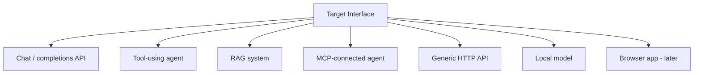

# Target adapters

**Purpose.** Give the engine one way to talk to any system under test, while only exposing the operations
that system actually supports. A target is *what we attack*; it is not a provider (a provider
is just a model endpoint; a target may be a whole agent or app).

**Responsibilities.** Deliver attempts to the target and return observations, declaring capabilities so
the planner only runs compatible strategies.

**Inputs.** A target config + an attempt.
**Outputs.** An `Observation` (response, reasoning if exposed, tool calls, metadata).
**Dependencies.** providers (for model targets), MCP client, httpx; security (egress guard).
**Failure cases.** Calling an unsupported capability raises before any network call; the planner checks
capabilities first so this is a guard, not a runtime surprise.

## Capabilities (declare, don't assume)

```text
send_message        send_multiturn      upload_image
call_tool           observe_tool_call   reset_session
get_metadata
```

A target implements only the ones it truly supports and reports them via `capabilities()`. A pure chat
API supports `send_message`/`send_multiturn`; an agent adds `call_tool`/`observe_tool_call`; an MCP
target adds tool discovery. Full signatures: [`../interfaces/target.md`](../interfaces/target.md).

## Target types



Phase 4 ships the **chat/completions API** target (the baseline). **Phase 9 adds the agent, RAG, and MCP
targets** (the confirmed order, a resolved decision in [`../../DECISIONS.md`](../../DECISIONS.md)); the
generic HTTP and browser targets remain later work (see [`../../ROADMAP.md`](../../ROADMAP.md)).

`config.target.type` selects the target (`chat` default, `agent`, `rag`, `mcp`) and `target_options`
carries its type-specific config. A factory (`targets/factory.py`) builds the right one, so the loop never
changes. What each adds:

- **agent** (`targets/agent.py`): a tool-using agent. `target_options.tools` is a list of
  `{name, description, sensitive}`. The agent decides tool calls; modelWrecker only *observes and records*
  them (it never executes a tool), and marks any sensitive call for the judge. Attack: `tool_misuse`
  (excessive agency / goal hijack; OWASP LLM03, ASI01).
- **rag** (`targets/rag.py`): a retrieval-augmented system. `target_options.documents` is the corpus; it
  retrieves by keyword overlap and injects documents as untrusted context. If `allow_ingest` (default on)
  it declares INGEST_DOCUMENT. Attack: `rag_injection` plants a poisoned document and triggers its
  retrieval (indirect prompt injection; OWASP LLM01/LLM05).
- **mcp** (`targets/mcp_target.py`): an MCP-connected agent whose tools (inline for now) may carry poisoned
  descriptions. Attack: `mcp_tool_poisoning` (OWASP MCP03). A live MCP-server connection is a documented
  follow-up; the inline form already exercises the full attack and judge path.

## Untrusted by default

A target's responses, reasoning, and tool outputs are **untrusted input** - they can carry injected
instructions aimed at the engine or the judge. Nothing from a target is ever executed or followed as an
instruction. All outbound requests a target makes on our behalf pass the egress guard. See
[`../security/SECURITY.md`](../security/SECURITY.md).

## Metadata and reset

`get_metadata` captures model/version/config for evidence; `reset_session` gives multi-turn strategies a
clean slate so attempts don't contaminate each other.
