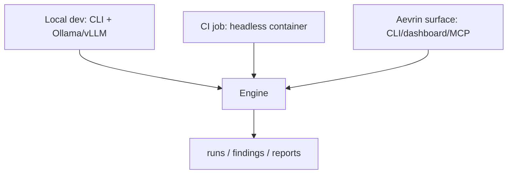

# Deployment

**Purpose.** How modelWrecker is installed and run. The design keeps it free and self-hostable: a laptop with Ollama is a complete deployment; cloud APIs are optional.

## Install

- Python 3.12+. Use a project `.venv` via **uv** (never the global interpreter):
  `uv venv` then `uv pip install -e ".[dev,mcp,attacks]"`. Extras: `mcp` (harness server),
  `attacks` (PyRIT PAIR/TAP + converters), `scan` (garak), `judges`, and `providers` (reserved for
  any-llm and direct SDK adapters, which are not built yet).
- From PyPI: `pip install modelwrecker` (add extras as `pip install "modelwrecker[mcp,attacks]"`).
- A Docker image you build locally (see Docker below).

## Run modes



- **Local**: CLI against local or cloud models. No network listener.
- **CI**: a headless container or a pip install running `modelwrecker run`. Keys come from the CI
  secret store, never the image. Planned, not built yet: `--ci`, `--fail-on-finding`, and SARIF output
  for code-scanning upload (see [`../reference/CLI.md`](../reference/CLI.md)).
- **As an Aevrin backend**: the engine is a library the Aevrin CLI/dashboard/MCP call. Any hosted surface
  is a *separate, authenticated* layer (see [`../security/SECURITY.md`](../security/SECURITY.md) and
  [`../decisions/ADR-0012-engine-library-first.md`](../decisions/ADR-0012-engine-library-first.md)).

## Docker

A `Dockerfile` builds a self-contained image from the same source as the pip package (one engine, many
distributions), and `docker-compose.yml` runs it with the hardening flags already set: non-root uid
10001, read-only root filesystem, all capabilities dropped, `no-new-privileges`, memory/CPU/process caps,
config mounted read-only, and one writable `runs/` folder. Keys come from `.env` (copied from
`.env.example`), never from the image.

```bash
cp .env.example .env
docker compose build
docker compose run --rm modelwrecker run /config/campaign.yaml
```

Steps, the plain `docker run` form, extras, and troubleshooting: [`../deployment/docker.md`](../deployment/docker.md).
Why each flag is there: [`../security/docker.md`](../security/docker.md). Verified status:
[`../testing/test-matrix.md`](../testing/test-matrix.md).

## Supply-chain hygiene

- Pin with `uv.lock`; if a provider gateway is used, prefer a pinned container image over a floating
  PyPI install (the LiteLLM Mar-2026 incident lesson).
- No custom checksum/corpus-integrity subsystem - normal lockfiles only
  ([`../decisions/ADR-0010-no-mandatory-checksum-gate.md`](../decisions/ADR-0010-no-mandatory-checksum-gate.md)).

## Hosted platform (Phase 10, live)

The optional hosted surface at https://app.aevrin.net is a managed Postgres database with row-level
security, Google sign-in, a Cloudflare-hosted dashboard and landing page, and the authenticated
control-plane API. It stays optional: the free CLI + local-model path remains a complete deployment. All
platform credentials are supplied out of band through the deploy secret store - never committed to this
repo, baked into an image, logged, or printed. How it is deployed:
[`../deployment/cloudflare.md`](../deployment/cloudflare.md) and [`../../deploy/README.md`](../../deploy/README.md).
Status: [`../../ROADMAP.md`](../../ROADMAP.md).

## Data handling

Run artifacts (runs/evidence/findings/reports) can contain harmful content and redacted secrets; they are
written with restrictive permissions and gitignored. Decide retention per engagement.
