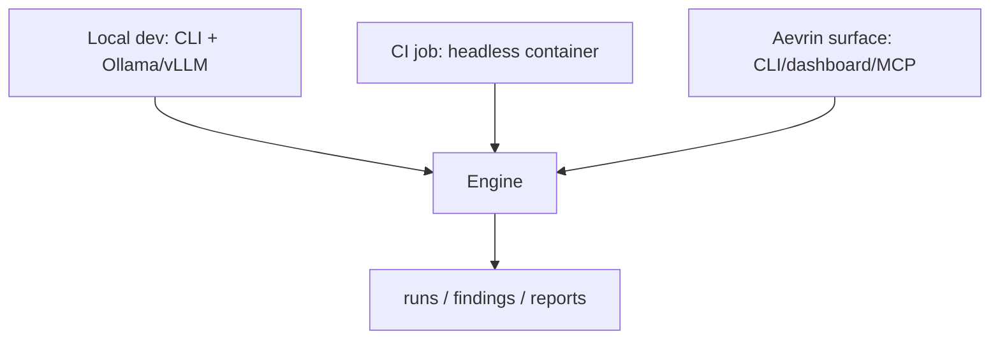

# Deployment

**Purpose.** How modelWrecker is installed and run. The design keeps it free and self-hostable: a laptop with Ollama is a complete deployment; cloud APIs are optional.

## Install

- Python 3.12+. Dependency/venv management with **uv** (`uv sync`); `uv.lock` pins everything.
- `pip install modelwrecker` once published.
- A container image for CI/headless use.

## Run modes

- **Local**: CLI against local or cloud models. No network listener.
- **CI**: headless container, `--ci --fail-on-finding`, SARIF upload. No secrets in the image; keys via
  CI secret store.
- **As an Aevrin backend**: the engine is a library the Aevrin CLI/dashboard/MCP call. Any hosted surface
  is a *separate, authenticated* layer (see [`../security/SECURITY.md`](../security/SECURITY.md) and
  [`../decisions/ADR-0012-engine-library-first.md`](../decisions/ADR-0012-engine-library-first.md)).

## Supply-chain hygiene

- Pin with `uv.lock`; if a provider gateway is used, prefer a pinned container image over a floating
  PyPI install (the LiteLLM Mar-2026 incident lesson).
- No custom checksum/corpus-integrity subsystem - normal lockfiles only
  ([`../decisions/ADR-0010-no-mandatory-checksum-gate.md`](../decisions/ADR-0010-no-mandatory-checksum-gate.md)).

## Data handling

Run artifacts (runs/evidence/findings/reports) can contain harmful content and redacted secrets; they are
written with restrictive permissions and gitignored. Decide retention per engagement.
